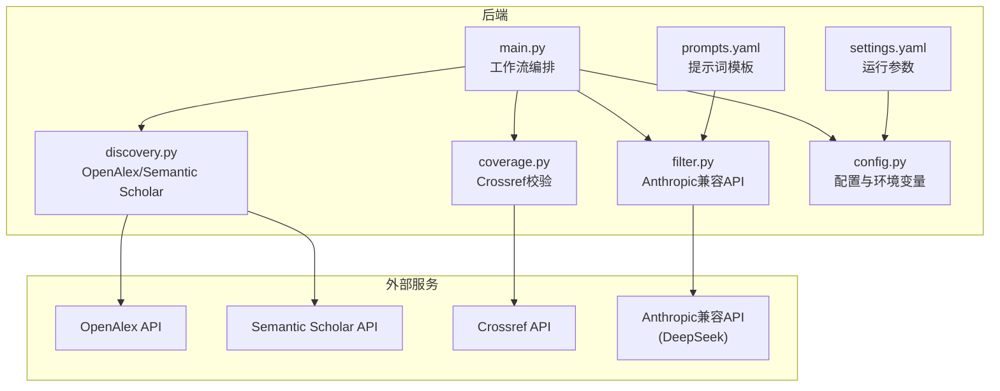
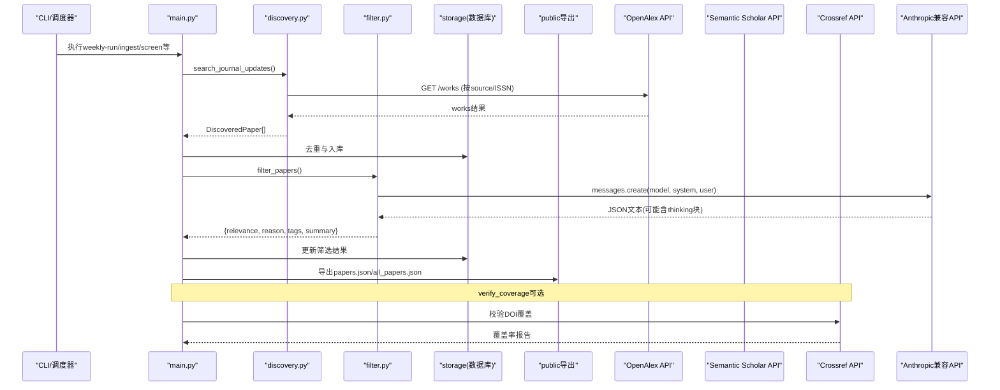
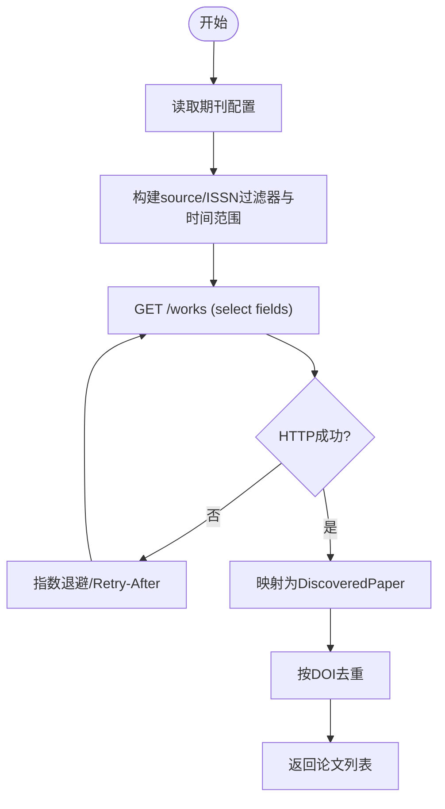
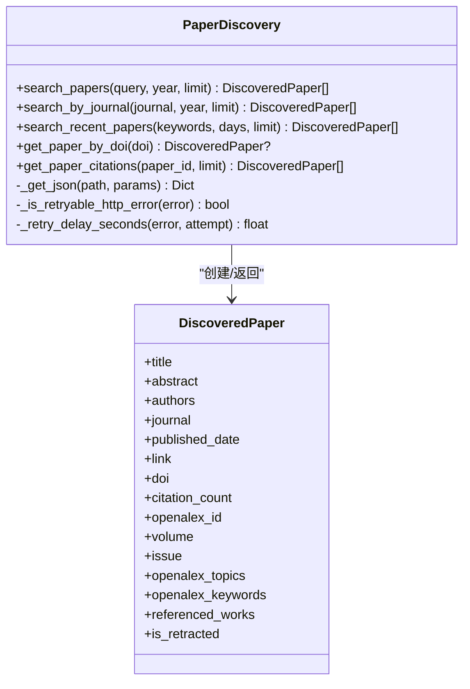
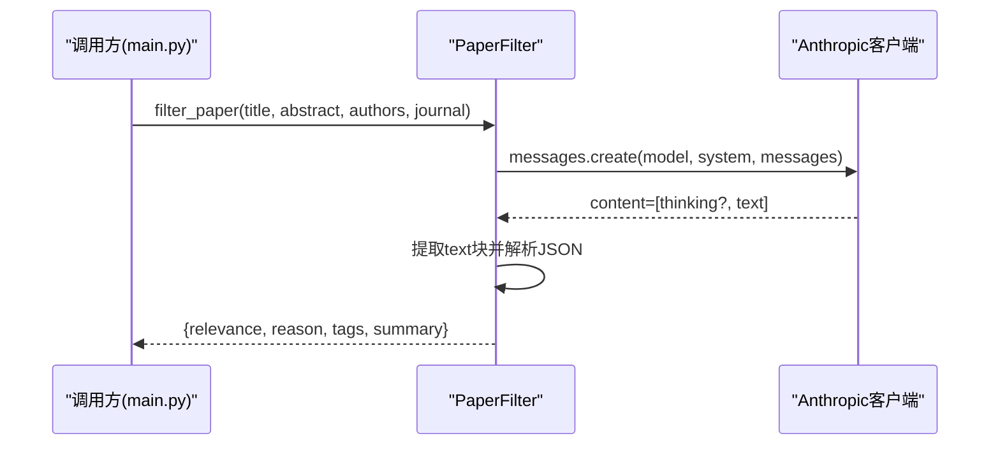
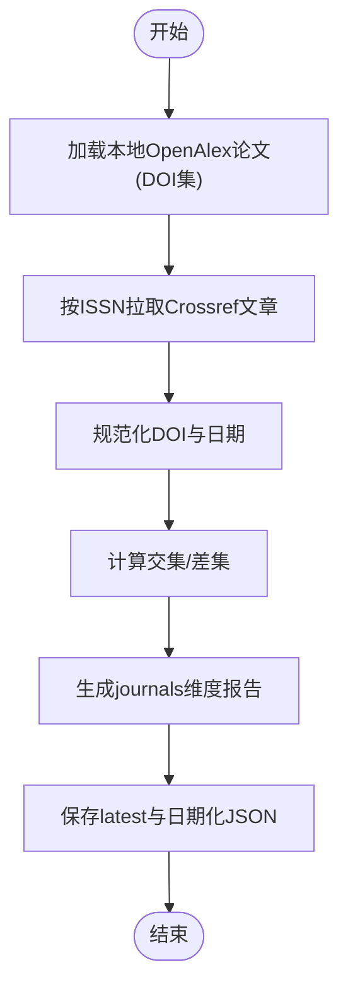
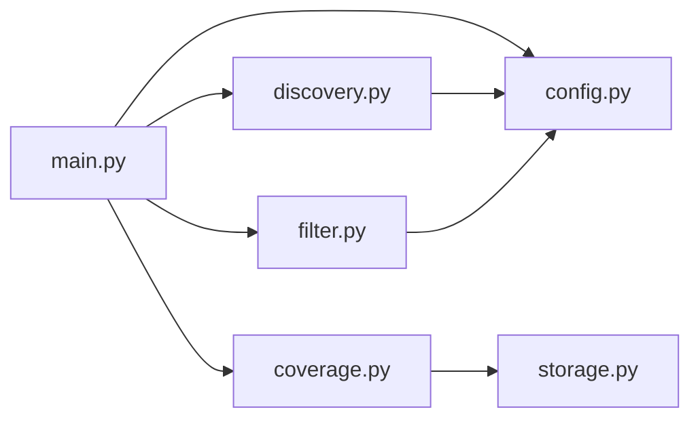

# API集成指南

<cite>
**本文引用的文件**   
- [README.md](file://README.md)
- [pyproject.toml](file://pyproject.toml)
- [backend/journal_tracker/discovery.py](file://backend/journal_tracker/discovery.py)
- [backend/journal_tracker/filter.py](file://backend/journal_tracker/filter.py)
- [backend/journal_tracker/coverage.py](file://backend/journal_tracker/coverage.py)
- [backend/journal_tracker/config.py](file://backend/journal_tracker/config.py)
- [backend/journal_tracker/main.py](file://backend/journal_tracker/main.py)
- [backend/config/settings.yaml](file://backend/config/settings.yaml)
- [backend/config/prompts.yaml](file://backend/config/prompts.yaml)
- [backend/tests/test_filter.py](file://backend/tests/test_filter.py)
- [backend/tests/test_discovery.py](file://backend/tests/test_discovery.py)
</cite>

## 目录
1. [简介](#简介)
2. [项目结构](#项目结构)
3. [核心组件](#核心组件)
4. [架构总览](#架构总览)
5. [详细组件分析](#详细组件分析)
6. [依赖关系分析](#依赖关系分析)
7. [性能与可靠性](#性能与可靠性)
8. [故障排查指南](#故障排查指南)
9. [结论](#结论)
10. [附录：API调用最佳实践与测试](#附录api调用最佳实践与测试)

## 简介
本指南面向Paper-Hot的API集成开发，覆盖以下能力：
- OpenAlex API：论文发现、期刊元数据获取、DOI解析、引用统计查询
- Semantic Scholar API：论文搜索、按期刊抓取更新、引用列表获取
- Anthropic兼容API（DeepSeek）：模型调用、提示词优化、响应解析与错误处理
- 认证机制、速率限制、请求重试与缓存策略
- 批量处理、异步请求、超时控制与资源管理
- 版本兼容性、降级方案与故障转移
- 密钥管理与安全配置
- 测试方法与调试工具使用

## 项目结构
后端以Python CLI为核心，通过journal_tracker模块组织各功能：
- discovery.py：OpenAlex与Semantic Scholar论文发现与检索
- filter.py：Anthropic兼容API筛选
- coverage.py：Crossref覆盖率校验
- config.py：配置加载与环境变量注入
- main.py：工作流编排与命令入口
- settings.yaml / prompts.yaml：运行时配置与提示词模板

图表来源
- [backend/journal_tracker/main.py:1-120](file://backend/journal_tracker/main.py#L1-L120)
- [backend/journal_tracker/discovery.py:1-120](file://backend/journal_tracker/discovery.py#L1-L120)
- [backend/journal_tracker/filter.py:1-90](file://backend/journal_tracker/filter.py#L1-L90)
- [backend/journal_tracker/coverage.py:1-60](file://backend/journal_tracker/coverage.py#L1-L60)
- [backend/journal_tracker/config.py:1-120](file://backend/journal_tracker/config.py#L1-L120)
- [backend/config/settings.yaml:1-30](file://backend/config/settings.yaml#L1-L30)
- [backend/config/prompts.yaml:1-40](file://backend/config/prompts.yaml#L1-L40)

章节来源
- [README.md:1-120](file://README.md#L1-L120)
- [pyproject.toml:1-49](file://pyproject.toml#L1-L49)

## 核心组件
- 论文发现与检索
  - PaperDiscovery（Semantic Scholar）：关键词/年份搜索、按期刊更新、DOI详情、引用列表、限流与重试
  - OpenAlexDiscovery（OpenAlex）：按source id或ISSN抓取更新、作品元数据与特征回填、引用计数
- AI筛选
  - PaperFilter（Anthropic兼容）：系统提示词+用户模板、JSON输出解析、thinking块兼容、批量筛选
- 覆盖率校验
  - CrossrefClient + CoverageVerifier：按ISSN拉取期刊文章、对比本地OpenAlex记录并生成报告
- 配置与环境
  - Config：从.env/key.env/.local/key.env与环境变量加载密钥与设置；支持OpenAlex/SS/AI Key与模型名

章节来源
- [backend/journal_tracker/discovery.py:1-120](file://backend/journal_tracker/discovery.py#L1-L120)
- [backend/journal_tracker/filter.py:1-120](file://backend/journal_tracker/filter.py#L1-L120)
- [backend/journal_tracker/coverage.py:1-120](file://backend/journal_tracker/coverage.py#L1-L120)
- [backend/journal_tracker/config.py:1-160](file://backend/journal_tracker/config.py#L1-L160)

## 架构总览
整体流程：
- 主入口main.py协调“采集→去重→AI筛选→存储→通知→公开导出”
- discovery.py对接OpenAlex与Semantic Scholar，统一返回DiscoveredPaper
- filter.py调用Anthropic兼容API进行相关性判断与摘要/标签生成
- coverage.py对OpenAlex与Crossref进行DOI覆盖度校验
- config.py集中管理密钥与运行参数

图表来源
- [backend/journal_tracker/main.py:556-646](file://backend/journal_tracker/main.py#L556-L646)
- [backend/journal_tracker/discovery.py:538-590](file://backend/journal_tracker/discovery.py#L538-L590)
- [backend/journal_tracker/filter.py:89-160](file://backend/journal_tracker/filter.py#L89-L160)
- [backend/journal_tracker/coverage.py:133-187](file://backend/journal_tracker/coverage.py#L133-L187)

## 详细组件分析

### OpenAlex API集成
- 能力
  - 按source id或ISSN抓取期刊更新（works），支持publication_date过滤与排序
  - 提取标题、作者、DOI、链接、引用计数、主题、关键词、参考文献、是否撤稿
  - 回填biblio（卷期）、topics/keywords/referenced_works/cited_by_count/is_retracted
- 关键实现
  - search_journal_updates：遍历期刊配置，构造filters与select字段，分页per-page≤100
  - _work_to_paper：将OpenAlex条目映射为DiscoveredPaper，标准化DOI与链接
  - get_bibliography/get_work_enrichment：按openalex_id或DOI回填元数据与特征
- 错误处理与重试
  - 指数退避+Retry-After优先，针对429/5xx可重试
  - 每次请求间隔SEARCH_PAUSE_SECONDS避免触发限流

图表来源
- [backend/journal_tracker/discovery.py:538-590](file://backend/journal_tracker/discovery.py#L538-L590)
- [backend/journal_tracker/discovery.py:652-717](file://backend/journal_tracker/discovery.py#L652-L717)
- [backend/journal_tracker/discovery.py:719-771](file://backend/journal_tracker/discovery.py#L719-L771)
- [backend/journal_tracker/discovery.py:842-862](file://backend/journal_tracker/discovery.py#L842-L862)

章节来源
- [backend/journal_tracker/discovery.py:521-800](file://backend/journal_tracker/discovery.py#L521-L800)

### Semantic Scholar API集成
- 能力
  - 关键词/年份搜索、按期刊名称过滤、最近论文聚合
  - 通过DOI获取论文详情、获取引用列表
- 关键实现
  - search_papers/search_by_journal/search_recent_papers：构造fields与limit，自动分配每个关键词的请求配额
  - get_paper_by_doi：按DOI拉取详情，补齐journal/externalIds/link
  - get_paper_citations：按paper_id（自动加DOI:前缀）拉取citing papers
- 错误处理与重试
  - 指数退避+Retry-After优先，针对429/5xx可重试
  - 内置SEARCH_PAUSE_SECONDS与MAX_RECENT_SEARCH_QUERIES控制并发与频率

图表来源
- [backend/journal_tracker/discovery.py:18-55](file://backend/journal_tracker/discovery.py#L18-L55)
- [backend/journal_tracker/discovery.py:116-191](file://backend/journal_tracker/discovery.py#L116-L191)
- [backend/journal_tracker/discovery.py:372-422](file://backend/journal_tracker/discovery.py#L372-L422)
- [backend/journal_tracker/discovery.py:424-471](file://backend/journal_tracker/discovery.py#L424-L471)
- [backend/journal_tracker/discovery.py:473-518](file://backend/journal_tracker/discovery.py#L473-L518)

章节来源
- [backend/journal_tracker/discovery.py:57-191](file://backend/journal_tracker/discovery.py#L57-L191)
- [backend/journal_tracker/discovery.py:372-471](file://backend/journal_tracker/discovery.py#L372-L471)
- [backend/journal_tracker/discovery.py:473-518](file://backend/journal_tracker/discovery.py#L473-L518)

### Anthropic兼容API（DeepSeek）集成
- 能力
  - 基于system prompt与user模板进行相关性判断，输出结构化JSON
  - 兼容thinking block（先返回思考内容再返回文本块）
  - 批量筛选与异常兜底（失败时标记Low并保留原因）
- 关键实现
  - __init__：从Config加载API Key/Base URL/Model，初始化anthropic客户端
  - filter_paper：构造messages，调用messages.create，解析content中的text块
  - filter_papers：循环调用并捕获异常，保证鲁棒性
- 错误处理
  - 无法解析JSON时尝试抽取{...}片段；缺失字段补默认值
  - 非期望relevance值归一化为Low

图表来源
- [backend/journal_tracker/filter.py:73-88](file://backend/journal_tracker/filter.py#L73-L88)
- [backend/journal_tracker/filter.py:89-160](file://backend/journal_tracker/filter.py#L89-L160)
- [backend/journal_tracker/filter.py:162-168](file://backend/journal_tracker/filter.py#L162-L168)

章节来源
- [backend/journal_tracker/filter.py:1-192](file://backend/journal_tracker/filter.py#L1-L192)
- [backend/config/prompts.yaml:1-64](file://backend/config/prompts.yaml#L1-L64)
- [backend/tests/test_filter.py:1-41](file://backend/tests/test_filter.py#L1-L41)

### Crossref覆盖率校验
- 能力
  - 按ISSN拉取期刊文章（from-pub-date/until-pub-date/type:journal-article）
  - 对比本地OpenAlex记录的DOI集合，输出匹配/缺失统计
- 关键实现
  - CrossrefClient.fetch_journal_works：分页rows，规范化DOI与日期
  - CoverageVerifier.verify：汇总journals维度报告，写入latest与日期化文件

图表来源
- [backend/journal_tracker/coverage.py:20-91](file://backend/journal_tracker/coverage.py#L20-L91)
- [backend/journal_tracker/coverage.py:133-187](file://backend/journal_tracker/coverage.py#L133-L187)

章节来源
- [backend/journal_tracker/coverage.py:1-261](file://backend/journal_tracker/coverage.py#L1-L261)

### 配置与密钥管理
- 优先级
  - .env / key.env / .local/key.env → 环境变量 → settings.yaml
- 关键键
  - ANTHROPIC_API_KEY / ANTHROPIC_BASE_URL / AI_MODEL
  - SEMANTIC_SCHOLAR_API_KEY
  - OPENALEX_API_KEY（可选但推荐）
- 路径与目录
  - database.path（相对或绝对）
  - public_data_dir自动创建

章节来源
- [backend/journal_tracker/config.py:24-160](file://backend/journal_tracker/config.py#L24-L160)
- [backend/config/settings.yaml:1-30](file://backend/config/settings.yaml#L1-L30)
- [README.md:99-109](file://README.md#L99-L109)

## 依赖关系分析
- 外部依赖
  - anthropic：用于Anthropic兼容API调用
  - requests：HTTP客户端，封装会话与重试逻辑
  - pyyaml：加载YAML配置
- 内部依赖
  - main.py依赖discovery/filter/coverage/config/storage等模块
  - discovery.py依赖config获取API Key与关键词
  - filter.py依赖config获取模型与提示词

图表来源
- [backend/journal_tracker/main.py:1-30](file://backend/journal_tracker/main.py#L1-L30)
- [backend/journal_tracker/discovery.py:1-20](file://backend/journal_tracker/discovery.py#L1-L20)
- [backend/journal_tracker/filter.py:1-10](file://backend/journal_tracker/filter.py#L1-L10)
- [backend/journal_tracker/coverage.py:1-15](file://backend/journal_tracker/coverage.py#L1-L15)

章节来源
- [pyproject.toml:1-20](file://pyproject.toml#L1-L20)

## 性能与可靠性
- 速率限制与重试
  - Semantic Scholar/OpenAlex/Crossref均实现指数退避与Retry-After优先
  - 单次请求超时30秒，避免长尾阻塞
- 批处理与节流
  - search_recent_papers按关键词数量分配limit，避免大量limit=1请求
  - 每轮请求间sleep（SS: 0.8s，OA: 0.2s）降低瞬时压力
- 去重与增量
  - 按DOI去重，无DOI记录保留以避免误删
  - 仅拉取from_publication_date之后的新作品
- 缓存建议
  - 可在上层对热门查询（如高频DOI详情）做短期内存缓存（LRU），TTL根据业务调整
  - 对embedding与图计算结果落盘缓存（热点网络已使用.cache/fastembed）

[本节为通用指导，不直接分析具体文件]

## 故障排查指南
- 常见错误
  - 429限流：检查API Key是否配置、是否启用更高额度；确认重试逻辑生效
  - 5xx服务器错误：指数退避后重试；若持续失败，检查网络与服务状态
  - JSON解析失败：确保prompt强制JSON输出；filter层已具备抽取{...}容错
- 定位方法
  - 查看last_query_error与last_run_report（discovery模块）
  - 查看筛选错误计数与错误详情（main.py中screen_pending与refilter_error_papers）
  - 覆盖率报告coverage_latest.json定位缺失DOI
- 恢复步骤
  - 修复prompt或模型配置后，重新执行screen-pending或refilter-error
  - 使用verify-coverage生成最新报告，核对差异

章节来源
- [backend/journal_tracker/discovery.py:473-518](file://backend/journal_tracker/discovery.py#L473-L518)
- [backend/journal_tracker/main.py:353-400](file://backend/journal_tracker/main.py#L353-L400)
- [backend/journal_tracker/main.py:717-758](file://backend/journal_tracker/main.py#L717-L758)
- [backend/journal_tracker/coverage.py:133-187](file://backend/journal_tracker/coverage.py#L133-L187)

## 结论
本项目围绕OpenAlex、Semantic Scholar与Anthropic兼容API构建了完整的论文追踪与筛选流水线。通过统一的配置管理、稳健的重试与限流策略、以及严格的JSON输出与容错解析，保证了在高并发与不稳定网络环境下的稳定性与可维护性。后续可在此基础上扩展更多数据源与更丰富的分析能力。

[本节为总结，不直接分析具体文件]

## 附录：API调用最佳实践与测试

### 认证与密钥管理
- 推荐做法
  - 将敏感信息放入.local/key.env或环境变量，避免提交到仓库
  - OpenAlex API Key虽可选，但建议配置以提升限额
- 验证方式
  - 使用run-doctor检查密钥与路径是否正确

章节来源
- [backend/journal_tracker/config.py:24-160](file://backend/journal_tracker/config.py#L24-L160)
- [README.md:99-109](file://README.md#L99-L109)
- [backend/journal_tracker/main.py:761-800](file://backend/journal_tracker/main.py#L761-L800)

### 速率限制与重试
- 原则
  - 遵循Retry-After头；否则指数退避
  - 合理设置per-page与limit，避免极限压测
- 实现参考
  - discovery._retry_delay_seconds/_is_retryable_http_error
  - coverage._retry_delay_seconds/_is_retryable_http_error

章节来源
- [backend/journal_tracker/discovery.py:473-518](file://backend/journal_tracker/discovery.py#L473-L518)
- [backend/journal_tracker/coverage.py:92-131](file://backend/journal_tracker/coverage.py#L92-L131)

### 批量处理与异步
- 当前实现
  - 同步串行为主，适合稳定任务；可通过线程池/进程池改造为异步
- 建议
  - 对独立请求（如多个DOI详情）采用并发；对同一API保持顺序与限速
  - 使用连接池（requests.Session已复用）

[本节为通用指导，不直接分析具体文件]

### 超时控制与资源管理
- 超时
  - HTTP请求统一30秒超时，避免挂起
- 资源
  - Session复用；及时关闭外部资源（如文件句柄）
  - 大对象（如embedding）落盘缓存，减少重复计算

章节来源
- [backend/journal_tracker/discovery.py:473-497](file://backend/journal_tracker/discovery.py#L473-L497)
- [backend/journal_tracker/coverage.py:92-114](file://backend/journal_tracker/coverage.py#L92-L114)

### 版本兼容与降级
- 兼容
  - Anthropic兼容API支持不同Base URL与模型名
  - OpenAlex/SS字段变化通过健壮解析与fallback处理
- 降级
  - 当某数据源不可用时，跳过该源并继续其他流程
  - 覆盖率校验失败不影响主流程

章节来源
- [backend/journal_tracker/filter.py:73-88](file://backend/journal_tracker/filter.py#L73-L88)
- [backend/journal_tracker/discovery.py:538-590](file://backend/journal_tracker/discovery.py#L538-L590)

### 测试与模拟
- 单元测试
  - test_filter：验证Anthropic客户端初始化与JSON抽取
  - test_discovery：验证重试、限流与limit分配
- 模拟服务
  - 使用Mock替换session.get与client.messages.create，断言行为与调用次数

章节来源
- [backend/tests/test_filter.py:1-41](file://backend/tests/test_filter.py#L1-L41)
- [backend/tests/test_discovery.py:48-104](file://backend/tests/test_discovery.py#L48-L104)