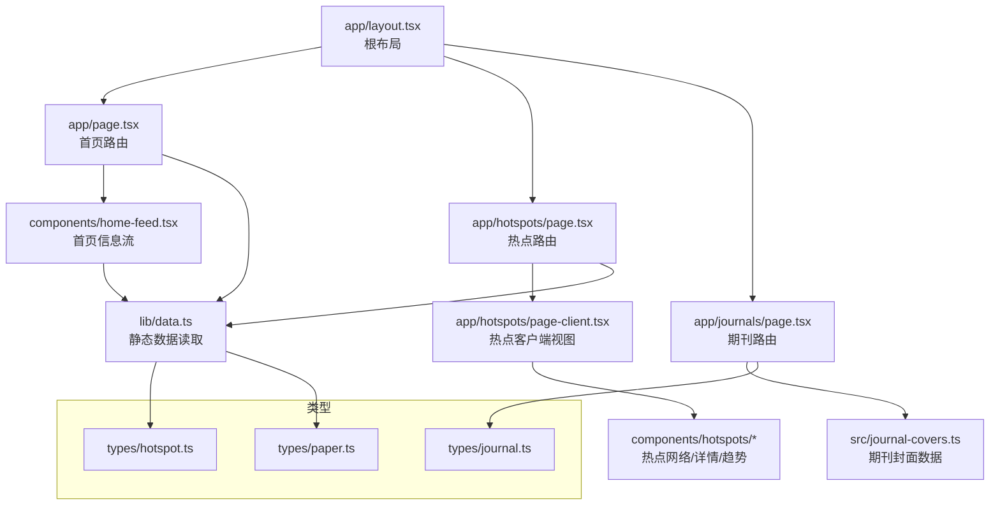
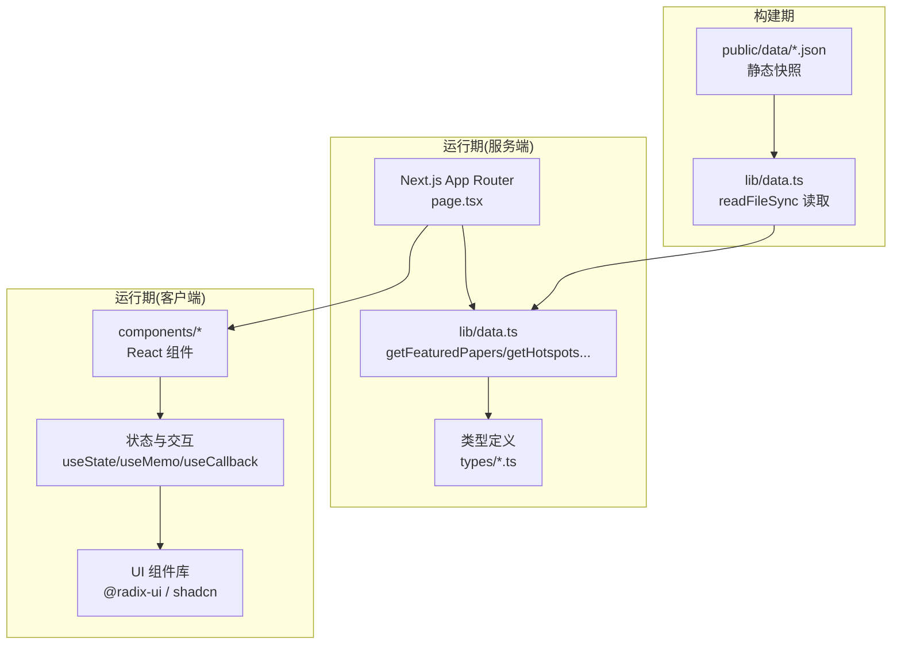
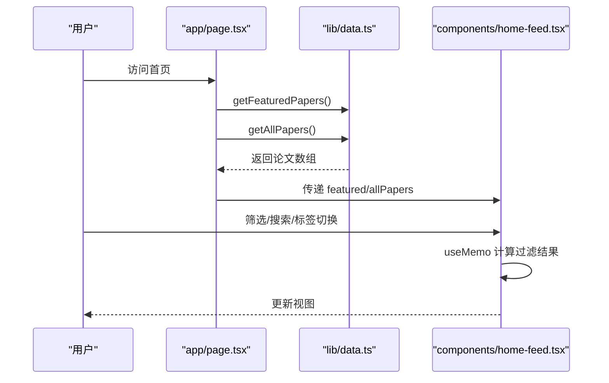
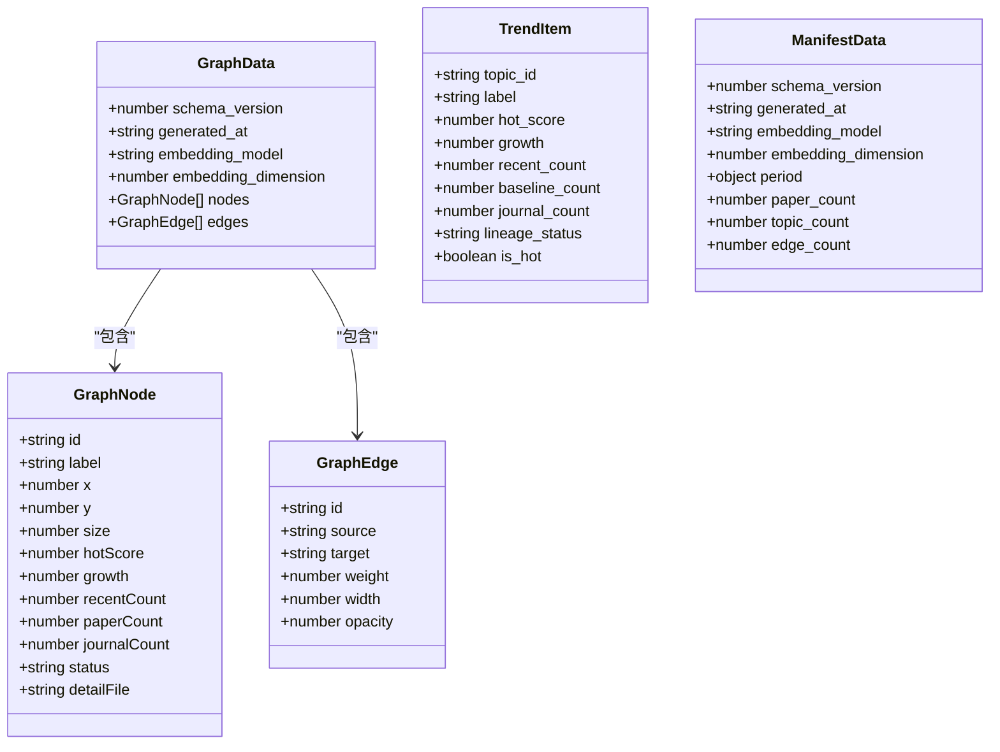
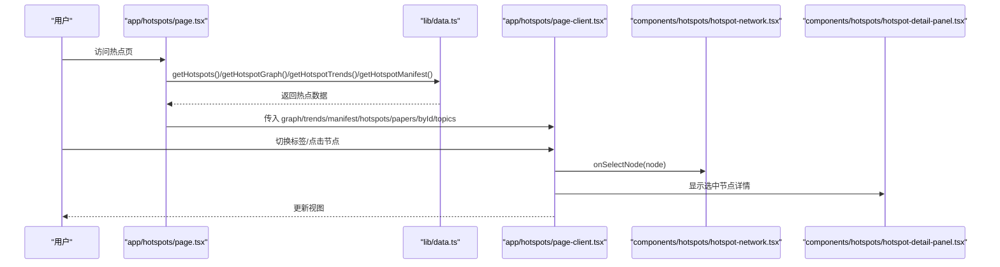
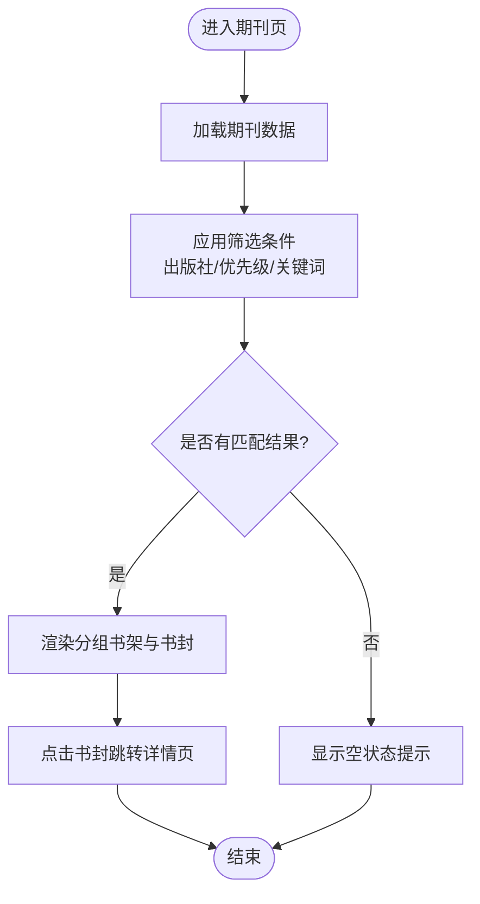
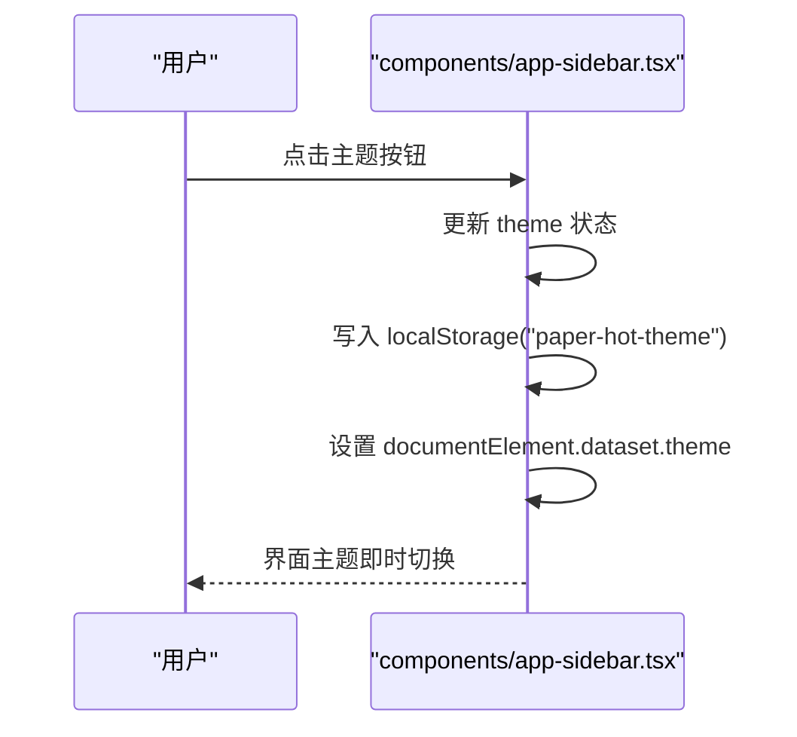
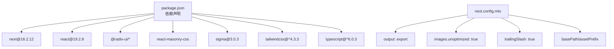

# 前端应用架构

<cite>
**本文引用的文件**
- [package.json](file://frontend/package.json)
- [next.config.mts](file://frontend/next.config.mts)
- [postcss.config.mjs](file://frontend/postcss.config.mjs)
- [tsconfig.json](file://frontend/tsconfig.json)
- [app/layout.tsx](file://frontend/app/layout.tsx)
- [app/page.tsx](file://frontend/app/page.tsx)
- [lib/data.ts](file://frontend/lib/data.ts)
- [types/hotspot.ts](file://frontend/types/hotspot.ts)
- [types/journal.ts](file://frontend/types/journal.ts)
- [types/paper.ts](file://frontend/types/paper.ts)
- [components/home-feed.tsx](file://frontend/components/home-feed.tsx)
- [components/app-sidebar.tsx](file://frontend/components/app-sidebar.tsx)
- [app/hotspots/page.tsx](file://frontend/app/hotspots/page.tsx)
- [app/hotspots/page-client.tsx](file://frontend/app/hotspots/page-client.tsx)
- [app/journals/page.tsx](file://frontend/app/journals/page.tsx)
</cite>

## 目录
1. [简介](#简介)
2. [项目结构](#项目结构)
3. [核心组件](#核心组件)
4. [架构总览](#架构总览)
5. [详细组件分析](#详细组件分析)
6. [依赖关系分析](#依赖关系分析)
7. [性能考量](#性能考量)
8. [故障排查指南](#故障排查指南)
9. [结论](#结论)
10. [附录](#附录)

## 简介
本文件为 Paper-Hot 前端应用的架构文档，基于 Next.js 16.2.12（App Router）与 React 19、TypeScript 构建。内容涵盖：
- 目录结构与组件组织方式
- App Router 页面路由设计（首页、热点分析、期刊书库等）
- React 组件体系与状态管理策略
- TypeScript 类型定义系统（hotspot、journal、paper 等）
- 数据获取与缓存策略（静态数据加载、API 集成与实时更新机制）
- 样式系统（Tailwind CSS v4 配置、自定义主题与响应式实现）
- 组件间通信模式、事件处理与用户交互流程
- 构建配置、性能优化与浏览器兼容性考虑

## 项目结构
前端采用 Next.js App Router 的目录约定，关键目录与职责如下：
- app：页面路由与全局布局，包含各功能页（首页、热点、期刊、关于）
- components：可复用 UI 与业务组件（侧边栏、首页信息流、热点网络与详情面板、趋势表等）
- lib：服务端数据读取工具与公共函数（JSON 快照读取、URL 拼接等）
- types：TypeScript 类型定义（hotspot、journal、paper）
- public/data：构建期静态数据快照（papers.json、all_papers.json、hotspots.json 及子目录 graph/manifest/trends）
- postcss.config.mjs：Tailwind v4 PostCSS 插件配置
- next.config.mts：Next.js 导出静态站点、路径前缀、图片优化关闭等
- tsconfig.json：严格 TS 编译选项与路径别名 @/*



**图表来源**
- [app/layout.tsx:1-19](file://frontend/app/layout.tsx#L1-L19)
- [app/page.tsx:1-9](file://frontend/app/page.tsx#L1-L9)
- [app/hotspots/page.tsx:1-94](file://frontend/app/hotspots/page.tsx#L1-L94)
- [app/hotspots/page-client.tsx:1-163](file://frontend/app/hotspots/page-client.tsx#L1-L163)
- [components/home-feed.tsx:1-118](file://frontend/components/home-feed.tsx#L1-L118)
- [lib/data.ts:1-80](file://frontend/lib/data.ts#L1-L80)
- [types/hotspot.ts:1-106](file://frontend/types/hotspot.ts#L1-L106)
- [types/journal.ts:1-19](file://frontend/types/journal.ts#L1-L19)
- [types/paper.ts:1-25](file://frontend/types/paper.ts#L1-L25)

**章节来源**
- [next.config.mts:1-14](file://frontend/next.config.mts#L1-L14)
- [postcss.config.mjs:1-8](file://frontend/postcss.config.mjs#L1-L8)
- [tsconfig.json:1-43](file://frontend/tsconfig.json#L1-L43)

## 核心组件
- 根布局与元数据：在根布局中设置语言、标题与描述，并引入全局样式与模块样式。
- 首页（精选论文与信息流）：通过服务端组件读取精选与全量论文，传递给客户端组件进行筛选、排序与瀑布流展示。
- 热点分析：服务端组件聚合热点数据（图谱、趋势、清单），客户端组件提供交互式标签页（图谱、趋势排行、议题概览）。
- 期刊书库：客户端组件按出版社、优先级与关键词过滤，并以“书封”形式呈现。
- 侧边栏导航：统一导航入口，支持折叠、移动端抽屉、主题切换与本地持久化。

**章节来源**
- [app/layout.tsx:1-19](file://frontend/app/layout.tsx#L1-L19)
- [components/home-feed.tsx:1-118](file://frontend/components/home-feed.tsx#L1-L118)
- [app/hotspots/page.tsx:1-94](file://frontend/app/hotspots/page.tsx#L1-L94)
- [app/hotspots/page-client.tsx:1-163](file://frontend/app/hotspots/page-client.tsx#L1-L163)
- [app/journals/page.tsx:1-53](file://frontend/app/journals/page.tsx#L1-L53)
- [components/app-sidebar.tsx:1-43](file://frontend/components/app-sidebar.tsx#L1-L43)

## 架构总览
整体采用“服务端渲染 + 客户端交互”的分层模式：
- 服务端组件负责数据读取（从 public/data 下的 JSON 快照）与初始渲染
- 客户端组件负责用户交互（筛选、搜索、标签切换、图谱交互）
- 类型系统贯穿前后端数据结构，确保一致性
- Tailwind v4 提供原子化样式，配合自定义 CSS 实现复杂布局与主题



**图表来源**
- [lib/data.ts:1-80](file://frontend/lib/data.ts#L1-L80)
- [app/page.tsx:1-9](file://frontend/app/page.tsx#L1-L9)
- [app/hotspots/page.tsx:1-94](file://frontend/app/hotspots/page.tsx#L1-L94)
- [types/hotspot.ts:1-106](file://frontend/types/hotspot.ts#L1-L106)
- [types/paper.ts:1-25](file://frontend/types/paper.ts#L1-L25)

## 详细组件分析

### 首页（精选与全量论文）
- 路由：app/page.tsx 作为首页路由，调用 lib/data.ts 获取精选与全量论文，再传入 HomeFeed 组件。
- 数据流：服务端组件读取 JSON 快照，返回结构化数据；客户端组件进行筛选、排序、标签云与瀑布流展示。
- 交互：支持按相关性、期刊、标签、关键词筛选；日期分组与时间线展示；Masonry 瀑布流布局。
- 状态管理：使用 useState 管理筛选条件，useMemo 计算衍生数据（期刊列表、标签计数、过滤结果）。



**图表来源**
- [app/page.tsx:1-9](file://frontend/app/page.tsx#L1-L9)
- [lib/data.ts:24-32](file://frontend/lib/data.ts#L24-L32)
- [components/home-feed.tsx:69-118](file://frontend/components/home-feed.tsx#L69-L118)

**章节来源**
- [app/page.tsx:1-9](file://frontend/app/page.tsx#L1-L9)
- [components/home-feed.tsx:1-118](file://frontend/components/home-feed.tsx#L1-L118)
- [lib/data.ts:24-32](file://frontend/lib/data.ts#L24-L32)

### 热点分析（图谱、趋势、概览）
- 路由：app/hotspots/page.tsx 在服务端聚合热点数据（图谱、趋势、清单、manifest），并决定渲染客户端视图或降级到纯文本概览。
- 客户端视图：app/hotspots/page-client.tsx 提供三标签页（热点图谱、趋势排行、议题概览），并通过状态控制选中节点与联动。
- 数据模型：GraphData、TrendItem、ManifestData、TopicDetail 等类型在 types/hotspot.ts 中统一定义。
- 交互：点击图谱节点或趋势行，联动右侧详情面板；支持清空选择与标签切换。



**图表来源**
- [types/hotspot.ts:19-68](file://frontend/types/hotspot.ts#L19-L68)
- [types/hotspot.ts:70-81](file://frontend/types/hotspot.ts#L70-L81)
- [types/hotspot.ts:53-68](file://frontend/types/hotspot.ts#L53-L68)



**图表来源**
- [app/hotspots/page.tsx:14-64](file://frontend/app/hotspots/page.tsx#L14-L64)
- [app/hotspots/page-client.tsx:64-163](file://frontend/app/hotspots/page-client.tsx#L64-L163)
- [lib/data.ts:34-69](file://frontend/lib/data.ts#L34-L69)

**章节来源**
- [app/hotspots/page.tsx:1-94](file://frontend/app/hotspots/page.tsx#L1-L94)
- [app/hotspots/page-client.tsx:1-163](file://frontend/app/hotspots/page-client.tsx#L1-L163)
- [types/hotspot.ts:1-106](file://frontend/types/hotspot.ts#L1-L106)
- [lib/data.ts:34-69](file://frontend/lib/data.ts#L34-L69)

### 期刊书库
- 路由：app/journals/page.tsx 为客户端组件，加载 src/journal-covers.ts 中的期刊数据。
- 交互：支持按出版社、优先级、关键词筛选；以“书封”卡片展示，点击跳转至期刊详情页（[slug]）。
- 状态管理：useState 管理查询与筛选，useMemo 计算出版社列表与可见集合。



**图表来源**
- [app/journals/page.tsx:30-53](file://frontend/app/journals/page.tsx#L30-L53)

**章节来源**
- [app/journals/page.tsx:1-53](file://frontend/app/journals/page.tsx#L1-L53)
- [types/journal.ts:1-19](file://frontend/types/journal.ts#L1-L19)

### 侧边栏与主题切换
- 导航：统一的侧边栏导航，支持折叠与移动端抽屉；当前路径高亮。
- 主题：支持深色/浅色/跟随系统，状态持久化到 localStorage。
- 交互：按钮点击切换状态，影响 document.documentElement.dataset 与本地存储。



**图表来源**
- [components/app-sidebar.tsx:22-28](file://frontend/components/app-sidebar.tsx#L22-L28)

**章节来源**
- [components/app-sidebar.tsx:1-43](file://frontend/components/app-sidebar.tsx#L1-L43)

## 依赖关系分析
- 运行时依赖：Next.js 16.2.12、React 19、Radix UI 组件、lucide-react 图标、react-masonry-css、sigma（图谱）、tailwind-merge、zod（校验）等。
- 开发依赖：Tailwind v4、PostCSS、TypeScript、类型声明等。
- 构建配置：静态导出、关闭图片优化、启用 trailingSlash、basePath/assetPrefix 适配 GitHub Pages。



**图表来源**
- [package.json:1-38](file://frontend/package.json#L1-L38)
- [next.config.mts:1-14](file://frontend/next.config.mts#L1-L14)

**章节来源**
- [package.json:1-38](file://frontend/package.json#L1-L38)
- [next.config.mts:1-14](file://frontend/next.config.mts#L1-L14)

## 性能考量
- 静态导出与构建期数据读取：所有数据在构建时通过 readFileSync 读取 JSON 快照，避免运行时 fetch，提升首屏性能与稳定性。
- 客户端计算优化：大量使用 useMemo 与 useCallback 减少重渲染与重复计算（如筛选结果、标签计数、出版社列表）。
- 图片优化关闭：images.unoptimized=true 适合静态站点托管场景，避免额外图片服务开销。
- 路由与代码分割：Next.js App Router 自动按需加载页面与组件，减小包体积。
- 响应式与布局：Masonry 与媒体查询结合，保证多设备体验。

[本节为通用指导，不直接分析具体文件]

## 故障排查指南
- 构建失败或路径错误：检查 basePath/assetPrefix 是否与部署环境一致（GitHub Actions 下为 /Paper-Hot）。
- 数据为空或异常：确认 public/data 下的 JSON 文件是否存在且格式正确；服务端读取函数会返回默认值，需检查上游数据生成流程。
- 主题未生效：确认 localStorage 中是否写入主题键，以及 documentElement.dataset.theme 是否正确设置。
- 图谱不显示：检查 graph.json 的 schema_version 与字段完整性；确保客户端组件能接收到非空 nodes。
- 筛选无效：检查筛选逻辑中对字段名与大小写的处理，确保输入与数据一致。

**章节来源**
- [next.config.mts:3-11](file://frontend/next.config.mts#L3-L11)
- [lib/data.ts:16-22](file://frontend/lib/data.ts#L16-L22)
- [components/app-sidebar.tsx:22-28](file://frontend/components/app-sidebar.tsx#L22-L28)
- [app/hotspots/page.tsx:24-28](file://frontend/app/hotspots/page.tsx#L24-L28)

## 结论
Paper-Hot 前端采用 Next.js App Router 与 React 19 的现代架构，结合 TypeScript 强类型与 Tailwind v4 原子化样式，实现了高性能的静态站点与丰富的客户端交互。通过构建期数据读取与客户端状态管理，保证了良好的用户体验与可维护性。后续可在 API 集成、增量更新与更细粒度的缓存策略上持续优化。

[本节为总结，不直接分析具体文件]

## 附录

### TypeScript 类型系统概览
- hotspot：热点话题、图谱节点/边、趋势项、清单与详情等
- journal：期刊优先级、封面与基本信息
- paper：论文标题、作者、期刊、发布日期、摘要、标签、评分等

```mermaid
erDiagram
HOTSPOT_TOPIC {
string title
string description
number[] paper_ids
}
GRAPH_NODE {
string id
string label
number x
number y
number size
number hotScore
number growth
number recentCount
number paperCount
number journalCount
string status
string detailFile
}
GRAPH_EDGE {
string id
string source
string target
number weight
number width
number opacity
}
TREND_ITEM {
string topic_id
string label
number hot_score
number growth
number recent_count
number baseline_count
number journal_count
string lineage_status
boolean is_hot
}
JOURNAL {
string abbr
string slug
string name
string publisher
enum priority
string issn
string publisherUrl
object cover
}
PAPER {
number id
string title
string|string[] authors
string journal
string published_date
string source_url
string doi
string relevance
number score
string summary
string reason
string[] tags
string volume
string issue
}
GRAPH_NODE ||--o{ GRAPH_EDGE : "关联"
HOTSPOT_TOPIC ||--o{ PAPER : "引用"
```

**图表来源**
- [types/hotspot.ts:6-17](file://frontend/types/hotspot.ts#L6-L17)
- [types/hotspot.ts:20-51](file://frontend/types/hotspot.ts#L20-L51)
- [types/hotspot.ts:70-81](file://frontend/types/hotspot.ts#L70-L81)
- [types/journal.ts:9-18](file://frontend/types/journal.ts#L9-L18)
- [types/paper.ts:8-24](file://frontend/types/paper.ts#L8-L24)

### 构建与样式配置要点
- Next.js：静态导出、关闭图片优化、trailingSlash、basePath/assetPrefix
- PostCSS：使用 @tailwindcss/postcss 插件
- TypeScript：严格模式、模块解析为 bundler、路径别名 @/*

**章节来源**
- [next.config.mts:5-11](file://frontend/next.config.mts#L5-L11)
- [postcss.config.mjs:1-8](file://frontend/postcss.config.mjs#L1-L8)
- [tsconfig.json:1-43](file://frontend/tsconfig.json#L1-L43)