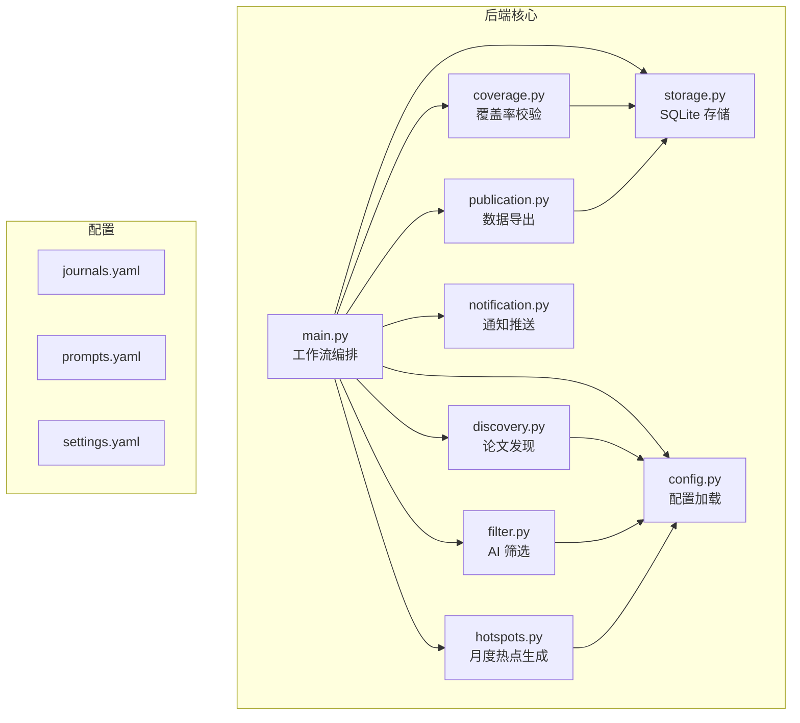
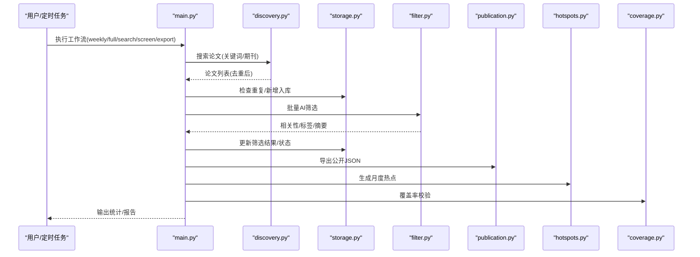
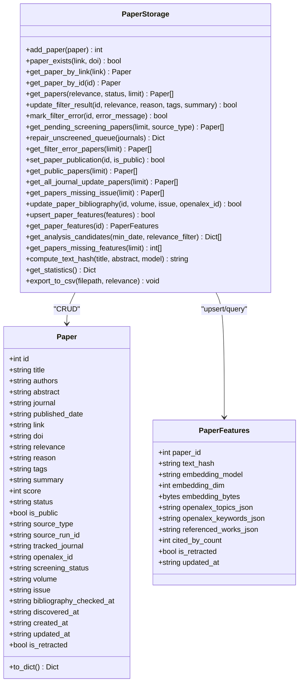
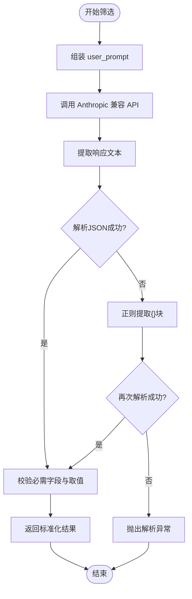
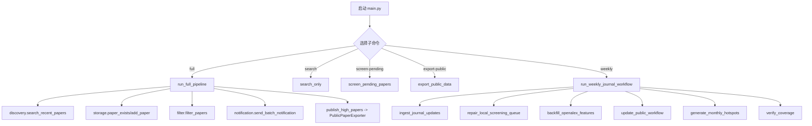
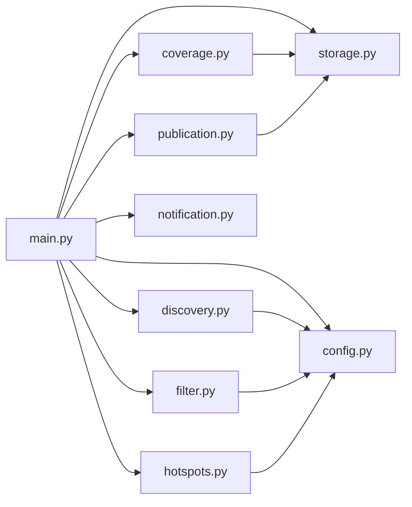

# 后端系统架构

<cite>
**本文引用的文件**   
- [storage.py](file://backend/journal_tracker/storage.py)
- [filter.py](file://backend/journal_tracker/filter.py)
- [discovery.py](file://backend/journal_tracker/discovery.py)
- [publication.py](file://backend/journal_tracker/publication.py)
- [main.py](file://backend/journal_tracker/main.py)
- [config.py](file://backend/journal_tracker/config.py)
- [hotspots.py](file://backend/journal_tracker/hotspots.py)
- [notification.py](file://backend/journal_tracker/notification.py)
- [coverage.py](file://backend/journal_tracker/coverage.py)
- [settings.yaml](file://backend/config/settings.yaml)
- [journals.yaml](file://backend/config/journals.yaml)
- [prompts.yaml](file://backend/config/prompts.yaml)
</cite>

## 目录
1. [简介](#简介)
2. [项目结构](#项目结构)
3. [核心组件](#核心组件)
4. [架构总览](#架构总览)
5. [详细组件分析](#详细组件分析)
6. [依赖关系分析](#依赖关系分析)
7. [性能考虑](#性能考虑)
8. [故障排查指南](#故障排查指南)
9. [结论](#结论)
10. [附录](#附录)

## 简介
本文件为 Paper-Hot 后端系统的全面架构文档，聚焦 Python 工作流的整体设计、模块化职责分离与数据流向。重点阐述：
- storage.py 的 SQLite 存储层设计与查询优化
- filter.py 的 AI 筛选机制（提示词工程、API 调用策略、结果解析）
- discovery.py 的论文发现模块（OpenAlex API、Semantic Scholar 搜索、去重逻辑）
- publication.py 的数据导出功能（JSON 生成与文件管理）
- main.py 的工作流编排与调度入口
- 组件间的依赖关系图与交互流程图
- 错误处理策略、日志记录与性能优化建议

## 项目结构
后端以 journal_tracker 包为核心，配合 config 配置目录与 scripts/tests 等辅助目录。关键路径：
- backend/journal_tracker：核心业务模块（存储、筛选、发现、发布、通知、覆盖率校验、热点生成）
- backend/config：YAML 配置文件（期刊列表、提示词、全局设置）
- frontend/public/data：公开站数据输出目录（由后端写入）



**图表来源** 
- [main.py:1-120](file://backend/journal_tracker/main.py#L1-L120)
- [storage.py:1-200](file://backend/journal_tracker/storage.py#L1-L200)
- [discovery.py:1-120](file://backend/journal_tracker/discovery.py#L1-L120)
- [filter.py:1-120](file://backend/journal_tracker/filter.py#L1-L120)
- [publication.py:1-62](file://backend/journal_tracker/publication.py#L1-L62)
- [config.py:1-120](file://backend/journal_tracker/config.py#L1-L120)

**章节来源**
- [main.py:1-120](file://backend/journal_tracker/main.py#L1-L120)
- [config.py:1-120](file://backend/journal_tracker/config.py#L1-L120)

## 核心组件
- 存储层 storage.py：定义 Paper/PaperFeatures 数据模型，维护 papers 与 paper_features 两张表，提供增删改查、统计、CSV/JSON 导出接口，内置索引与字段补齐逻辑。
- 发现层 discovery.py：封装 Semantic Scholar 与 OpenAlex 两种发现方式，支持按关键词/期刊检索、去重、重试退避、运行报告。
- 筛选层 filter.py：基于 Anthropic 兼容 API（Claude/DeepSeek），使用可配置的 system/user prompt，返回结构化 JSON 并做健壮性校验。
- 发布层 publication.py：从存储读取已公开论文，序列化为前端可用的 JSON，支持全量更新与高相关论文自动公开。
- 工作流编排 main.py：串联“搜索→去重→筛选→存储→通知→公开→热点→覆盖率校验”的完整流程，并提供 CLI 子命令。
- 配置层 config.py：集中加载 .env/key.env/.local/key.env 与 YAML 配置，暴露 API Key、模型名、数据库路径、公开目录等属性。
- 通知层 notification.py：支持微信（Server酱）与邮件通知，按相关性分级发送单条或批量汇总。
- 热点生成 hotspots.py：基于近一个月公开论文，调用 LLM 归纳研究议题，输出 hotspots.json。
- 覆盖率校验 coverage.py：对比本地 OpenAlex 收录与 Crossref DOI 覆盖，生成覆盖率报告。

**章节来源**
- [storage.py:1-200](file://backend/journal_tracker/storage.py#L1-L200)
- [discovery.py:1-120](file://backend/journal_tracker/discovery.py#L1-L120)
- [filter.py:1-120](file://backend/journal_tracker/filter.py#L1-L120)
- [publication.py:1-62](file://backend/journal_tracker/publication.py#L1-L62)
- [main.py:1-120](file://backend/journal_tracker/main.py#L1-L120)
- [config.py:1-120](file://backend/journal_tracker/config.py#L1-L120)
- [notification.py:1-120](file://backend/journal_tracker/notification.py#L1-L120)
- [hotspots.py:1-120](file://backend/journal_tracker/hotspots.py#L1-L120)
- [coverage.py:1-120](file://backend/journal_tracker/coverage.py#L1-L120)

## 架构总览
整体采用“发现→筛选→存储→发布→分析”的分层流水线，各层通过配置与存储解耦，外部依赖（Anthropic、Semantic Scholar、OpenAlex、Crossref）通过独立客户端封装，具备重试与限流控制。



**图表来源** 
- [main.py:36-131](file://backend/journal_tracker/main.py#L36-L131)
- [discovery.py:116-192](file://backend/journal_tracker/discovery.py#L116-L192)
- [storage.py:196-245](file://backend/journal_tracker/storage.py#L196-L245)
- [filter.py:89-161](file://backend/journal_tracker/filter.py#L89-L161)
- [publication.py:17-33](file://backend/journal_tracker/publication.py#L17-L33)
- [hotspots.py:140-161](file://backend/journal_tracker/hotspots.py#L140-L161)
- [coverage.py:140-187](file://backend/journal_tracker/coverage.py#L140-L187)

## 详细组件分析

### 存储层 storage.py（SQLite 数据模型与查询优化）
- 数据模型
  - Paper：包含标题、作者、摘要、期刊、发表日期、链接、DOI、相关性、理由、标签、摘要、分数、状态、是否公开、来源类型、来源批次、追踪期刊、OpenAlex ID、筛选状态、卷期、元数据检查时间、发现时间、创建/更新时间、撤回标记等。
  - PaperFeatures：每篇论文的嵌入哈希、嵌入模型/维度、embedding BLOB、OpenAlex 主题/关键词/参考文献、被引次数、撤回标记、更新时间。
- 表结构与索引
  - papers：主键 id，唯一 link，常用过滤字段 relevance/status/is_public/screening_status/source_type，建立多列索引加速查询。
  - paper_features：主键 paper_id，外键关联 papers(id)，用于扩展特征。
- 迁移与兼容性
  - _ensure_columns 动态补齐历史缺失字段，并将旧 Unscreened 分流为 pending/quarantined，统一 source_type/discovered_at 等默认值。
- 查询与优化
  - get_papers/get_pending_screening_papers/get_public_papers 等使用参数化 SQL + ORDER BY/LIMIT，避免全表扫描。
  - get_analysis_candidates 联合 paper_features 进行热点分析候选集构建，支持最小日期与相关性过滤。
  - compute_text_hash 确定性文本哈希，便于 embedding 缓存与去重。
- 导出与统计
  - export_to_csv 导出指定字段；get_statistics 聚合总数、相关性、状态、筛选状态、本周新增等。



**图表来源** 
- [storage.py:13-63](file://backend/journal_tracker/storage.py#L13-L63)
- [storage.py:64-200](file://backend/journal_tracker/storage.py#L64-L200)
- [storage.py:513-631](file://backend/journal_tracker/storage.py#L513-L631)

**章节来源**
- [storage.py:82-152](file://backend/journal_tracker/storage.py#L82-L152)
- [storage.py:154-195](file://backend/journal_tracker/storage.py#L154-L195)
- [storage.py:196-245](file://backend/journal_tracker/storage.py#L196-L245)
- [storage.py:266-322](file://backend/journal_tracker/storage.py#L266-L322)
- [storage.py:341-422](file://backend/journal_tracker/storage.py#L341-L422)
- [storage.py:449-511](file://backend/journal_tracker/storage.py#L449-L511)
- [storage.py:515-631](file://backend/journal_tracker/storage.py#L515-L631)
- [storage.py:632-706](file://backend/journal_tracker/storage.py#L632-L706)

### 筛选层 filter.py（AI 筛选机制）
- 提示词工程
  - DEFAULT_SYSTEM_PROMPT 定义纳入/排除标准与输出 JSON 格式，强调 High/Medium/Low 三级相关性。
  - DEFAULT_USER_PROMPT_TEMPLATE 模板化输入（标题、摘要、作者、期刊）。
- API 调用策略
  - 使用 anthropic.Anthropic 客户端，支持 base_url 自定义（兼容 DeepSeek）。
  - 限制 max_tokens，构造 messages 请求。
- 结果解析与健壮性
  - _extract_response_text 跳过 thinking/tool 等非文本块，提取纯文本。
  - 先尝试直接 json.loads，失败则正则提取 {} 块，再校验必需字段与有效性。
- 批量筛选
  - filter_papers 逐篇调用，异常捕获并降级为 Low，保证批处理不中断。



**图表来源** 
- [filter.py:13-72](file://backend/journal_tracker/filter.py#L13-L72)
- [filter.py:89-161](file://backend/journal_tracker/filter.py#L89-L161)
- [filter.py:162-169](file://backend/journal_tracker/filter.py#L162-L169)

**章节来源**
- [filter.py:1-120](file://backend/journal_tracker/filter.py#L1-L120)
- [filter.py:120-192](file://backend/journal_tracker/filter.py#L120-L192)

### 发现层 discovery.py（论文发现与去重）
- 双源发现
  - PaperDiscovery：Semantic Scholar API，支持关键词/年份/限制数量，按期刊精确匹配，最近论文搜索，运行报告统计。
  - OpenAlexDiscovery：按 source_id/ISSN 抓取期刊更新，支持 bibliographic 信息回填与作品增强（主题/关键词/引用/撤回标记）。
- 去重逻辑
  - 优先按 DOI 去重；无 DOI 的记录保留，避免误删新论文。
- 网络请求与容错
  - 统一 _get_json 实现指数退避与 Retry-After 支持，针对 429/5xx 错误重试。
  - 每次查询记录 last_query_error，便于上层诊断。
- 数据转换
  - DiscoveredPaper 标准化字段，OpenAlex 抽象反转重建摘要、作者前5人+et al.、主题/关键词/参考文献序列化。

```mermaid
sequenceDiagram
participant Main as "main.py"
participant SD as "PaperDiscovery"
participant OD as "OpenAlexDiscovery"
participant SS as "Semantic Scholar API"
participant OA as "OpenAlex API"
Main->>SD : search_recent_papers(keywords, days, limit)
SD->>SS : /paper/search (query, year, fields)
SS-->>SD : data[]
SD-->>Main : DiscoveredPaper[]
Main->>OD : search_journal_updates(journals, from_year, limit_per_journal)
OD->>OA : /works (source filter, date range, select)
OA-->>OD : results[]
OD-->>Main : DiscoveredPaper[]
Note over SD,OD : 去重 by DOI; 请求带重试与限流
```

**图表来源** 
- [discovery.py:116-192](file://backend/journal_tracker/discovery.py#L116-L192)
- [discovery.py:217-271](file://backend/journal_tracker/discovery.py#L217-L271)
- [discovery.py:538-591](file://backend/journal_tracker/discovery.py#L538-L591)
- [discovery.py:773-796](file://backend/journal_tracker/discovery.py#L773-L796)

**章节来源**
- [discovery.py:1-120](file://backend/journal_tracker/discovery.py#L1-L120)
- [discovery.py:116-192](file://backend/journal_tracker/discovery.py#L116-L192)
- [discovery.py:217-271](file://backend/journal_tracker/discovery.py#L217-L271)
- [discovery.py:331-348](file://backend/journal_tracker/discovery.py#L331-L348)
- [discovery.py:473-519](file://backend/journal_tracker/discovery.py#L473-L519)
- [discovery.py:538-591](file://backend/journal_tracker/discovery.py#L538-L591)
- [discovery.py:652-796](file://backend/journal_tracker/discovery.py#L652-L796)

### 发布层 publication.py（数据导出）
- 功能
  - export_json：导出已公开论文为 JSON。
  - export_all_journal_updates_json：导出所有红榜期刊更新论文。
  - _serialize_paper：将 Paper 序列化为前端可用结构（拆分 CSV 字段、生成 detail_slug）。
  - _write_json：确保目录存在并以 UTF-8 写入。
- 集成
  - 依赖 PaperStorage.get_public_papers/get_all_journal_update_papers。
  - 在 main.py 中用于自动刷新公开站数据。

**章节来源**
- [publication.py:1-62](file://backend/journal_tracker/publication.py#L1-L62)

### 工作流编排 main.py（调度与CLI）
- 主要流程
  - run_full_pipeline：搜索→去重→AI筛选→存储→通知→公开刷新。
  - ingest_journal_updates：OpenAlex 红榜期刊更新抓取与入库，附带 features 回填。
  - screen_pending_papers：批量筛选待处理论文，错误降级并记录。
  - backfill_openalex_bibliography/features：对缺失卷期与特征的论文进行回填。
  - update_public_workflow：重筛错误论文→公开 High→刷新公开数据。
  - run_weekly_journal_workflow：周度全流程编排，产出 weekly_run_*.json 报告。
- CLI 子命令
  - search、screen-pending、workflow-status、export-public、publish-paper、list-public/list-all、refilter-error、run-doctor 等。



**图表来源** 
- [main.py:36-131](file://backend/journal_tracker/main.py#L36-L131)
- [main.py:171-241](file://backend/journal_tracker/main.py#L171-L241)
- [main.py:353-400](file://backend/journal_tracker/main.py#L353-L400)
- [main.py:556-647](file://backend/journal_tracker/main.py#L556-L647)

**章节来源**
- [main.py:1-120](file://backend/journal_tracker/main.py#L1-L120)
- [main.py:171-241](file://backend/journal_tracker/main.py#L171-L241)
- [main.py:353-400](file://backend/journal_tracker/main.py#L353-L400)
- [main.py:556-647](file://backend/journal_tracker/main.py#L556-L647)

### 配置层 config.py（配置加载与属性访问）
- 环境变量优先级：.env/key.env/.local/key.env → 环境变量 → settings.yaml
- 关键属性：anthropic_api_key/base_url、semantic_scholar_api_key、openalex_api_key、claude_model、数据库路径、公开目录、提示词、热点网络参数、通知配置、期刊关键词等。
- 期刊跟踪：get_tracked_journals 支持优先级过滤（core/watch/skip）。

**章节来源**
- [config.py:1-120](file://backend/journal_tracker/config.py#L1-L120)
- [config.py:120-249](file://backend/journal_tracker/config.py#L120-L249)

### 通知层 notification.py（微信/邮件）
- 微信：通过 Server酱 POST 发送，支持标题与内容格式化。
- 邮件：预留接口，当前仅打印日志。
- 批量通知：按 High/Medium 分组汇总，限制展示条目数。

**章节来源**
- [notification.py:1-152](file://backend/journal_tracker/notification.py#L1-L152)

### 热点生成 hotspots.py（月度热点）
- 输入：近一个月公开论文（最多 40 篇）。
- 输出：topics 数组（标题、描述、关联论文ID），严格校验与去重。
- 持久化：public_data_dir/hotspots.json。

**章节来源**
- [hotspots.py:1-161](file://backend/journal_tracker/hotspots.py#L1-L161)

### 覆盖率校验 coverage.py（OpenAlex vs Crossref）
- 比较本地 OpenAlex 收录与 Crossref DOI 覆盖，输出 per-journal 差异与总体摘要。
- 支持 ISSN 列表与时间范围过滤，重试与退避。

**章节来源**
- [coverage.py:1-261](file://backend/journal_tracker/coverage.py#L1-L261)

## 依赖关系分析
- 模块耦合
  - main.py 作为编排器，依赖 storage、discovery、filter、publication、notification、hotspots、coverage、config。
  - discovery.py 依赖 config（获取 API Key、关键词、期刊列表）。
  - filter.py 依赖 config（获取 API Key、Base URL、模型名、提示词）。
  - hotspots.py 依赖 config 与 storage/publication。
  - coverage.py 依赖 storage 与 requests（Crossref）。
- 外部依赖
  - Anthropic 兼容 API（Claude/DeepSeek）
  - Semantic Scholar API
  - OpenAlex API
  - Crossref API
- 潜在循环依赖
  - 未发现循环导入；main 作为顶层编排，其他模块单向依赖。



**图表来源** 
- [main.py:1-120](file://backend/journal_tracker/main.py#L1-L120)
- [discovery.py:1-120](file://backend/journal_tracker/discovery.py#L1-L120)
- [filter.py:1-120](file://backend/journal_tracker/filter.py#L1-L120)
- [hotspots.py:1-120](file://backend/journal_tracker/hotspots.py#L1-L120)
- [coverage.py:1-120](file://backend/journal_tracker/coverage.py#L1-L120)
- [publication.py:1-62](file://backend/journal_tracker/publication.py#L1-L62)

**章节来源**
- [main.py:1-120](file://backend/journal_tracker/main.py#L1-L120)
- [config.py:1-120](file://backend/journal_tracker/config.py#L1-L120)

## 性能考虑
- 数据库层面
  - 合理使用索引（link、doi、relevance、is_public、screening_status、source_type）减少全表扫描。
  - 使用参数化查询与 LIMIT 分页，避免大结果集内存压力。
  - 批量 upsert paper_features 减少往返开销。
- 网络层面
  - 统一 _get_json 实现指数退避与 Retry-After，降低 429/5xx 失败率。
  - 合理设置 per-page/limit，避免单次请求过大。
  - 请求间 sleep 控制速率，遵守第三方 API 限制。
- 计算层面
  - compute_text_hash 确定性哈希，避免重复 embedding 计算。
  - 热点生成限制候选论文数量（≤40），控制上下文长度与输出 Token。
- 存储与导出
  - CSV/JSON 导出时按需字段裁剪，减少 I/O。
  - 公开数据目录预创建，避免运行时权限问题。

[本节为通用指导，无需特定文件来源]

## 故障排查指南
- 常见错误与定位
  - AI 筛选失败：filter.py 捕获异常并降级为 Low，storage.mark_filter_error 记录原因；可通过 refilter_error_papers 重筛。
  - 网络超时/限流：discovery/coverage 的 _get_json 会重试并记录 last_query_error；检查 API Key 与配额。
  - 数据库字段缺失：_ensure_columns 自动补齐；若仍异常，检查 schema 版本与迁移逻辑。
  - 公开数据未更新：确认 publish_high_papers 与 PublicPaperExporter 调用路径；检查 public_data_dir 权限。
- 日志与调试
  - safe_print 解决 Windows 控制台编码问题。
  - run_doctor 进行环境预检（API Key、数据库、公开 JSON、关键词）。
  - weekly_run_latest.json 与 coverage_latest.json 提供运行与覆盖率快照。
- 恢复策略
  - repair_unscreened_queue 修复历史队列分流。
  - backfill_openalex_bibliography/features 补全缺失元数据与特征。
  - update_public_workflow 重筛错误→公开→刷新。

**章节来源**
- [filter.py:170-192](file://backend/journal_tracker/filter.py#L170-L192)
- [storage.py:324-340](file://backend/journal_tracker/storage.py#L324-L340)
- [discovery.py:473-519](file://backend/journal_tracker/discovery.py#L473-L519)
- [coverage.py:92-131](file://backend/journal_tracker/coverage.py#L92-L131)
- [main.py:761-800](file://backend/journal_tracker/main.py#L761-L800)

## 结论
Paper-Hot 后端采用清晰的分层与模块化设计，通过 storage/filter/discovery/publication 等组件协同完成论文发现、AI 筛选、持久化与发布。配置集中、外部依赖封装良好，具备完善的错误处理、重试与报告能力。建议在大规模运行中关注数据库索引、网络限流与上下文长度控制，以确保稳定与高效。

[本节为总结，无需特定文件来源]

## 附录
- 配置文件要点
  - settings.yaml：API Key、模型名、数据库路径、公开目录、通知开关、热点网络参数等。
  - journals.yaml：红榜期刊列表、优先级、ISSN/OpenAlex Source ID、追踪起始年。
  - prompts.yaml：筛选与热点生成的 system/user 提示词模板。

**章节来源**
- [settings.yaml:1-81](file://backend/config/settings.yaml#L1-L81)
- [journals.yaml:1-299](file://backend/config/journals.yaml#L1-L299)
- [prompts.yaml:1-108](file://backend/config/prompts.yaml#L1-L108)