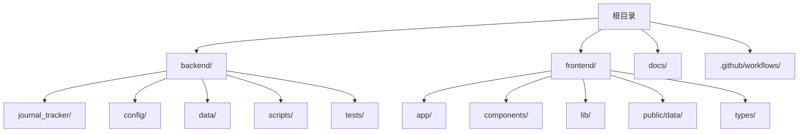
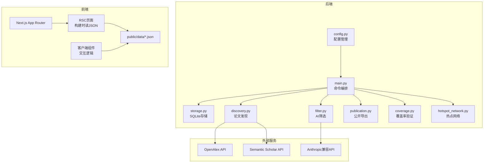
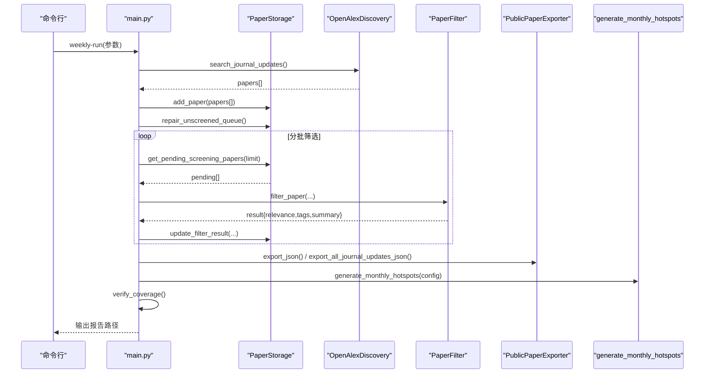
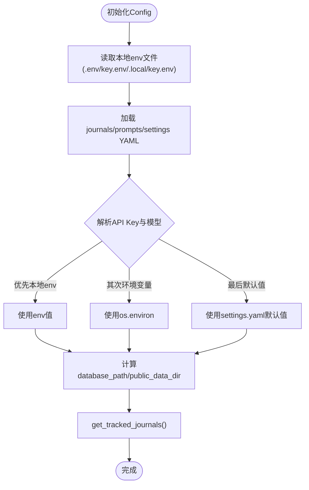
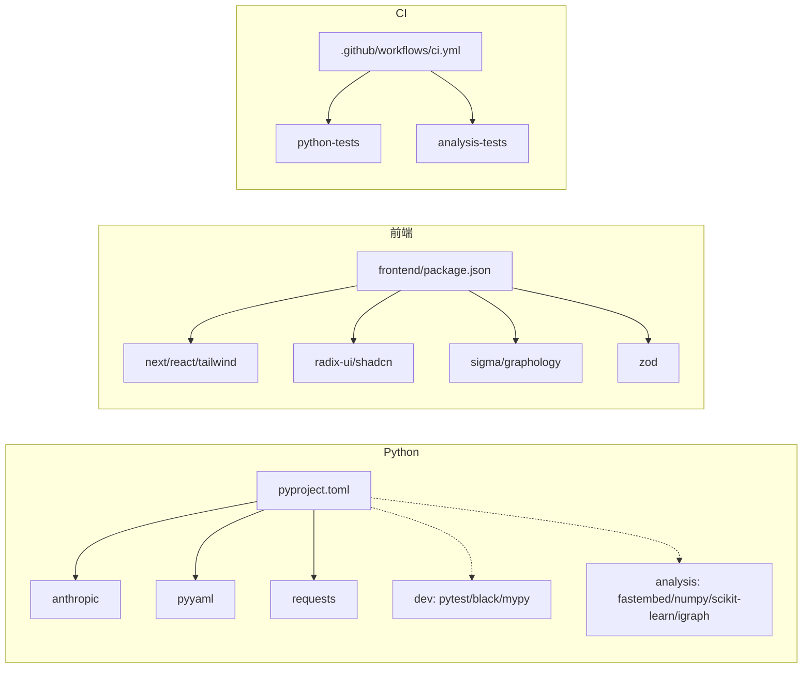

# 开发指南

<cite>
**本文引用的文件**   
- [README.md](file://README.md)
- [pyproject.toml](file://pyproject.toml)
- [frontend/package.json](file://frontend/package.json)
- [AGENTS.md](file://AGENTS.md)
- [CLAUDE.md](file://CLAUDE.md)
- [backend/journal_tracker/main.py](file://backend/journal_tracker/main.py)
- [backend/journal_tracker/config.py](file://backend/journal_tracker/config.py)
- [backend/config/settings.yaml](file://backend/config/settings.yaml)
- [frontend/app/layout.tsx](file://frontend/app/layout.tsx)
- [frontend/next.config.mts](file://frontend/next.config.mts)
- [docs/project-map.md](file://docs/project-map.md)
- [.github/workflows/ci.yml](file://.github/workflows/ci.yml)
- [backend/scripts/run_weekly.ps1](file://backend/scripts/run_weekly.ps1)
- [backend/tests/test_config.py](file://backend/tests/test_config.py)
</cite>

## 目录
1. [简介](#简介)
2. [项目结构](#项目结构)
3. [核心组件](#核心组件)
4. [架构总览](#架构总览)
5. [详细组件分析](#详细组件分析)
6. [依赖关系分析](#依赖关系分析)
7. [性能考量](#性能考量)
8. [故障排查指南](#故障排查指南)
9. [结论](#结论)
10. [附录](#附录)

## 简介
本指南面向Paper-Hot项目的开发者，提供从本地环境搭建、代码组织、开发工作流、测试策略、调试技巧到代码质量与文档规范的完整说明。项目由后端Python包（论文抓取、AI筛选、存储与导出）和前端Next.js静态站点组成，通过GitHub Actions进行CI与自动化发布。

## 项目结构
- 根目录仅保留入口与必要配置；后端源码位于 backend/journal_tracker；前端源码位于 frontend；文档集中于 docs。
- Python包通过 pyproject.toml 声明依赖与可执行脚本；前端使用 pnpm 管理依赖与构建脚本。
- 配置文件集中在 backend/config（journals、prompts、settings、topic_overrides），敏感信息通过 .local/key.env 或环境变量注入。

**图表来源** 
- [docs/project-map.md:24-84](file://docs/project-map.md#L24-L84)

**章节来源**
- [README.md:65-85](file://README.md#L65-L85)
- [docs/project-map.md:24-84](file://docs/project-map.md#L24-L84)

## 核心组件
- 后端主入口与命令编排：main.py 提供 workflow-status、fetch-journals、repair-queue、screen-pending、export-public、verify-coverage、update-public、weekly-run 等命令。
- 配置管理：config.py 统一加载 YAML 配置与环境变量/本地env文件，提供数据库路径、API Key、模型名、红榜期刊列表与热点网络参数。
- 前端布局与构建：layout.tsx 定义站点元数据；next.config.mts 配置静态导出与GitHub Pages子路径。
- 前端脚本与依赖：package.json 定义 dev/build/start/typecheck 脚本与依赖版本。

**章节来源**
- [backend/journal_tracker/main.py:1-120](file://backend/journal_tracker/main.py#L1-L120)
- [backend/journal_tracker/config.py:1-120](file://backend/journal_tracker/config.py#L1-L120)
- [frontend/app/layout.tsx:1-19](file://frontend/app/layout.tsx#L1-L19)
- [frontend/next.config.mts:1-14](file://frontend/next.config.mts#L1-L14)
- [frontend/package.json:1-38](file://frontend/package.json#L1-L38)

## 架构总览
系统采用“后端数据处理 + 前端静态站点”的解耦架构：
- 后端负责数据采集（OpenAlex/Semantic Scholar）、AI筛选、SQLite存储、公开JSON导出、覆盖率验证与热点网络生成。
- 前端在构建时读取 public/data/*.json 进行预渲染，交互部分以客户端组件实现。
- CI流水线在每次推送/PR上运行Python测试与前端构建，并支持每周定时任务更新。

**图表来源** 
- [backend/journal_tracker/main.py:1-120](file://backend/journal_tracker/main.py#L1-L120)
- [backend/journal_tracker/config.py:1-120](file://backend/journal_tracker/config.py#L1-L120)
- [docs/project-map.md:24-84](file://docs/project-map.md#L24-L84)

## 详细组件分析

### 后端主入口与命令编排（main.py）
- 提供多类命令：状态查看、期刊抓取、队列修复、AI筛选、公开数据导出、覆盖率验证、周度工作流等。
- 关键流程：
  - 周度工作流 weekly-run：抓取 → 修复队列 → 分批筛选 → 特征回填 → 公开刷新 → 热点生成 → 覆盖率验证 → 报告输出。
  - 公开刷新 update-public：重筛错误论文 → 公开High论文 → 刷新JSON。
  - 覆盖率验证 verify-coverage：对比OpenAlex与Crossref DOI覆盖情况，输出报告。

**图表来源** 
- [backend/journal_tracker/main.py:556-646](file://backend/journal_tracker/main.py#L556-L646)
- [backend/journal_tracker/main.py:484-541](file://backend/journal_tracker/main.py#L484-L541)
- [backend/journal_tracker/main.py:402-434](file://backend/journal_tracker/main.py#L402-L434)

**章节来源**
- [backend/journal_tracker/main.py:1-120](file://backend/journal_tracker/main.py#L1-L120)
- [backend/journal_tracker/main.py:556-646](file://backend/journal_tracker/main.py#L556-L646)

### 配置管理（config.py）
- 优先级顺序：本地env文件（.env/key.env/.local/key.env）→ 环境变量 → settings.yaml默认值。
- 关键属性：数据库路径、公开数据目录、API Key（Anthropic兼容、Semantic Scholar、OpenAlex）、模型名、提示词模板、热点网络参数、主题覆盖规则。
- 红榜期刊过滤：按 priority（core/watch/skip）返回追踪列表，默认包含 core 与 watch。

**图表来源** 
- [backend/journal_tracker/config.py:24-94](file://backend/journal_tracker/config.py#L24-L94)
- [backend/journal_tracker/config.py:97-156](file://backend/journal_tracker/config.py#L97-L156)
- [backend/journal_tracker/config.py:199-214](file://backend/journal_tracker/config.py#L199-L214)

**章节来源**
- [backend/journal_tracker/config.py:1-120](file://backend/journal_tracker/config.py#L1-L120)
- [backend/config/settings.yaml:1-81](file://backend/config/settings.yaml#L1-L81)

### 前端布局与构建（layout.tsx 与 next.config.mts）
- layout.tsx 设置站点元数据（标题、描述）。
- next.config.mts 启用静态导出 output: export，适配GitHub Pages子路径 basePath/assetPrefix，关闭图片优化以兼容静态托管。

**章节来源**
- [frontend/app/layout.tsx:1-19](file://frontend/app/layout.tsx#L1-L19)
- [frontend/next.config.mts:1-14](file://frontend/next.config.mts#L1-L14)

### 前端脚本与依赖（package.json）
- 脚本：dev、build、start、typecheck（tsc --noEmit）。
- 依赖：Next.js 16、React 19、Tailwind v4、shadcn/ui风格组件库、Sigma.js与Graphology用于图谱可视化、Zod用于运行时校验。

**章节来源**
- [frontend/package.json:1-38](file://frontend/package.json#L1-L38)

## 依赖关系分析
- Python依赖：anthropic、pyyaml、requests；可选dev工具（pytest、black、mypy）与分析扩展（fastembed、numpy、scikit-learn、igraph等）。
- 前端依赖：Next.js生态、UI组件库、图谱可视化库、类型校验库。
- CI依赖：Python 3.9/3.12双版本测试，分析扩展独立job，前端构建与类型检查。

**图表来源** 
- [pyproject.toml:1-49](file://pyproject.toml#L1-L49)
- [frontend/package.json:1-38](file://frontend/package.json#L1-L38)
- [.github/workflows/ci.yml:17-54](file://.github/workflows/ci.yml#L17-L54)

**章节来源**
- [pyproject.toml:1-49](file://pyproject.toml#L1-L49)
- [frontend/package.json:1-38](file://frontend/package.json#L1-L38)
- [.github/workflows/ci.yml:17-54](file://.github/workflows/ci.yml#L17-L54)

## 性能考量
- 后端批量处理：周度工作流对筛选进行分批控制（max_screen_batches），避免单次负载过大；OpenAlex请求间加入延时限制速率。
- 数据导出：公开JSON导出为静态快照，前端构建时直接读取，减少运行时IO。
- 前端构建：静态导出与图片优化关闭提升兼容性；TypeScript严格模式与增量编译加速类型检查。

[本节为通用指导，不直接分析具体文件]

## 故障排查指南
- 环境预检：使用 doctor 命令检查API Key、数据库、公开JSON、关键词等是否就绪。
- 常见问题：
  - 未配置ANTHROPIC_API_KEY或SEMANTIC_SCHOLAR_API_KEY导致筛选失败。
  - 数据库路径错误或权限不足导致写入失败。
  - OpenAlex/Crossref接口限流或超时影响覆盖率验证。
- 日志与报告：
  - Windows计划任务脚本 run_weekly.ps1 会记录运行日志到 backend/data/logs。
  - 覆盖率验证与周度运行报告输出到 backend/data/reports。

**章节来源**
- [backend/journal_tracker/main.py:761-800](file://backend/journal_tracker/main.py#L761-L800)
- [backend/scripts/run_weekly.ps1:1-44](file://backend/scripts/run_weekly.ps1#L1-L44)
- [backend/journal_tracker/main.py:402-434](file://backend/journal_tracker/main.py#L402-L434)

## 结论
Paper-Hot项目通过清晰的模块化设计与严格的配置管理，实现了从数据采集、AI筛选到静态站点发布的完整闭环。开发者应遵循本地环境搭建规范、分支与提交约定、测试与质量门禁，确保迭代稳定可靠。

[本节为总结性内容，不直接分析具体文件]

## 附录

### 本地开发环境搭建
- Python虚拟环境：
  - 创建并激活venv，安装可编辑包：python -m pip install -e .
  - Windows使用 venv\Scripts\activate 与 py -m pip install -e .
- 敏感配置：
  - 将密钥放入 .local/key.env（已忽略git），或通过环境变量注入。
- 前端开发：
  - pnpm --dir frontend install && pnpm --dir frontend dev
  - 类型检查：pnpm --dir frontend typecheck
  - 生产构建：pnpm --dir frontend build

**章节来源**
- [README.md:87-110](file://README.md#L87-L110)
- [README.md:173-180](file://README.md#L173-L180)
- [README.md:192-210](file://README.md#L192-L210)

### 代码组织结构
- 后端包：backend/journal_tracker 下包含 main、config、discovery、filter、storage、publication、coverage、hotspot_* 等模块。
- 前端组件：app（RSC页面）、components（ui与业务组件）、lib（数据与工具）、types（共享类型）、public/data（静态数据）。
- 配置文件：backend/config 下的 journals、prompts、settings、topic_overrides。

**章节来源**
- [docs/project-map.md:24-84](file://docs/project-map.md#L24-L84)

### 开发工作流程
- 分支策略：基于最新 main 创建功能分支，小PR提交，CI通过后合并。
- 提交规范：遵循“小PR”原则，只提交本次改动。
- Pull Request流程：触发CI（Python测试+前端构建），GitHub Pages自动部署。
- 代码审查标准：参考 AGENTS.md 前端设计规范与 CLAUDE.md 安全注意事项。

**章节来源**
- [AGENTS.md:38-43](file://AGENTS.md#L38-L43)
- [CLAUDE.md:26-31](file://CLAUDE.md#L26-L31)
- [.github/workflows/ci.yml:1-15](file://.github/workflows/ci.yml#L1-15)

### 测试策略
- 单元测试：unittest discover backend/tests -v，覆盖配置、发现、筛选、存储、发布、覆盖率、通知、README更新、热点网络等。
- 集成测试：分析扩展job运行热点网络/验证/特性测试；Smoke-test新数据库与CLI。
- 测试数据管理：临时目录与mock模拟API响应，避免污染真实数据。
- 覆盖率要求：建议结合pytest-cov等工具提升覆盖率（当前仓库未强制）。

**章节来源**
- [backend/tests/test_config.py:1-232](file://backend/tests/test_config.py#L1-L232)
- [.github/workflows/ci.yml:17-54](file://.github/workflows/ci.yml#L17-L54)

### 调试技巧与工具
- Python调试器：使用pdb或IDE断点调试main.py命令流程。
- 前端开发者工具：浏览器DevTools检查RSC预渲染结果与客户端交互。
- 日志分析：Windows计划任务脚本输出日志到 backend/data/logs；覆盖率报告在 backend/data/reports。
- 性能监控：关注OpenAlex/Semantic Scholar/AI API调用耗时与限流。

**章节来源**
- [backend/scripts/run_weekly.ps1:1-44](file://backend/scripts/run_weekly.ps1#L1-L44)
- [backend/journal_tracker/main.py:761-800](file://backend/journal_tracker/main.py#L761-L800)

### 代码质量保证
- 静态检查：mypy（pyproject.toml配置），前端tsc --noEmit。
- 格式化：black（line-length=100，target-version py39+）。
- 安全扫描：禁止提交 .local/key.env、papers.db、本地二维码与工具状态。
- 依赖审计：定期更新依赖，关注CVE与版本兼容性。

**章节来源**
- [pyproject.toml:40-49](file://pyproject.toml#L40-L49)
- [CLAUDE.md:26-31](file://CLAUDE.md#L26-L31)

### 文档编写规范
- 代码注释：函数级docstring说明用途、参数、返回值。
- API文档：README.md维护命令与状态；docs/project-map.md维护文件职责。
- 用户手册：README.md提供本地搭建与常用命令；AGENTS.md提供前端设计约定。
- 维护记录：docs/archive归档历史规划与评审文档。

**章节来源**
- [README.md:1-28](file://README.md#L1-L28)
- [docs/project-map.md:1-23](file://docs/project-map.md#L1-L23)
- [AGENTS.md:1-11](file://AGENTS.md#L1-L11)

### 常见开发问题与解决方案
- 问题：AI筛选失败（error状态）
  - 解决：检查ANTHROPIC_API_KEY与AI_MODEL配置；使用 refilter_error_papers 重筛。
- 问题：覆盖率验证缺失DOI
  - 解决：确认OpenAlex与Crossref API Key；检查网络与限流；查看 coverage_latest.json 报告。
- 问题：前端构建失败
  - 解决：检查Node版本（>=20.9.0）；清理node_modules后重新安装；确认basePath配置。

**章节来源**
- [backend/journal_tracker/main.py:717-758](file://backend/journal_tracker/main.py#L717-L758)
- [backend/journal_tracker/main.py:402-434](file://backend/journal_tracker/main.py#L402-L434)
- [frontend/package.json:901-936](file://frontend/package.json#L901-L936)