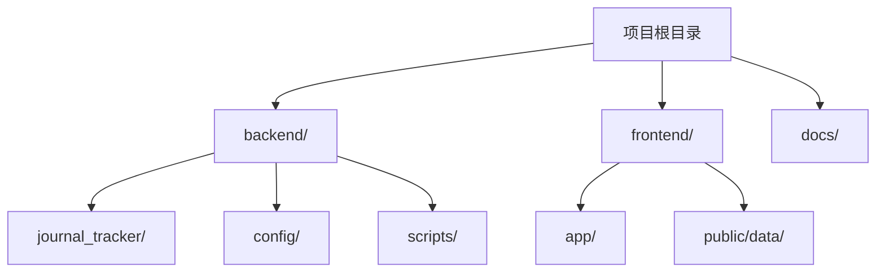
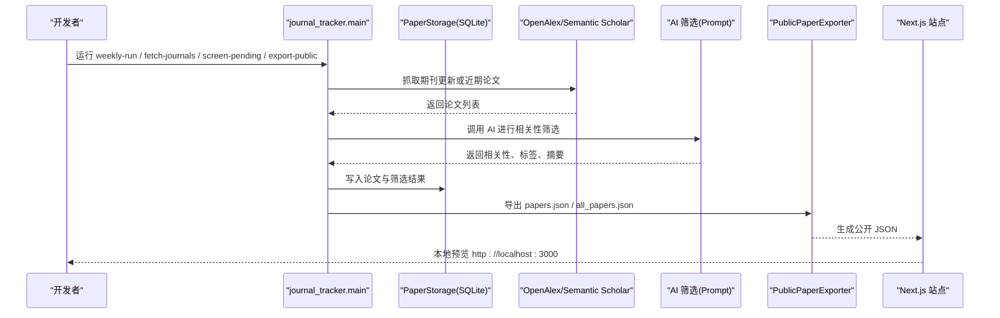

# 快速开始

<cite>
**本文引用的文件**   
- [README.md](file://README.md)
- [pyproject.toml](file://pyproject.toml)
- [frontend/package.json](file://frontend/package.json)
- [backend/config/settings.yaml](file://backend/config/settings.yaml)
- [backend/config/journals.yaml](file://backend/config/journals.yaml)
- [backend/config/prompts.yaml](file://backend/config/prompts.yaml)
- [backend/journal_tracker/config.py](file://backend/journal_tracker/config.py)
- [backend/journal_tracker/main.py](file://backend/journal_tracker/main.py)
- [backend/scripts/run_weekly.ps1](file://backend/scripts/run_weekly.ps1)
- [docs/automation.md](file://docs/automation.md)
- [CLAUDE.md](file://CLAUDE.md)
</cite>

## 目录
1. [简介](#简介)
2. [项目结构](#项目结构)
3. [核心组件](#核心组件)
4. [架构总览](#架构总览)
5. [详细组件分析](#详细组件分析)
6. [依赖关系分析](#依赖关系分析)
7. [性能注意事项](#性能注意事项)
8. [故障排除指南](#故障排除指南)
9. [结论](#结论)
10. [附录](#附录)

## 简介
Paper-Hot 是一个面向计算传播研究的论文情报站。它以团队红榜期刊为稳定数据源，定期抓取更新，使用 AI 筛选出相关论文并生成摘要、标签与推荐理由，最终发布到静态网站和推送渠道。本快速开始指南将帮助你在 30 分钟内完成本地环境搭建、配置密钥、运行首次工作流，并导出公开数据。

## 项目结构
- 后端（Python）：负责数据采集、AI 筛选、存储与导出，入口模块位于 backend/journal_tracker。
- 前端（Next.js + TypeScript）：提供静态站点展示，读取 public/data/*.json 数据。
- 配置与脚本：后端配置文件在 backend/config；Windows 自动化脚本在 backend/scripts。



**章节来源**
- [README.md:65-85](file://README.md#L65-L85)

## 核心组件
- 配置管理：从 .env/key.env/.local/key.env、环境变量与 settings.yaml 加载 API Key、模型名、数据库路径等。
- 工作流主入口：提供 weekly-run、fetch-journals、screen-pending、export-public、verify-coverage、update-public 等命令。
- 前端构建与开发：通过 pnpm 安装依赖并启动 Next.js 开发服务器。

**章节来源**
- [backend/journal_tracker/config.py:24-42](file://backend/journal_tracker/config.py#L24-L42)
- [backend/journal_tracker/main.py:111-178](file://backend/journal_tracker/main.py#L111-L178)
- [frontend/package.json:5-10](file://frontend/package.json#L5-L10)

## 架构总览
下图展示了“采集 → 筛选 → 存储 → 导出 → 前端展示”的端到端流程。



**图表来源**
- [backend/journal_tracker/main.py:171-240](file://backend/journal_tracker/main.py#L171-L240)
- [backend/journal_tracker/main.py:353-399](file://backend/journal_tracker/main.py#L353-L399)
- [backend/journal_tracker/main.py:484-494](file://backend/journal_tracker/main.py#L484-L494)

**章节来源**
- [backend/journal_tracker/main.py:556-646](file://backend/journal_tracker/main.py#L556-L646)

## 详细组件分析

### 环境与依赖要求
- Python 版本：>=3.9（推荐 3.12），用于运行后端与测试。
- Node.js 与包管理器：Node.js（CI 使用 v22）、pnpm（CI 使用 v10）。
- 可选分析依赖：analysis 组包含 fastembed、numpy、scikit-learn、scipy、igraph（非必需）。

**章节来源**
- [pyproject.toml:7-12](file://pyproject.toml#L7-L12)
- [pyproject.toml:14-27](file://pyproject.toml#L14-L27)
- [.github/workflows/ci.yml:56-78](file://.github/workflows/ci.yml#L56-L78)

### 安装步骤（虚拟环境与依赖）
- 创建并激活 Python 虚拟环境。
- 以可编辑模式安装后端包。
- 安装前端依赖并启动开发服务器。

```bash
python3 -m venv venv
source venv/bin/activate
python -m pip install -e .
pnpm --dir frontend install
pnpm --dir frontend dev
```

Windows 激活方式见 README。

**章节来源**
- [README.md:87-98](file://README.md#L87-L98)
- [README.md:173-180](file://README.md#L173-L180)

### 配置文件与环境变量
- 敏感信息存放位置：.local/key.env（被 gitignore 忽略），也支持 .env 与 key.env。
- 必需环境变量：
  - ANTHROPIC_API_KEY：Anthropic 兼容接口（如 DeepSeek）API Key。
  - SEMANTIC_SCHOLAR_API_KEY：Semantic Scholar API Key（可选但建议配置）。
  - OPENALEX_API_KEY：OpenAlex API Key（可选，提高请求限制）。
- 其他常用变量：
  - ANTHROPIC_BASE_URL：指定 Anthropic 兼容 Base URL。
  - AI_MODEL：指定筛选模型名称（默认 deepseek-v4-flash）。
  - SERVERCHAN_SCKEY：Server酱通知密钥（可选）。

配置优先级：.env/key.env/.local/key.env > 环境变量 > settings.yaml。

**章节来源**
- [README.md:99-109](file://README.md#L99-L109)
- [backend/journal_tracker/config.py:24-42](file://backend/journal_tracker/config.py#L24-L42)
- [backend/journal_tracker/config.py:96-156](file://backend/journal_tracker/config.py#L96-L156)
- [backend/config/settings.yaml:1-25](file://backend/config/settings.yaml#L1-L25)

### 基本使用示例（核心命令）
- 查看工作流状态：workflow-status
- 抓取红榜期刊更新：fetch-journals（可设置每刊上限）
- 修复本地队列与隔离脏数据：repair-queue
- 使用 AI 筛选待处理论文：screen-pending（可设置批次限制）
- 导出公开数据：export-public
- 刷新 README 统计与精选预览：readme_update
- 验证 OpenAlex 覆盖度：verify-coverage
- 运行每周工作流（推荐）：weekly-run（含抓取、筛选、导出、热点生成、覆盖率校验）
- Windows 自动化包装：run_weekly.ps1

```bash
python -m journal_tracker.main workflow-status
python -m journal_tracker.main fetch-journals --limit-per-journal 100
python -m journal_tracker.main repair-queue
python -m journal_tracker.main screen-pending --limit 20
python -m journal_tracker.main export-public
python -m journal_tracker.readme_update
python -m journal_tracker.main verify-coverage
python -m journal_tracker.main weekly-run --limit-per-journal 100 --screen-limit 50 --max-screen-batches 10 --refilter-limit 10
powershell -NoProfile -ExecutionPolicy Bypass -File .\backend\scripts\run_weekly.ps1
```

**章节来源**
- [README.md:111-178](file://README.md#L111-L178)
- [CLAUDE.md:33-45](file://CLAUDE.md#L33-L45)
- [backend/scripts/run_weekly.ps1:29-41](file://backend/scripts/run_weekly.ps1#L29-L41)

### 首次运行工作流（30 分钟指南）
1) 准备环境
- 安装 Python >=3.9（推荐 3.12）、Node.js（v22）、pnpm（v10）。
- 创建并激活虚拟环境，安装后端与前端依赖。

2) 配置密钥
- 在项目根目录创建 .local/key.env，填入 ANTHROPIC_API_KEY、SEMANTIC_SCHOLAR_API_KEY 等。
- 如需自定义 Base URL 或模型名，同时设置 ANTHROPIC_BASE_URL、AI_MODEL。

3) 运行工作流
- 执行 weekly-run 完成抓取、筛选、导出与热点生成。
- 检查输出：backend/data/reports/weekly_run_*.json、frontend/public/data/papers.json 与 all_papers.json。

4) 启动前端
- 进入 frontend 目录，运行 pnpm dev，打开浏览器访问 http://localhost:3000。

5) 验证与调试
- 使用 workflow-status 查看状态，verify-coverage 检查覆盖率报告。
- 若出现筛选错误，使用 refilter-error 或 update-public 重试并重导。

**章节来源**
- [docs/automation.md:41-57](file://docs/automation.md#L41-L57)
- [backend/journal_tracker/main.py:556-646](file://backend/journal_tracker/main.py#L556-L646)
- [backend/journal_tracker/main.py:661-685](file://backend/journal_tracker/main.py#L661-L685)

### 获取期刊更新
- 使用 fetch-journals 拉取红榜期刊最新论文，按每刊 limit 控制数量。
- 数据去重后进入 pending 队列，等待 AI 筛选。

**章节来源**
- [backend/journal_tracker/main.py:171-240](file://backend/journal_tracker/main.py#L171-L240)

### AI 筛选论文
- 使用 screen-pending 对 pending 队列中的论文进行 AI 筛选。
- 筛选结果包括相关性（High/Medium/Low）、标签、摘要与理由。
- 失败条目会被标记为 error，可通过 refilter-error 重试。

**章节来源**
- [backend/journal_tracker/main.py:353-399](file://backend/journal_tracker/main.py#L353-L399)
- [backend/config/prompts.yaml:4-64](file://backend/config/prompts.yaml#L4-L64)

### 导出公开数据
- export-public 会导出 papers.json（精选）与 all_papers.json（全量更新）。
- update-public 会重筛错误论文、公开 High 论文并刷新公开 JSON。

**章节来源**
- [backend/journal_tracker/main.py:484-494](file://backend/journal_tracker/main.py#L484-L494)
- [backend/journal_tracker/main.py:543-553](file://backend/journal_tracker/main.py#L543-L553)

## 依赖关系分析
- 后端依赖：anthropic、pyyaml、requests 等。
- 前端依赖：Next.js、React、Tailwind CSS v4、shadcn/ui 等。
- CI 环境：Python 3.9/3.12、Node.js 22、pnpm 10。

```mermaid
graph LR
subgraph "后端"
P["pyproject.toml"] --> A["anthropic"]
P --> Y["pyyaml"]
P --> R["requests"]
end
subgraph "前端"
F["frontend/package.json"] --> N["next"]
F --> React["react/react-dom"]
F --> Tailwind["tailwindcss"]
end
subgraph "CI"
CI[".github/workflows/ci.yml"] --> Py["Python 3.9/3.12"]
CI --> Node["Node.js 22"]
CI --> Pnpm["pnpm 10"]
end
```

**图表来源**
- [pyproject.toml:7-12](file://pyproject.toml#L7-L12)
- [frontend/package.json:11-27](file://frontend/package.json#L11-L27)
- [.github/workflows/ci.yml:56-78](file://.github/workflows/ci.yml#L56-L78)

**章节来源**
- [pyproject.toml:7-27](file://pyproject.toml#L7-L27)
- [frontend/package.json:11-36](file://frontend/package.json#L11-L36)
- [.github/workflows/ci.yml:56-78](file://.github/workflows/ci.yml#L56-L78)

## 性能注意事项
- 批量筛选时合理设置 screen-limit 与 max-screen-batches，避免单次请求过多导致超时。
- OpenAlex 与 Crossref 请求存在速率限制，必要时配置 OPENALEX_API_KEY 提升配额。
- SQLite 作为本地数据库适合小规模运行；生产环境建议迁移至托管数据库以提升并发与持久性。

[本节为通用指导，不直接分析具体文件]

## 故障排除指南
- 常见问题
  - 未找到 API Key：确认 .local/key.env 已正确配置 ANTHROPIC_API_KEY、SEMANTIC_SCHOLAR_API_KEY。
  - 筛选报错：使用 refilter-error 重试；检查 prompts.yaml 与模型名是否正确。
  - 无新论文：检查 fetch-journals 的 limit_per_journal 与时间范围设置。
  - 前端无法读取数据：确保 export-public 或 update-public 已运行，papers.json 与 all_papers.json 存在。
- 诊断命令
  - workflow-status：查看统计与状态。
  - verify-coverage：生成覆盖率报告，定位缺失 DOI。
  - readme_update：刷新 README 统计与精选预览。

**章节来源**
- [backend/journal_tracker/main.py:661-685](file://backend/journal_tracker/main.py#L661-L685)
- [backend/journal_tracker/main.py:402-434](file://backend/journal_tracker/main.py#L402-L434)
- [backend/journal_tracker/main.py:717-758](file://backend/journal_tracker/main.py#L717-L758)

## 结论
通过本指南，你已完成 Paper-Hot 的本地环境搭建、密钥配置与首次工作流运行，并能导出公开数据与启动前端站点。后续可按周执行 weekly-run 保持数据更新，结合 verify-coverage 与 readme_update 维护站点质量。

[本节为总结，不直接分析具体文件]

## 附录
- 推荐命令速查
  - 状态与导出：workflow-status、export-public、update-public
  - 抓取与修复：fetch-journals、repair-queue
  - 筛选与验证：screen-pending、verify-coverage
  - 每周工作流：weekly-run（含参数调优）
  - Windows 自动化：run_weekly.ps1

**章节来源**
- [CLAUDE.md:33-45](file://CLAUDE.md#L33-L45)
- [backend/scripts/run_weekly.ps1:29-41](file://backend/scripts/run_weekly.ps1#L29-L41)