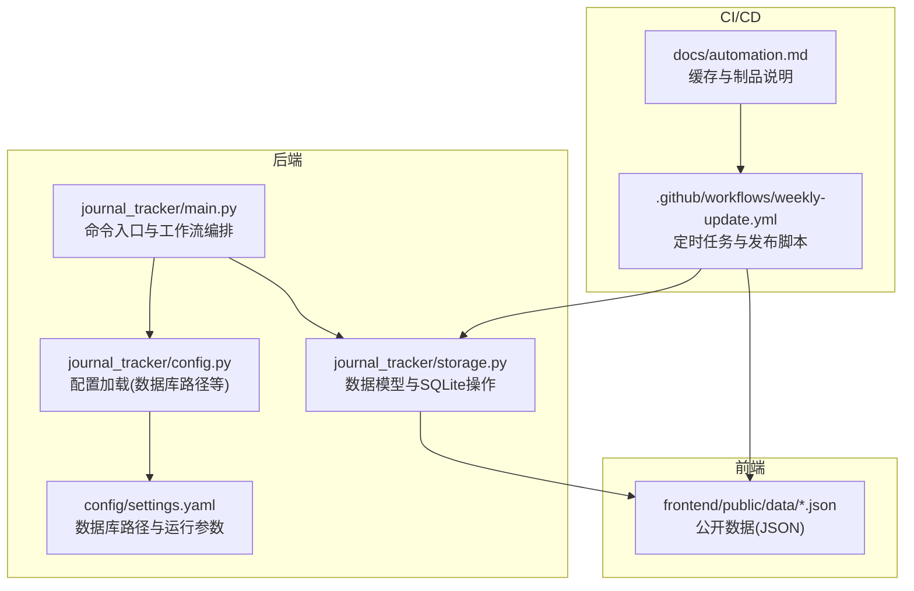
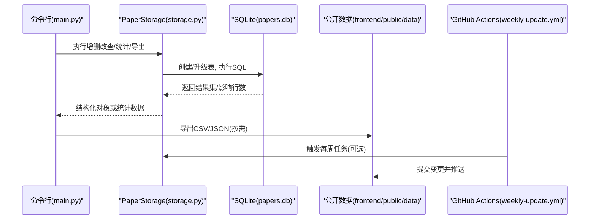
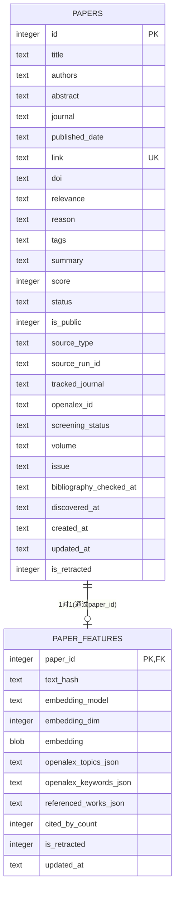
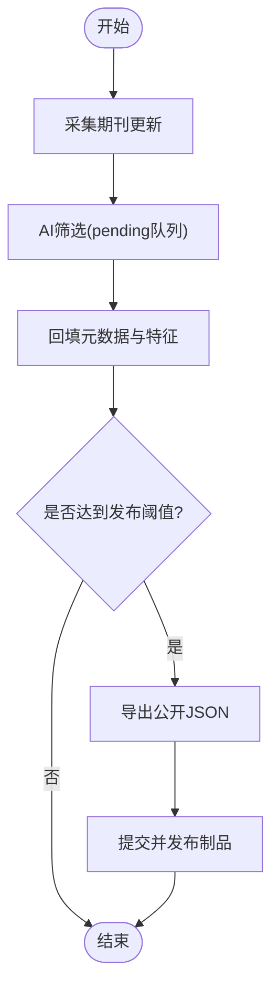
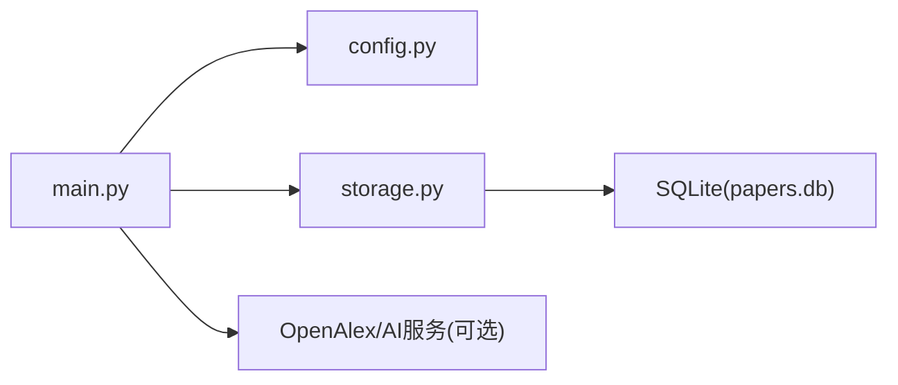

# 数据库设计

<cite>
**本文引用的文件**   
- [storage.py](file://backend/journal_tracker/storage.py)
- [config.py](file://backend/journal_tracker/config.py)
- [settings.yaml](file://backend/config/settings.yaml)
- [main.py](file://backend/journal_tracker/main.py)
- [test_storage_workflow.py](file://backend/tests/test_storage_workflow.py)
- [automation.md](file://docs/automation.md)
- [weekly-update.yml](file://.github/workflows/weekly-update.yml)
</cite>

## 目录
1. [简介](#简介)
2. [项目结构](#项目结构)
3. [核心组件](#核心组件)
4. [架构总览](#架构总览)
5. [详细组件分析](#详细组件分析)
6. [依赖关系分析](#依赖关系分析)
7. [性能考虑](#性能考虑)
8. [故障排查指南](#故障排查指南)
9. [结论](#结论)
10. [附录](#附录)

## 简介
本文件为 Paper-Hot 项目的 SQLite 数据库设计文档，聚焦于论文追踪与热点分析的数据模型、索引与查询优化、事务与一致性、版本迁移与备份恢复、数据导入导出、监控与维护等。系统以本地 SQLite 作为工作存储，配合 GitHub Actions 的缓存与制品机制实现可重复构建与发布流程。

## 项目结构
- 后端工作流与数据存储位于 backend/journal_tracker，其中 storage.py 定义数据模型、表结构与访问方法；config.py 提供配置加载（含数据库路径）；settings.yaml 指定数据库路径与运行参数。
- 前端公开数据由后端导出到 frontend/public/data，供静态站点消费。
- 自动化与发布通过 .github/workflows/weekly-update.yml 驱动，结合 docs/automation.md 描述的缓存策略。

图表来源
- [storage.py:64-152](file://backend/journal_tracker/storage.py#L64-L152)
- [config.py:70-94](file://backend/journal_tracker/config.py#L70-L94)
- [settings.yaml:40-44](file://backend/config/settings.yaml#L40-L44)
- [main.py:842-969](file://backend/journal_tracker/main.py#L842-L969)
- [weekly-update.yml:195-209](file://.github/workflows/weekly-update.yml#L195-L209)
- [automation.md:24-37](file://docs/automation.md#L24-L37)

章节来源
- [storage.py:64-152](file://backend/journal_tracker/storage.py#L64-L152)
- [config.py:70-94](file://backend/journal_tracker/config.py#L70-L94)
- [settings.yaml:40-44](file://backend/config/settings.yaml#L40-L44)
- [main.py:842-969](file://backend/journal_tracker/main.py#L842-L969)
- [automation.md:24-37](file://docs/automation.md#L24-L37)
- [weekly-update.yml:195-209](file://.github/workflows/weekly-update.yml#L195-L209)

## 核心组件
- 数据模型
  - Paper：论文实体，包含标题、作者、摘要、期刊、发表日期、链接、DOI、相关性、标签、摘要、评分、状态、公开标记、来源类型、来源运行ID、跟踪期刊、OpenAlex ID、筛选状态、卷期信息、时间戳、撤回标记等。
  - PaperFeatures：每篇论文的扩展特征，包括文本哈希、嵌入模型与维度、嵌入向量（BLOB）、OpenAlex主题/关键词/引用列表JSON、被引次数、撤回标记、更新时间。
- 存储层
  - PaperStorage：封装 SQLite 连接管理、表初始化与演进、CRUD、批量更新、统计、导出等功能。
- 配置层
  - Config：加载环境变量与 YAML 配置，提供 database_path、public_data_dir 等关键路径属性。
- 工作流入口
  - main.py：命令行入口，调度采集、筛选、回填、发布、热点网络构建等子命令。

章节来源
- [storage.py:13-62](file://backend/journal_tracker/storage.py#L13-L62)
- [storage.py:64-152](file://backend/journal_tracker/storage.py#L64-L152)
- [config.py:70-94](file://backend/journal_tracker/config.py#L70-L94)
- [main.py:842-969](file://backend/journal_tracker/main.py#L842-L969)

## 架构总览
下图展示从 CLI 命令到数据库操作的调用链，以及公开数据的生成与发布流程。

图表来源
- [main.py:842-969](file://backend/journal_tracker/main.py#L842-L969)
- [storage.py:64-152](file://backend/journal_tracker/storage.py#L64-L152)
- [weekly-update.yml:195-209](file://.github/workflows/weekly-update.yml#L195-L209)

## 详细组件分析

### 数据模型与表结构
- papers 表
  - 主键：id（自增整数）
  - 唯一约束：link（UNIQUE）
  - 关键字段：title、authors、abstract、journal、published_date、doi、relevance、reason、tags、summary、score、status、is_public、source_type、source_run_id、tracked_journal、openalex_id、screening_status、volume、issue、bibliography_checked_at、discovered_at、created_at、updated_at、is_retracted
- paper_features 表
  - 主键：paper_id（外键关联 papers.id）
  - 字段：text_hash、embedding_model、embedding_dim、embedding（BLOB）、openalex_topics_json、openalex_keywords_json、referenced_works_json、cited_by_count、is_retracted、updated_at

图表来源
- [storage.py:86-132](file://backend/journal_tracker/storage.py#L86-L132)

章节来源
- [storage.py:86-132](file://backend/journal_tracker/storage.py#L86-L132)

### 索引设计与查询优化
- 现有索引
  - idx_papers_link：加速按链接查找
  - idx_papers_doi：加速按DOI查找
  - idx_papers_relevance：按相关性过滤
  - idx_papers_is_public：按公开状态过滤
  - idx_papers_screening_status：按筛选状态过滤
  - idx_papers_source_type：按来源类型过滤
- 复合索引建议
  - (screening_status, source_type)：用于“待筛选队列”查询
  - (is_public, published_date)：用于公开数据排序导出
  - (source_type, screening_status, published_date)：用于复杂筛选+排序
- 查询优化要点
  - 使用参数化查询避免注入与解析开销
  - 限制 LIMIT 与合理 ORDER BY 字段，减少全表扫描
  - 对大字段（如摘要、嵌入）按需加载，避免不必要读取

章节来源
- [storage.py:134-151](file://backend/journal_tracker/storage.py#L134-L151)
- [storage.py:341-358](file://backend/journal_tracker/storage.py#L341-L358)
- [storage.py:449-460](file://backend/journal_tracker/storage.py#L449-L460)

### 数据完整性与约束
- 主键与唯一性
  - papers.id 自增主键
  - papers.link 唯一约束，防止重复插入
- 外键约束
  - paper_features.paper_id 引用 papers.id，确保特征与论文一一对应
- 默认值与布尔映射
  - is_public、is_retracted 在 SQLite 中以 INTEGER 存储，读取时转换为布尔
- 数据校验
  - paper_exists 支持 link 或 doi 任一匹配去重检查

章节来源
- [storage.py:86-132](file://backend/journal_tracker/storage.py#L86-L132)
- [storage.py:229-244](file://backend/journal_tracker/storage.py#L229-L244)
- [storage.py:507-511](file://backend/journal_tracker/storage.py#L507-L511)

### 版本控制与迁移策略
- 表结构初始化
  - _init_database 负责 CREATE TABLE IF NOT EXISTS
- 向后兼容与字段补齐
  - _ensure_columns 通过 PRAGMA table_info 检测缺失列并 ALTER TABLE ADD COLUMN
  - 历史数据修复：将旧 relevance/unscreened 映射到新的 screening_status，设置默认 source_type 与 discovered_at
- 迁移实践建议
  - 新增字段时统一在 _ensure_columns 中声明补齐逻辑
  - 对历史数据修复采用幂等 UPDATE 语句，避免重复执行副作用

章节来源
- [storage.py:82-116](file://backend/journal_tracker/storage.py#L82-L116)
- [storage.py:154-194](file://backend/journal_tracker/storage.py#L154-L194)

### 事务处理与并发控制
- 连接上下文
  - _get_connection 使用 contextmanager 管理连接生命周期，自动关闭
- 事务边界
  - INSERT/UPDATE 后显式 conn.commit()，保证原子性
- 并发与锁
  - SQLite 单写者模型，写入互斥；读多写少场景适合该模式
  - 批量操作建议分批次提交，降低长事务风险

章节来源
- [storage.py:72-80](file://backend/journal_tracker/storage.py#L72-L80)
- [storage.py:208-227](file://backend/journal_tracker/storage.py#L208-L227)
- [storage.py:292-301](file://backend/journal_tracker/storage.py#L292-L301)

### 数据访问层抽象
- ORM 风格
  - Paper 与 PaperFeatures 为 dataclass，便于结构化读写
- 查询构建器
  - get_papers 等方法动态拼接 WHERE 条件与 ORDER BY/LIMIT
- 连接池
  - 当前未实现连接池，每次请求新建连接；在高并发下可引入连接池或改用 WAL 模式提升并发读性能

章节来源
- [storage.py:13-62](file://backend/journal_tracker/storage.py#L13-L62)
- [storage.py:266-290](file://backend/journal_tracker/storage.py#L266-L290)

### 数据导入导出与清理
- 导出
  - export_to_csv：按固定字段集导出 CSV，便于离线分析与审计
- 导入
  - add_paper：INSERT OR IGNORE 防重；支持批量插入（调用方循环）
- 清理策略
  - 基于 screening_status/source_type 的分区清理（如 quarantined 归档）
  - 定期 VACUUM 与 ANALYZE 维护索引与统计信息

章节来源
- [storage.py:683-706](file://backend/journal_tracker/storage.py#L683-L706)
- [storage.py:196-227](file://backend/journal_tracker/storage.py#L196-L227)

### 监控与维护工具
- 统计接口
  - get_statistics：总数、相关性分布、状态分布、筛选状态分布、本周新增
- 诊断命令
  - doctor：检查 API Key、数据库存在性、公开 JSON、关键词配置
- 工作流状态
  - workflow-status：显示采集、筛选、发布阶段状态

章节来源
- [storage.py:632-681](file://backend/journal_tracker/storage.py#L632-L681)
- [main.py:770-802](file://backend/journal_tracker/main.py#L770-L802)
- [main.py:869-876](file://backend/journal_tracker/main.py#L869-L876)

### 工作流与数据生命周期
- 采集与筛选
  - weekly-run：按期刊优先顺序采集、筛选、发布与覆盖验证
  - screen-pending：批量筛选 pending 队列
  - repair-queue：修复历史 Unscreened 数据分流
- 回填与增强
  - backfill-bibliography：用 OpenAlex 回填卷期与 OpenAlex ID
  - backfill-features：回填 topics/keywords/references/citations
- 发布与制品
  - export-public/publish-high/update-public：生成公开 JSON 并提交至仓库
  - weekly-update.yml：定时任务与提交逻辑

图表来源
- [main.py:926-936](file://backend/journal_tracker/main.py#L926-L936)
- [weekly-update.yml:195-209](file://.github/workflows/weekly-update.yml#L195-L209)

章节来源
- [main.py:926-936](file://backend/journal_tracker/main.py#L926-L936)
- [automation.md:24-37](file://docs/automation.md#L24-L37)
- [weekly-update.yml:195-209](file://.github/workflows/weekly-update.yml#L195-L209)

## 依赖关系分析
- 模块耦合
  - main.py 依赖 config.py 获取路径与配置，依赖 storage.py 进行数据操作
  - storage.py 直接操作 SQLite，不依赖外部 ORM
- 外部依赖
  - OpenAlex API（可选）用于元数据与特征回填
  - AI 服务（Anthropic兼容）用于筛选与热点归纳
- 潜在循环依赖
  - 当前无循环依赖；storage.py 仅被上层模块调用

图表来源
- [main.py:842-969](file://backend/journal_tracker/main.py#L842-L969)
- [config.py:70-94](file://backend/journal_tracker/config.py#L70-L94)
- [storage.py:64-152](file://backend/journal_tracker/storage.py#L64-L152)

章节来源
- [main.py:842-969](file://backend/journal_tracker/main.py#L842-L969)
- [config.py:70-94](file://backend/journal_tracker/config.py#L70-L94)
- [storage.py:64-152](file://backend/journal_tracker/storage.py#L64-L152)

## 性能考虑
- 索引策略
  - 针对高频查询添加复合索引，减少回表与排序成本
- 查询优化
  - 限制返回字段与记录数，避免大结果集传输
  - 使用 EXPLAIN QUERY PLAN 分析慢查询
- 存储优化
  - 启用 WAL 模式提升并发读性能
  - 定期 VACUUM 回收空间，ANALYZE 更新统计
- 批处理
  - 批量插入/更新减少事务开销
  - 分批提交避免长事务锁竞争

[本节为通用指导，不直接分析具体文件]

## 故障排查指南
- 常见问题
  - 数据库路径不存在：检查 settings.yaml 与 Config.database_path
  - 筛选失败重试：使用 refilter-errors 命令拉取 error 状态论文
  - 公开数据未更新：检查 update-public 与 weekly-update.yml 提交逻辑
- 诊断步骤
  - 运行 doctor 检查环境依赖
  - 查看 statistics 与筛选状态分布定位瓶颈
  - 使用测试用例复现问题（参考 test_storage_workflow.py）

章节来源
- [main.py:770-802](file://backend/journal_tracker/main.py#L770-L802)
- [storage.py:632-681](file://backend/journal_tracker/storage.py#L632-L681)
- [test_storage_workflow.py:1-188](file://backend/tests/test_storage_workflow.py#L1-L188)

## 结论
Paper-Hot 的 SQLite 数据模型围绕论文生命周期展开，具备完善的表结构、索引与迁移机制。通过 CLI 工作流与 CI/CD 协作，实现了从采集、筛选、回填到发布的完整闭环。建议在后续迭代中引入连接池、WAL 模式与更细粒度的复合索引，以进一步提升并发与查询性能。

[本节为总结，不直接分析具体文件]

## 附录
- 配置项速览
  - database.path：SQLite 数据库路径
  - anthropic_api_key/base_url：AI 服务密钥与端点
  - hotspot_network.*：热点网络构建参数
- 常用命令
  - weekly-run：执行每周全流程
  - export/export-public：导出 CSV/公开 JSON
  - backfill-*：回填元数据与特征
  - doctor/list/stats/refilter-errors：诊断与管理

章节来源
- [settings.yaml:1-81](file://backend/config/settings.yaml#L1-L81)
- [main.py:842-969](file://backend/journal_tracker/main.py#L842-L969)