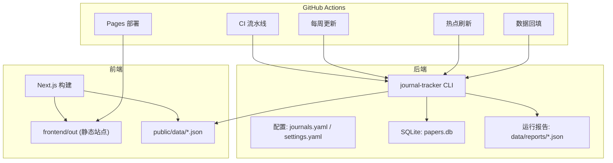
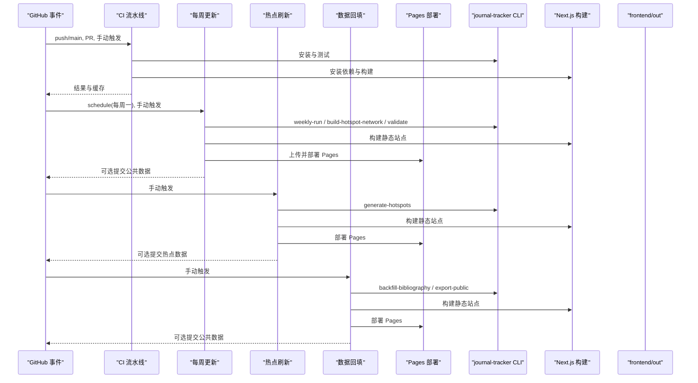
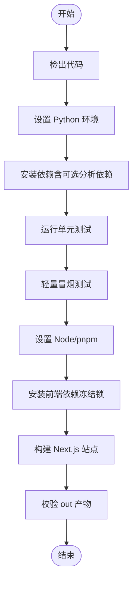
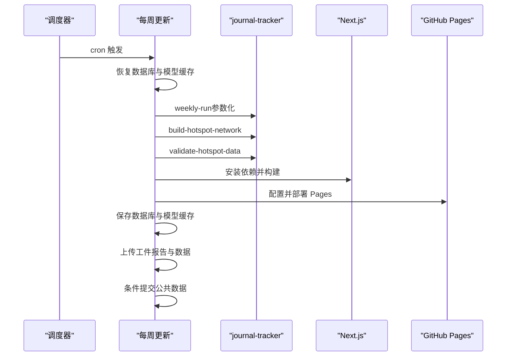
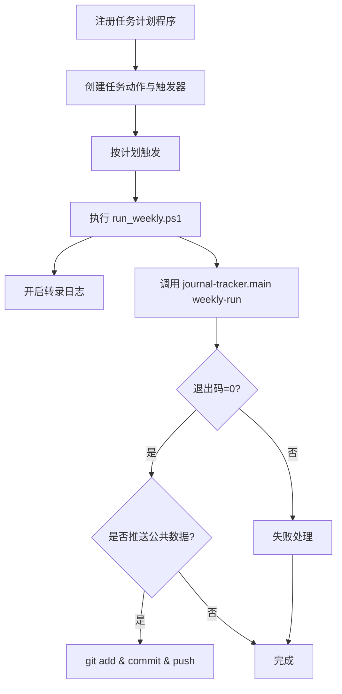
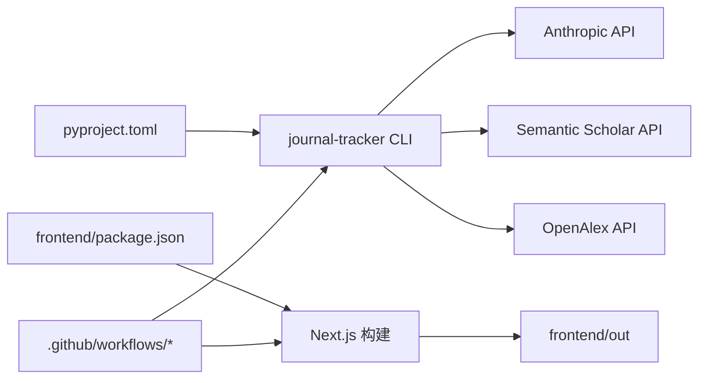

# 自动化部署

<cite>
**本文引用的文件**   
- [ci.yml](file://.github/workflows/ci.yml)
- [deploy-pages.yml](file://.github/workflows/deploy-pages.yml)
- [weekly-update.yml](file://.github/workflows/weekly-update.yml)
- [refresh-hotspots.yml](file://.github/workflows/refresh-hotspots.yml)
- [backfill-issue-metadata.yml](file://.github/workflows/backfill-issue-metadata.yml)
- [jcmc-2026-backfill.yml](file://.github/workflows/jcmc-2026-backfill.yml)
- [register_weekly_task.ps1](file://backend/scripts/register_weekly_task.ps1)
- [run_weekly.ps1](file://backend/scripts/run_weekly.ps1)
- [run_tracker.sh](file://backend/scripts/run_tracker.sh)
- [pyproject.toml](file://pyproject.toml)
- [package.json](file://frontend/package.json)
- [next.config.mts](file://frontend/next.config.mts)
- [settings.yaml](file://backend/config/settings.yaml)
- [journals.yaml](file://backend/config/journals.yaml)
- [README.md](file://README.md)
</cite>

## 目录
1. [简介](#简介)
2. [项目结构](#项目结构)
3. [核心组件](#核心组件)
4. [架构总览](#架构总览)
5. [详细组件分析](#详细组件分析)
6. [依赖关系分析](#依赖关系分析)
7. [性能考量](#性能考量)
8. [故障排查指南](#故障排查指南)
9. [结论](#结论)
10. [附录](#附录)

## 简介
本文件为 Paper-Hot 自动化部署系统的综合文档，覆盖 GitHub Actions 工作流设计、CI 流水线、每周更新任务与静态站点部署的完整配置；解释持续集成流程（Python 测试、前端构建验证、代码质量检查与依赖更新）；详述每周自动更新工作流（定时调度、数据同步、AI 筛选与网站更新）；说明 GitHub Pages 部署配置（静态站点生成、域名绑定、HTTPS 与 CDN 加速）；介绍 Windows 本地自动化脚本（任务计划程序、PowerShell 执行与环境隔离）；提供监控、日志、告警与手动触发机制；并给出回滚策略、版本管理与发布流程，以及环境变量、Secret 管理与权限控制的最佳实践。

## 项目结构
Paper-Hot 采用前后端分离与多工作流协同：
- 后端 Python CLI（journal-tracker）负责论文抓取、AI 筛选、热点网络构建与公共数据导出
- 前端 Next.js 静态站点消费 public/data 下的 JSON 数据，构建后输出到 frontend/out
- GitHub Actions 编排 CI、Pages 部署、每周更新、热点刷新与数据回填等任务
- 配置文件集中于 backend/config，包含期刊列表、系统设置与提示词模板

图表来源
- [ci.yml:1-79](file://.github/workflows/ci.yml#L1-L79)
- [weekly-update.yml:1-210](file://.github/workflows/weekly-update.yml#L1-L210)
- [refresh-hotspots.yml:1-96](file://.github/workflows/refresh-hotspots.yml#L1-L96)
- [backfill-issue-metadata.yml:1-106](file://.github/workflows/backfill-issue-metadata.yml#L1-L106)
- [deploy-pages.yml:1-58](file://.github/workflows/deploy-pages.yml#L1-L58)
- [pyproject.toml:1-49](file://pyproject.toml#L1-L49)
- [package.json:1-38](file://frontend/package.json#L1-L38)
- [next.config.mts:1-14](file://frontend/next.config.mts#L1-L14)

章节来源
- [README.md:1-200](file://README.md#L1-L200)

## 核心组件
- CI 流水线（ci.yml）
  - 并行执行 Python 测试矩阵（3.9/3.12）、热点分析套件、Next.js 构建与产物校验
  - 使用缓存加速 pip/pnpm 安装，确保稳定与快速
- 每周更新（weekly-update.yml）
  - 定时任务（每周一 13:00 CST），支持手动触发与参数化输入
  - 恢复数据库与模型缓存，执行 weekly-run、热点网络构建与校验，构建并部署 Pages
  - 可选提交公共数据至 main 分支
- 热点刷新（refresh-hotspots.yml）
  - 手动触发，仅生成热点数据并重建站点，适合按需刷新
- 数据回填（backfill-issue-metadata.yml / jcmc-2026-backfill.yml）
  - 从 OpenAlex 回填元数据或针对特定期刊批量拉取与筛选，支持选择性提交公共数据
- Pages 部署（deploy-pages.yml）
  - 监听 frontend 变更，构建静态站点并部署到 GitHub Pages
- 本地自动化（Windows）
  - PowerShell 脚本注册任务计划程序并执行 weekly-run，支持跳过覆盖率检查与推送公共数据
- 配置与环境
  - pyproject.toml 定义包入口 journal-tracker 与可选依赖（analysis/dev）
  - settings.yaml 管理 AI、通知、数据库、日志与热点网络参数
  - journals.yaml 维护红榜期刊清单与关键词

章节来源
- [ci.yml:1-79](file://.github/workflows/ci.yml#L1-L79)
- [weekly-update.yml:1-210](file://.github/workflows/weekly-update.yml#L1-L210)
- [refresh-hotspots.yml:1-96](file://.github/workflows/refresh-hotspots.yml#L1-L96)
- [backfill-issue-metadata.yml:1-106](file://.github/workflows/backfill-issue-metadata.yml#L1-L106)
- [jcmc-2026-backfill.yml:1-153](file://.github/workflows/jcmc-2026-backfill.yml#L1-L153)
- [deploy-pages.yml:1-58](file://.github/workflows/deploy-pages.yml#L1-L58)
- [register_weekly_task.ps1:1-52](file://backend/scripts/register_weekly_task.ps1#L1-L52)
- [run_weekly.ps1:1-64](file://backend/scripts/run_weekly.ps1#L1-L64)
- [run_tracker.sh:1-36](file://backend/scripts/run_tracker.sh#L1-L36)
- [pyproject.toml:1-49](file://pyproject.toml#L1-L49)
- [settings.yaml:1-81](file://backend/config/settings.yaml#L1-L81)
- [journals.yaml:1-299](file://backend/config/journals.yaml#L1-L299)

## 架构总览
下图展示各工作流与后端/前端的交互关系，以及数据流向与部署路径。

图表来源
- [ci.yml:1-79](file://.github/workflows/ci.yml#L1-L79)
- [weekly-update.yml:1-210](file://.github/workflows/weekly-update.yml#L1-L210)
- [refresh-hotspots.yml:1-96](file://.github/workflows/refresh-hotspots.yml#L1-L96)
- [backfill-issue-metadata.yml:1-106](file://.github/workflows/backfill-issue-metadata.yml#L1-L106)
- [deploy-pages.yml:1-58](file://.github/workflows/deploy-pages.yml#L1-L58)

## 详细组件分析

### CI 流水线（持续集成）
- 触发条件：push 到 main、PR、手动触发
- 并发控制：按分支分组，取消进行中的任务
- 作业划分：
  - python-tests：多 Python 版本矩阵，安装依赖并运行 unittest，附带轻量 smoke-test
  - analysis-tests：安装 analysis 可选依赖，运行热点网络、验证与特征相关测试
  - frontend-tests：pnpm + Node 22，冻结锁文件安装，构建 Next.js 并校验 out 产物
- 缓存策略：pip 与 pnpm 缓存，提升构建速度

图表来源
- [ci.yml:1-79](file://.github/workflows/ci.yml#L1-L79)
- [pyproject.toml:1-49](file://pyproject.toml#L1-L49)
- [package.json:1-38](file://frontend/package.json#L1-L38)

章节来源
- [ci.yml:1-79](file://.github/workflows/ci.yml#L1-L79)

### 每周更新工作流（定时任务、数据同步、AI 筛选与网站更新）
- 触发条件：cron 每周一 13:00 CST，支持手动触发并传入参数
- 权限与并发：写入内容、Pages 部署权限；并发组避免重复执行
- 关键步骤：
  - 恢复数据库与 FastEmbed 模型缓存
  - 检查 ANTHROPIC_API_KEY 并执行 journal-tracker doctor
  - 执行 weekly-run（可跳过 Crossref 覆盖率检查）
  - 构建热点网络并校验
  - 校验生成的公共 JSON
  - 构建 Next.js 站点并部署 Pages
  - 保存数据库与模型缓存
  - 上传运行报告与公共数据作为工件
  - 条件性提交公共数据至 main（满足特定条件时）

图表来源
- [weekly-update.yml:1-210](file://.github/workflows/weekly-update.yml#L1-L210)

章节来源
- [weekly-update.yml:1-210](file://.github/workflows/weekly-update.yml#L1-L210)

### 热点刷新工作流（按需刷新）
- 触发条件：手动触发
- 能力：恢复数据库缓存，生成热点数据，构建并部署 Pages，保存缓存，可选提交热点数据
- 适用场景：在数据已就绪但需要重新计算热点或修复热点展示时使用

章节来源
- [refresh-hotspots.yml:1-96](file://.github/workflows/refresh-hotspots.yml#L1-L96)

### 数据回填工作流（OpenAlex 元数据与 JCMC 2026）
- 通用回填（backfill-issue-metadata.yml）
  - 从 OpenAlex 回填卷期元数据，导出公共数据，构建并部署 Pages，可选提交
- JCMC 2026 专用回填（jcmc-2026-backfill.yml）
  - 创建运行时配置（仅 JCMC），拉取记录、AI 筛选、导出公共数据、构建并部署 Pages，可选提交

章节来源
- [backfill-issue-metadata.yml:1-106](file://.github/workflows/backfill-issue-metadata.yml#L1-L106)
- [jcmc-2026-backfill.yml:1-153](file://.github/workflows/jcmc-2026-backfill.yml#L1-L153)

### Pages 部署配置（静态站点、域名、HTTPS、CDN）
- 触发条件：frontend 或工作流文件变更、手动触发
- 构建：pnpm + Node 22，构建 Next.js 站点
- 部署：configure-pages + upload-pages-artifact + deploy-pages
- 域名与 HTTPS：由 GitHub Pages 托管，默认启用 HTTPS 并通过 GitHub CDN 分发
- basePath：根据 GITHUB_ACTIONS 环境变量设置，适配仓库根路径部署

章节来源
- [deploy-pages.yml:1-58](file://.github/workflows/deploy-pages.yml#L1-L58)
- [next.config.mts:1-14](file://frontend/next.config.mts#L1-L14)

### Windows 本地自动化脚本（任务计划程序与 PowerShell）
- register_weekly_task.ps1
  - 注册任务计划程序，指定周触发、执行策略与超时限制，调用 run_weekly.ps1
- run_weekly.ps1
  - 设置日志目录与时间戳，启动转录日志，调用 journal-tracker.main weekly-run
  - 支持跳过覆盖率检查与推送公共数据到 main
- run_tracker.sh
  - 跨平台 Shell 包装，激活虚拟环境并执行 journal-tracker.main

图表来源
- [register_weekly_task.ps1:1-52](file://backend/scripts/register_weekly_task.ps1#L1-L52)
- [run_weekly.ps1:1-64](file://backend/scripts/run_weekly.ps1#L1-L64)
- [run_tracker.sh:1-36](file://backend/scripts/run_tracker.sh#L1-L36)

章节来源
- [register_weekly_task.ps1:1-52](file://backend/scripts/register_weekly_task.ps1#L1-L52)
- [run_weekly.ps1:1-64](file://backend/scripts/run_weekly.ps1#L1-L64)
- [run_tracker.sh:1-36](file://backend/scripts/run_tracker.sh#L1-L36)

### 配置与环境变量
- pyproject.toml
  - 定义 journal-tracker 命令入口与可选依赖（analysis/dev）
- settings.yaml
  - 管理 Anthropic API、模型、Semantic Scholar、通知、数据库路径、日志级别与热点网络参数
- journals.yaml
  - 红榜期刊清单、ISSN、OpenAlex source_id、优先级与备注
- next.config.mts
  - 基于 GITHUB_ACTIONS 设置 basePath，适配 Pages 部署路径

章节来源
- [pyproject.toml:1-49](file://pyproject.toml#L1-L49)
- [settings.yaml:1-81](file://backend/config/settings.yaml#L1-L81)
- [journals.yaml:1-299](file://backend/config/journals.yaml#L1-L299)
- [next.config.mts:1-14](file://frontend/next.config.mts#L1-L14)

## 依赖关系分析
- 后端依赖
  - 必需：anthropic、pyyaml、requests
  - 可选 analysis：fastembed、numpy、scikit-learn、scipy、igraph
  - 可选 dev：pytest、black、mypy
- 前端依赖
  - Next.js、React、Tailwind CSS v4、shadcn/ui 组件库、图可视化库（sigma/graphology）
- 工作流依赖
  - actions/checkout、setup-python、setup-node、pnpm/action-setup、configure-pages、upload-pages-artifact、deploy-pages

图表来源
- [pyproject.toml:1-49](file://pyproject.toml#L1-L49)
- [package.json:1-38](file://frontend/package.json#L1-L38)
- [ci.yml:1-79](file://.github/workflows/ci.yml#L1-L79)
- [weekly-update.yml:1-210](file://.github/workflows/weekly-update.yml#L1-L210)

章节来源
- [pyproject.toml:1-49](file://pyproject.toml#L1-L49)
- [package.json:1-38](file://frontend/package.json#L1-L38)

## 性能考量
- 缓存策略
  - pip 与 pnpm 缓存显著缩短安装时间
  - 数据库与 FastEmbed 模型缓存减少重复下载与初始化开销
- 并发与限流
  - CI 按分支分组并发，避免资源竞争
  - 每周更新与热点刷新禁用“进行中取消”，保证长任务完整性
- 构建优化
  - 冻结锁文件安装，确保可重现构建
  - Next.js 静态导出与图片未优化选项适配 Pages 托管
- 资源上限
  - 每周更新设置 120 分钟超时，回填任务 45/90 分钟，避免长时间占用

[本节为通用指导，不直接分析具体文件]

## 故障排查指南
- 常见错误定位
  - 缺少 ANTHROPIC_API_KEY：在工作流中显式检查并报错
  - 数据库为空或损坏：首次运行会优雅跳过候选，后续恢复缓存
  - 公共 JSON 校验失败：通过 json.tool 校验，确保格式正确
  - 构建失败：检查 Node/pnpm 版本与依赖锁定文件一致性
- 日志与工件
  - 每周更新上传运行报告与公共数据工件，保留 30 天
  - Windows 本地脚本启用转录日志，便于回溯
- 回滚策略
  - 通过 GitHub Pages 历史版本回滚
  - 公共数据提交到 main 分支，可通过 git revert 回滚
  - 数据库与模型缓存按运行 ID 命名，避免污染历史状态

章节来源
- [weekly-update.yml:1-210](file://.github/workflows/weekly-update.yml#L1-L210)
- [refresh-hotspots.yml:1-96](file://.github/workflows/refresh-hotspots.yml#L1-L96)
- [run_weekly.ps1:1-64](file://backend/scripts/run_weekly.ps1#L1-L64)

## 结论
Paper-Hot 的自动化部署体系以 GitHub Actions 为核心，结合 Python CLI 与 Next.js 静态站点，形成从数据抓取、AI 筛选、热点分析到站点发布的完整闭环。通过缓存、并发控制与工件上传，系统在稳定性与性能之间取得平衡。Windows 本地脚本为离线或实验环境提供了便捷入口。建议在生产环境中完善 Secret 管理、权限最小化与告警机制，并建立版本化发布与回滚流程，以确保长期稳定运行。

[本节为总结性内容，不直接分析具体文件]

## 附录

### 工作流监控、日志查看、失败告警与手动触发
- 监控与日志
  - GitHub Actions 页面查看运行状态与日志
  - 工件下载运行报告与公共数据
- 失败告警
  - 可在工作流中添加通知步骤（如邮件、企业微信、Server酱）
  - 结合 Repository Settings 的 Webhook 或第三方服务实现告警
- 手动触发
  - 所有工作流均支持 workflow_dispatch，可按需调整参数执行

章节来源
- [weekly-update.yml:1-210](file://.github/workflows/weekly-update.yml#L1-L210)
- [refresh-hotspots.yml:1-96](file://.github/workflows/refresh-hotspots.yml#L1-L96)
- [backfill-issue-metadata.yml:1-106](file://.github/workflows/backfill-issue-metadata.yml#L1-L106)
- [jcmc-2026-backfill.yml:1-153](file://.github/workflows/jcmc-2026-backfill.yml#L1-L153)

### 部署回滚策略、版本管理与发布流程
- 回滚策略
  - GitHub Pages 历史版本回滚
  - 公共数据提交到 main，使用 git revert 回滚
- 版本管理
  - 前端 package.json 维护版本号
  - 后端 pyproject.toml 维护包版本
- 发布流程
  - 推荐通过 PR 合并到 main 触发 CI 与 Pages 部署
  - 重要更新可使用工作流手动触发并附加参数控制行为

章节来源
- [deploy-pages.yml:1-58](file://.github/workflows/deploy-pages.yml#L1-L58)
- [package.json:1-38](file://frontend/package.json#L1-L38)
- [pyproject.toml:1-49](file://pyproject.toml#L1-L49)

### 环境变量配置、Secret 管理与权限控制
- 环境变量
  - ANTHROPIC_BASE_URL、AI_MODEL 通过 vars 注入
  - ANTHROPIC_API_KEY、SEMANTIC_SCHOLAR_API_KEY 通过 secrets 注入
- Secret 管理
  - 在仓库 Settings > Secrets and variables 中配置
  - 最小权限原则，仅授予必要 Secret
- 权限控制
  - 工作流声明 permissions（contents/pages/id-token）
  - 使用 environment 约束 Pages 部署环境

章节来源
- [weekly-update.yml:1-210](file://.github/workflows/weekly-update.yml#L1-L210)
- [refresh-hotspots.yml:1-96](file://.github/workflows/refresh-hotspots.yml#L1-L96)
- [backfill-issue-metadata.yml:1-106](file://.github/workflows/backfill-issue-metadata.yml#L1-L106)
- [jcmc-2026-backfill.yml:1-153](file://.github/workflows/jcmc-2026-backfill.yml#L1-L153)
- [deploy-pages.yml:1-58](file://.github/workflows/deploy-pages.yml#L1-L58)