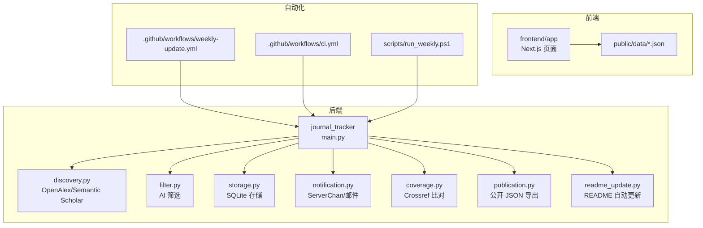
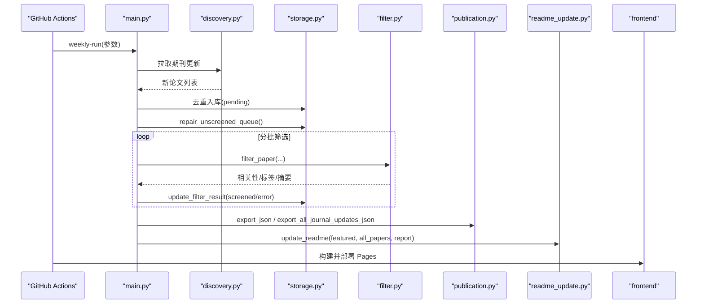
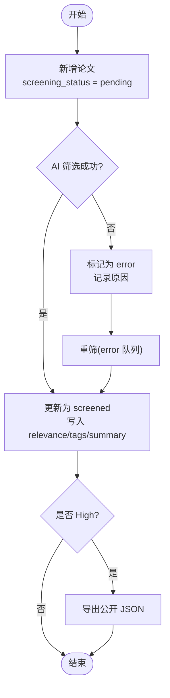
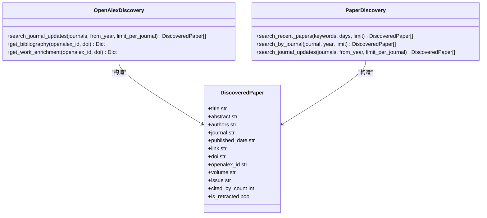
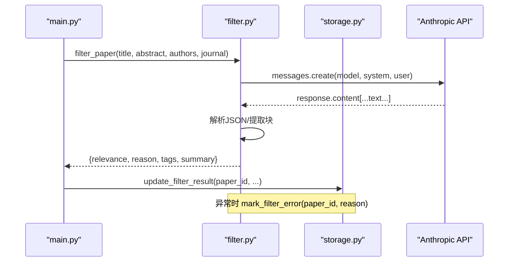
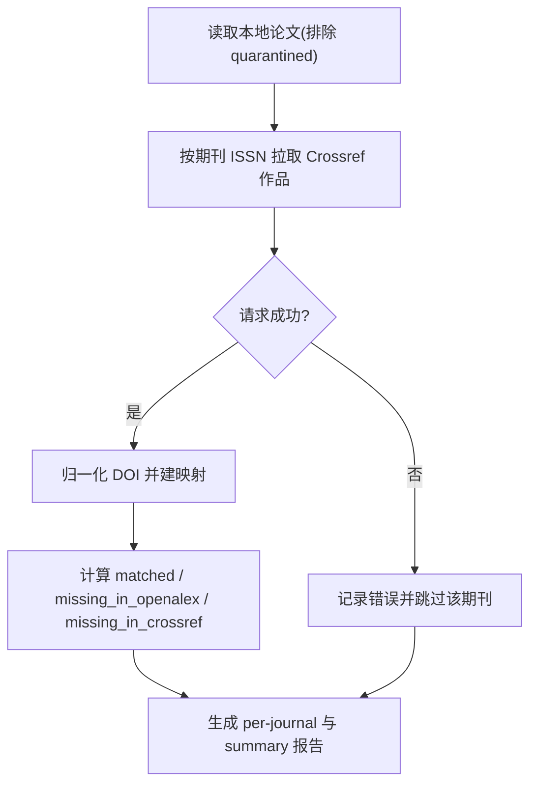
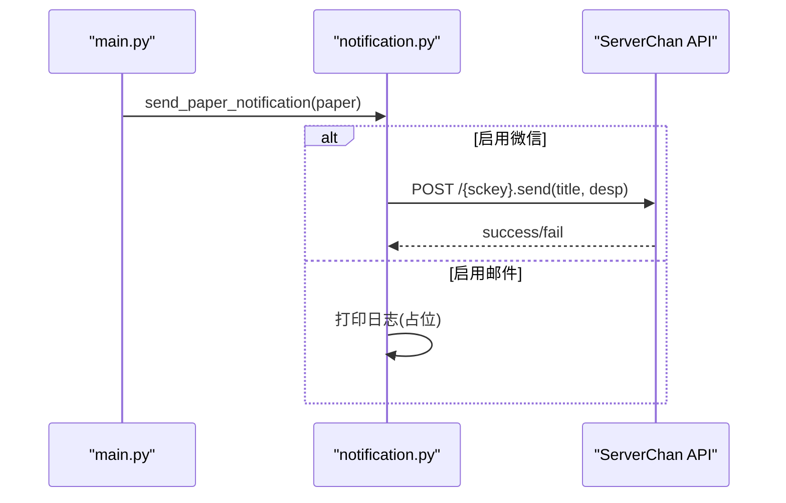
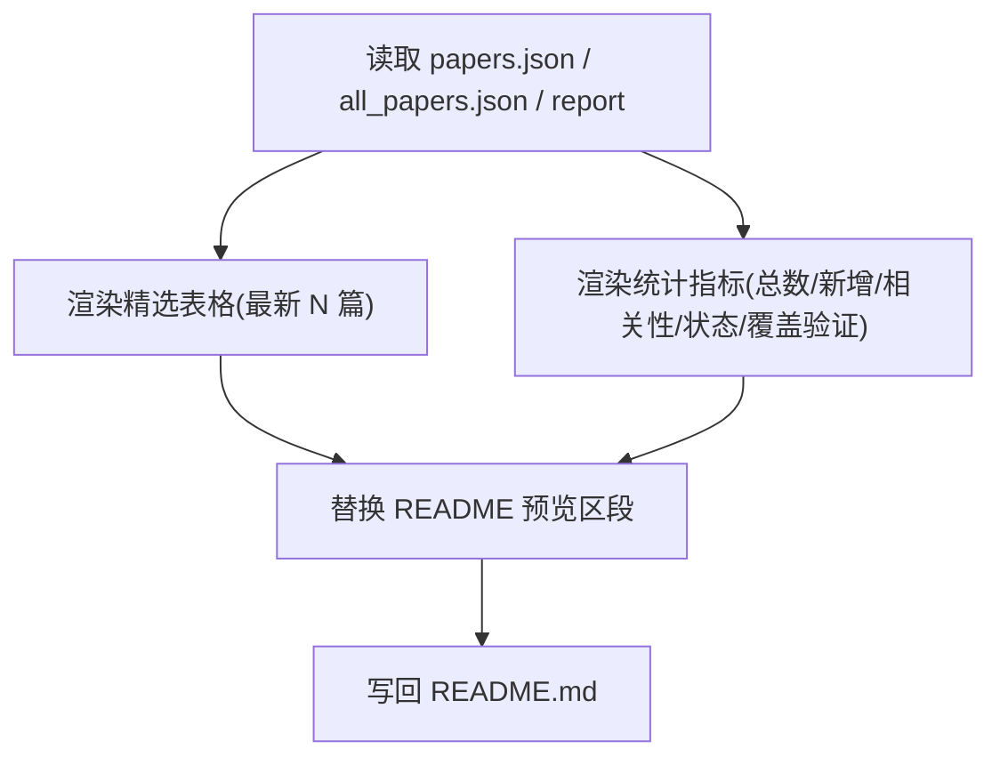
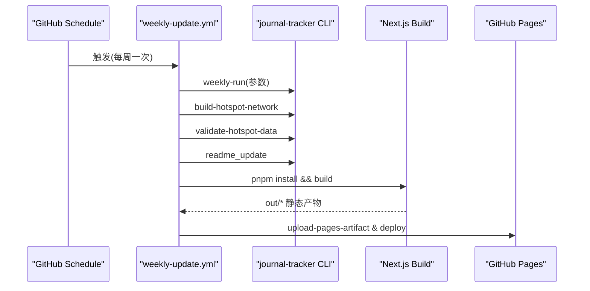
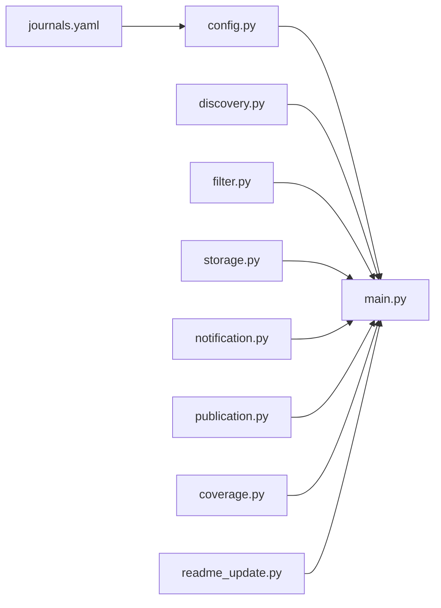

# 论文追踪工作流

<cite>
**本文引用的文件**   
- [README.md](file://README.md)
- [main.py](file://backend/journal_tracker/main.py)
- [config.py](file://backend/journal_tracker/config.py)
- [storage.py](file://backend/journal_tracker/storage.py)
- [filter.py](file://backend/journal_tracker/filter.py)
- [notification.py](file://backend/journal_tracker/notification.py)
- [coverage.py](file://backend/journal_tracker/coverage.py)
- [readme_update.py](file://backend/journal_tracker/readme_update.py)
- [discovery.py](file://backend/journal_tracker/discovery.py)
- [publication.py](file://backend/journal_tracker/publication.py)
- [journals.yaml](file://backend/config/journals.yaml)
- [weekly-update.yml](file://.github/workflows/weekly-update.yml)
- [ci.yml](file://.github/workflows/ci.yml)
- [run_weekly.ps1](file://backend/scripts/run_weekly.ps1)
</cite>

## 目录
1. [简介](#简介)
2. [项目结构](#项目结构)
3. [核心组件](#核心组件)
4. [架构总览](#架构总览)
5. [详细组件分析](#详细组件分析)
6. [依赖关系分析](#依赖关系分析)
7. [性能考量](#性能考量)
8. [故障排查指南](#故障排查指南)
9. [结论](#结论)
10. [附录](#附录)

## 简介
Paper-Hot 是一个面向计算传播研究的“期刊优先”论文追踪系统。其目标是：以红榜期刊为稳定数据源，定期抓取更新，使用 AI 筛选出与计算传播相关的论文，生成摘要、标签和推荐理由，并通过静态网站与通知渠道对外发布。系统涵盖从数据采集、AI 筛选、数据存储、覆盖率验证到公开导出与 README 自动更新的完整生命周期，并提供队列管理机制（pending、screened、quarantined）与错误恢复策略。

## 项目结构
- backend/journal_tracker：Python CLI 与工作流模块（采集、筛选、存储、通知、覆盖率验证、热点网络、公开导出等）
- backend/config：期刊配置、提示词模板、系统设置
- backend/data：本地 SQLite 数据库与运行报告
- frontend：Next.js 静态站点，消费 public/data/*.json
- .github/workflows：GitHub Actions 定时任务与 CI
- docs：项目文档与归档



**图表来源** 
- [main.py:1-120](file://backend/journal_tracker/main.py#L1-L120)
- [discovery.py:520-600](file://backend/journal_tracker/discovery.py#L520-L600)
- [filter.py:1-120](file://backend/journal_tracker/filter.py#L1-L120)
- [storage.py:64-150](file://backend/journal_tracker/storage.py#L64-L150)
- [notification.py:1-80](file://backend/journal_tracker/notification.py#L1-L80)
- [coverage.py:133-187](file://backend/journal_tracker/coverage.py#L133-L187)
- [publication.py:11-33](file://backend/journal_tracker/publication.py#L11-L33)
- [readme_update.py:137-156](file://backend/journal_tracker/readme_update.py#L137-L156)
- [weekly-update.yml:94-129](file://.github/workflows/weekly-update.yml#L94-L129)
- [ci.yml:17-36](file://.github/workflows/ci.yml#L17-L36)
- [run_weekly.ps1:24-44](file://backend/scripts/run_weekly.ps1#L24-L44)

**章节来源**
- [README.md:1-120](file://README.md#L1-L120)

## 核心组件
- 配置管理：统一加载环境变量、YAML 配置，提供 API Key、模型名、提示词、期刊列表等
- 论文发现：支持 OpenAlex 与 Semantic Scholar 两种数据源，按期刊或关键词检索
- AI 筛选：基于 Anthropic 兼容 API（Claude/DeepSeek），输出相关性、理由、标签、摘要
- 数据存储：SQLite 持久化，维护论文与特征表，索引优化查询
- 通知推送：ServerChan 微信推送与邮件占位
- 覆盖率验证：对比本地 OpenAlex DOI 与 Crossref DOI，输出差异报告
- 公开导出：导出精选与全量更新 JSON，供前端消费
- README 自动更新：刷新统计与精选预览，嵌入 Markdown 标记区段

**章节来源**
- [config.py:9-120](file://backend/journal_tracker/config.py#L9-L120)
- [discovery.py:57-120](file://backend/journal_tracker/discovery.py#L57-L120)
- [filter.py:10-120](file://backend/journal_tracker/filter.py#L10-L120)
- [storage.py:64-150](file://backend/journal_tracker/storage.py#L64-L150)
- [notification.py:13-80](file://backend/journal_tracker/notification.py#L13-L80)
- [coverage.py:133-187](file://backend/journal_tracker/coverage.py#L133-L187)
- [publication.py:11-33](file://backend/journal_tracker/publication.py#L11-L33)
- [readme_update.py:137-156](file://backend/journal_tracker/readme_update.py#L137-L156)

## 架构总览
系统采用“期刊优先”的周度流水线：先拉取红榜期刊更新，再修复历史队列，分批进行 AI 筛选，随后回填 OpenAlex 特征、公开导出、生成热点网络、执行覆盖率验证，最后刷新 README 并部署静态站点。



**图表来源** 
- [weekly-update.yml:94-129](file://.github/workflows/weekly-update.yml#L94-L129)
- [main.py:556-646](file://backend/journal_tracker/main.py#L556-L646)
- [discovery.py:538-590](file://backend/journal_tracker/discovery.py#L538-L590)
- [storage.py:360-421](file://backend/journal_tracker/storage.py#L360-L421)
- [filter.py:89-160](file://backend/journal_tracker/filter.py#L89-L160)
- [publication.py:17-25](file://backend/journal_tracker/publication.py#L17-L25)
- [readme_update.py:137-156](file://backend/journal_tracker/readme_update.py#L137-L156)

## 详细组件分析

### 队列管理与状态转换
- 状态定义
  - pending：待 AI 筛选
  - screened：已筛选（High/Medium/Low）
  - quarantined：非红榜或历史脏数据隔离
  - error：筛选异常，需重筛
- 转换规则
  - 新增论文默认 screening_status=pending
  - 成功筛选后更新为 screened；失败则标记为 error
  - 历史 Unscreened 数据经 repair_unscreened_queue 分流：属于红榜→pending；否则→quarantined
- 查询与修复
  - get_pending_screening_papers：获取 pending 队列
  - repair_unscreened_queue：批量修正历史数据
  - get_filter_error_papers：获取 error 队列用于重筛



**图表来源** 
- [storage.py:196-227](file://backend/journal_tracker/storage.py#L196-L227)
- [storage.py:303-339](file://backend/journal_tracker/storage.py#L303-L339)
- [storage.py:360-421](file://backend/journal_tracker/storage.py#L360-L421)
- [main.py:353-399](file://backend/journal_tracker/main.py#L353-L399)
- [main.py:717-758](file://backend/journal_tracker/main.py#L717-L758)

**章节来源**
- [storage.py:196-227](file://backend/journal_tracker/storage.py#L196-L227)
- [storage.py:303-339](file://backend/journal_tracker/storage.py#L303-L339)
- [storage.py:360-421](file://backend/journal_tracker/storage.py#L360-L421)
- [main.py:353-399](file://backend/journal_tracker/main.py#L353-L399)
- [main.py:717-758](file://backend/journal_tracker/main.py#L717-L758)

### 数据采集与去重
- 数据源
  - OpenAlexDiscovery：按 source_id 或 ISSN 拉取期刊更新，返回结构化字段与 OpenAlex 元数据
  - PaperDiscovery：Semantic Scholar 关键词搜索，支持按期刊过滤
- 去重策略
  - 基于 DOI 去重；无 DOI 的记录保留以避免误删
  - 入库前通过 storage.paper_exists(link, doi) 二次校验
- 限流与重试
  - 指数退避 + Retry-After 头处理
  - 请求间暂停避免触发速率限制



**图表来源** 
- [discovery.py:521-600](file://backend/journal_tracker/discovery.py#L521-L600)
- [discovery.py:57-120](file://backend/journal_tracker/discovery.py#L57-L120)
- [discovery.py:18-55](file://backend/journal_tracker/discovery.py#L18-L55)

**章节来源**
- [discovery.py:521-600](file://backend/journal_tracker/discovery.py#L521-L600)
- [discovery.py:57-120](file://backend/journal_tracker/discovery.py#L57-L120)
- [discovery.py:18-55](file://backend/journal_tracker/discovery.py#L18-L55)
- [storage.py:229-244](file://backend/journal_tracker/storage.py#L229-L244)

### AI 筛选流程
- 输入：标题、摘要、作者、期刊
- 输出：relevance（High/Medium/Low）、reason、tags、summary
- 解析容错：支持 thinking block 与 JSON 片段提取；缺失字段回退默认值
- 批量处理：逐篇调用，异常捕获并标记 error



**图表来源** 
- [filter.py:89-160](file://backend/journal_tracker/filter.py#L89-L160)
- [storage.py:303-339](file://backend/journal_tracker/storage.py#L303-L339)
- [main.py:353-399](file://backend/journal_tracker/main.py#L353-L399)

**章节来源**
- [filter.py:89-160](file://backend/journal_tracker/filter.py#L89-L160)
- [storage.py:303-339](file://backend/journal_tracker/storage.py#L303-L339)
- [main.py:353-399](file://backend/journal_tracker/main.py#L353-L399)

### 数据存储与统计
- 表结构
  - papers：论文主表，含筛选状态、来源、时间戳等
  - paper_features：每篇论文的 OpenAlex 主题、关键词、引用、被引数、撤回标记等
- 索引与查询
  - link、doi、relevance、is_public、screening_status、source_type 等索引
  - 统计接口聚合总数、相关性分布、状态分布、本周新增
- 迁移与兼容
  - _ensure_columns 补齐旧库字段，并初始化 screening_status/source_type/discovered_at

```mermaid
erDiagram
PAPERS {
integer id PK
text title
text authors
text abstract
text journal
text published_date
text link UK
text doi
text relevance
text reason
text tags
text summary
integer score
text status
integer is_public
text source_type
text source_run_id
text tracked_journal
text openalex_id
text screening_status
text volume
text issue
text bibliography_checked_at
text discovered_at
text created_at
text updated_at
boolean is_retracted
}
PAPER_FEATURES {
integer paper_id PK FK
text text_hash
text embedding_model
integer embedding_dim
blob embedding
text openalex_topics_json
text openalex_keywords_json
text referenced_works_json
integer cited_by_count
boolean is_retracted
text updated_at
}
PAPERS ||--o{ PAPER_FEATURES : "1对多"
```

**图表来源** 
- [storage.py:82-152](file://backend/journal_tracker/storage.py#L82-L152)
- [storage.py:117-132](file://backend/journal_tracker/storage.py#L117-L132)
- [storage.py:632-681](file://backend/journal_tracker/storage.py#L632-L681)

**章节来源**
- [storage.py:82-152](file://backend/journal_tracker/storage.py#L82-L152)
- [storage.py:632-681](file://backend/journal_tracker/storage.py#L632-L681)

### 覆盖率验证（OpenAlex vs Crossref）
- 目标：对比本地 OpenAlex 收录的 DOI 与 Crossref 元数据中的 DOI，识别缺失与差异
- 流程
  - 读取本地所有红榜更新论文（排除 quarantined）
  - 按期刊 ISSN 拉取 Crossref works（限定年份范围）
  - 归一化 DOI，计算匹配集合与差集
  - 输出 per-journal 明细与汇总报告
- 错误处理：HTTP 错误重试与指数退避；记录错误信息



**图表来源** 
- [coverage.py:133-187](file://backend/journal_tracker/coverage.py#L133-L187)
- [coverage.py:189-224](file://backend/journal_tracker/coverage.py#L189-L224)
- [coverage.py:92-130](file://backend/journal_tracker/coverage.py#L92-L130)

**章节来源**
- [coverage.py:133-187](file://backend/journal_tracker/coverage.py#L133-L187)
- [coverage.py:189-224](file://backend/journal_tracker/coverage.py#L189-L224)
- [coverage.py:92-130](file://backend/journal_tracker/coverage.py#L92-L130)

### 通知系统（ServerChan 集成）
- 能力：微信通知（ServerChan）、邮件占位
- 触发：单篇 High/Medium 论文入库时发送；批量汇总按 High/Medium 分组
- 配置：serverchan_sckey、enable_wechat、email_to 等



**图表来源** 
- [notification.py:72-110](file://backend/journal_tracker/notification.py#L72-L110)
- [notification.py:112-151](file://backend/journal_tracker/notification.py#L112-L151)

**章节来源**
- [notification.py:72-110](file://backend/journal_tracker/notification.py#L72-L110)
- [notification.py:112-151](file://backend/journal_tracker/notification.py#L112-L151)

### README 自动更新机制
- 功能：替换 README 中 auto-preview 与 auto-stats 标记区段，刷新精选预览与统计数据
- 数据来源：papers.json（精选）、all_papers.json（全量）、weekly_run_latest.json（运行报告）
- 时间与时区：Asia/Shanghai 格式化显示



**图表来源** 
- [readme_update.py:137-156](file://backend/journal_tracker/readme_update.py#L137-L156)
- [readme_update.py:46-70](file://backend/journal_tracker/readme_update.py#L46-L70)
- [readme_update.py:85-125](file://backend/journal_tracker/readme_update.py#L85-L125)

**章节来源**
- [readme_update.py:137-156](file://backend/journal_tracker/readme_update.py#L137-L156)
- [readme_update.py:46-70](file://backend/journal_tracker/readme_update.py#L46-L70)
- [readme_update.py:85-125](file://backend/journal_tracker/readme_update.py#L85-L125)

### 公开导出与前端消费
- 导出内容
  - papers.json：已公开发布的精选论文
  - all_papers.json：红榜期刊全量更新（排除 quarantined）
- 数据结构：标准化字段（id、title、authors、journal、published_date、relevance、summary、reason、tags、doi、source_url、detail_slug、source_type、screening_status、tracked_journal、volume、issue）
- 前端消费：Next.js App Router 在构建时预渲染数据，生成静态站点

**章节来源**
- [publication.py:11-33](file://backend/journal_tracker/publication.py#L11-L33)
- [publication.py:34-62](file://backend/journal_tracker/publication.py#L34-L62)
- [weekly-update.yml:145-156](file://.github/workflows/weekly-update.yml#L145-L156)

### 工作流调度与定时任务
- GitHub Actions
  - weekly-update.yml：每周一 13:00（Asia/Shanghai）触发，支持手动输入参数；执行 weekly-run、热点网络构建与验证、README 更新、构建与部署 Pages、保存数据库缓存与上传工件
  - ci.yml：每次 push/PR 运行 Python 测试、热点分析测试与前端构建
- 本地脚本
  - run_weekly.ps1：Windows Task Scheduler 友好封装，支持日志记录、可选提交公共数据



**图表来源** 
- [weekly-update.yml:1-40](file://.github/workflows/weekly-update.yml#L1-L40)
- [weekly-update.yml:94-129](file://.github/workflows/weekly-update.yml#L94-L129)
- [weekly-update.yml:145-168](file://.github/workflows/weekly-update.yml#L145-L168)
- [ci.yml:17-36](file://.github/workflows/ci.yml#L17-L36)
- [run_weekly.ps1:24-44](file://backend/scripts/run_weekly.ps1#L24-L44)

**章节来源**
- [weekly-update.yml:1-40](file://.github/workflows/weekly-update.yml#L1-L40)
- [weekly-update.yml:94-129](file://.github/workflows/weekly-update.yml#L94-L129)
- [weekly-update.yml:145-168](file://.github/workflows/weekly-update.yml#L145-L168)
- [ci.yml:17-36](file://.github/workflows/ci.yml#L17-L36)
- [run_weekly.ps1:24-44](file://backend/scripts/run_weekly.ps1#L24-L44)

## 依赖关系分析
- 模块耦合
  - main.py 作为编排入口，依赖 discovery、filter、storage、notification、publication、coverage、readme_update
  - storage.py 被多个模块读写，承担核心数据契约
  - config.py 提供全局配置，贯穿各模块
- 外部依赖
  - OpenAlex API、Crossref API、Semantic Scholar API、Anthropic 兼容 API、ServerChan
- 潜在循环依赖
  - 当前未发现循环导入；模块职责清晰



**图表来源** 
- [main.py:20-27](file://backend/journal_tracker/main.py#L20-L27)
- [config.py:9-120](file://backend/journal_tracker/config.py#L9-L120)
- [journals.yaml:1-20](file://backend/config/journals.yaml#L1-L20)

**章节来源**
- [main.py:20-27](file://backend/journal_tracker/main.py#L20-L27)
- [config.py:9-120](file://backend/journal_tracker/config.py#L9-L120)
- [journals.yaml:1-20](file://backend/config/journals.yaml#L1-L20)

## 性能考量
- 请求限流与重试
  - 指数退避 + Retry-After 头处理，降低 429/5xx 影响
  - 请求间隔暂停（SEARCH_PAUSE_SECONDS）避免触发速率限制
- 数据库优化
  - 多列索引加速筛选与导出查询
  - 增量更新与 upsert 减少重复写入
- 批处理与分页
  - 分批筛选（max_screen_batches）控制单次负载
  - OpenAlex/Crossref 分页与 rows 限制
- 缓存
  - GitHub Actions 缓存数据库与 FastEmbed 模型，缩短冷启动时间

[本节为通用指导，不直接分析具体文件]

## 故障排查指南
- 常见问题
  - AI 筛选失败：检查 ANTHROPIC_API_KEY、ANTHROPIC_BASE_URL、AI_MODEL；查看 error 队列并重筛
  - 覆盖率验证失败：确认 Crossref 可访问性与 ISSN 配置；查看 reports/coverage_*.json 错误列表
  - 通知未送达：检查 serverchan_sckey 与 enable_wechat；查看日志输出
  - 数据库损坏或字段缺失：运行 repair-queue 与 _ensure_columns 逻辑
- 诊断命令
  - workflow-status：查看工作流状态与统计
  - verify-coverage：执行覆盖率验证并输出报告
  - doctor：环境预检（API Key、数据库、关键词等）
- 日志与工件
  - weekly 运行报告：backend/data/reports/weekly_run_*.json
  - 覆盖率报告：backend/data/reports/coverage_*.json
  - GitHub Actions 工件：包含 README、JSON 数据与报告

**章节来源**
- [main.py:761-800](file://backend/journal_tracker/main.py#L761-L800)
- [main.py:402-434](file://backend/journal_tracker/main.py#L402-L434)
- [notification.py:20-58](file://backend/journal_tracker/notification.py#L20-L58)
- [storage.py:154-194](file://backend/journal_tracker/storage.py#L154-L194)
- [weekly-update.yml:182-193](file://.github/workflows/weekly-update.yml#L182-L193)

## 结论
Paper-Hot 通过“期刊优先”的周度流水线，实现了从数据采集、AI 筛选、数据存储、覆盖率验证到公开导出与 README 自动更新的端到端自动化。系统具备健壮的队列管理与错误恢复机制，结合 GitHub Actions 与本地脚本，确保稳定运行与持续交付。未来可在提示词优化、解析鲁棒性、热点网络可视化等方面继续迭代。

[本节为总结性内容，不直接分析具体文件]

## 附录
- 关键命令参考
  - 工作流状态：journal-tracker workflow-status
  - 拉取期刊更新：journal-tracker fetch-journals --limit-per-journal 100
  - 修复队列：journal-tracker repair-queue
  - AI 筛选：journal-tracker screen-pending --limit 20
  - 公开导出：journal-tracker export-public
  - 覆盖率验证：journal-tracker verify-coverage
  - 周度流水线：journal-tracker weekly-run --limit-per-journal 100 --screen-limit 50 --max-screen-batches 10 --refilter-limit 10
  - 本地 PowerShell 包装：powershell -NoProfile -ExecutionPolicy Bypass -File .\backend\scripts\run_weekly.ps1

**章节来源**
- [README.md:111-171](file://README.md#L111-L171)
- [run_weekly.ps1:29-41](file://backend/scripts/run_weekly.ps1#L29-L41)