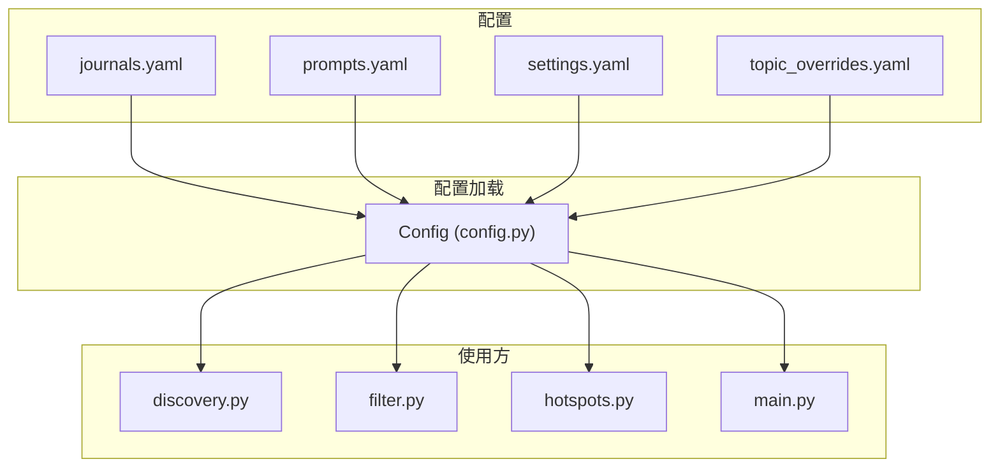
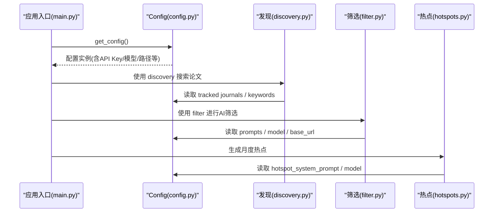
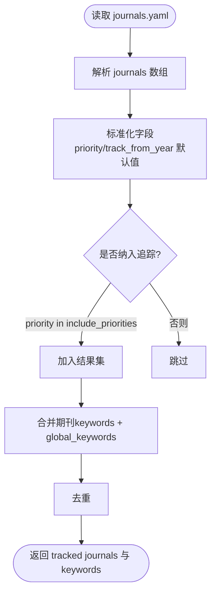
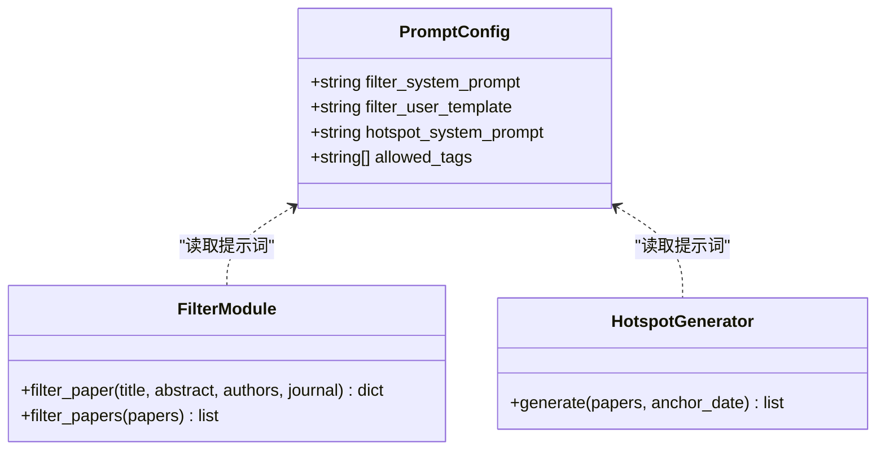
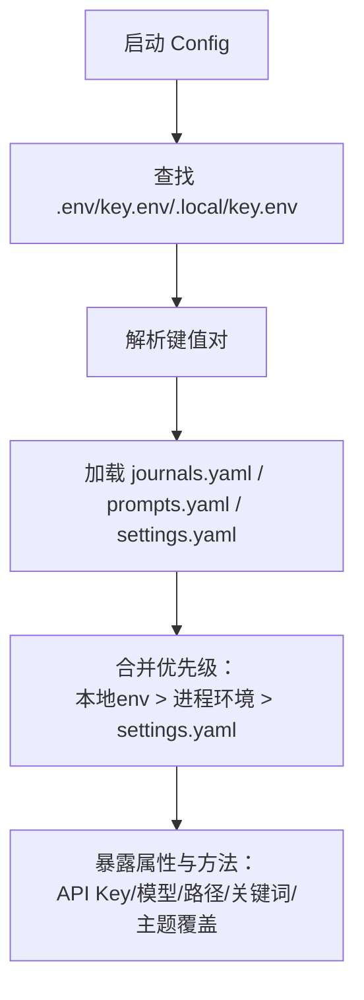
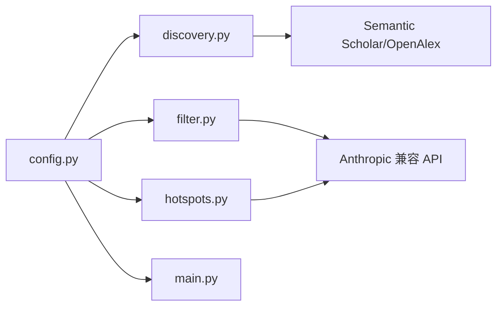

# 配置管理系统

<cite>
**本文引用的文件**
- [backend/config/journals.yaml](file://backend/config/journals.yaml)
- [backend/config/prompts.yaml](file://backend/config/prompts.yaml)
- [backend/config/settings.yaml](file://backend/config/settings.yaml)
- [backend/config/topic_overrides.yaml](file://backend/config/topic_overrides.yaml)
- [backend/journal_tracker/config.py](file://backend/journal_tracker/config.py)
- [backend/journal_tracker/filter.py](file://backend/journal_tracker/filter.py)
- [backend/journal_tracker/discovery.py](file://backend/journal_tracker/discovery.py)
- [backend/journal_tracker/hotspots.py](file://backend/journal_tracker/hotspots.py)
- [backend/journal_tracker/main.py](file://backend/journal_tracker/main.py)
- [backend/tests/test_config.py](file://backend/tests/test_config.py)
</cite>

## 目录
1. [简介](#简介)
2. [项目结构](#项目结构)
3. [核心组件](#核心组件)
4. [架构总览](#架构总览)
5. [详细组件分析](#详细组件分析)
6. [依赖关系分析](#依赖关系分析)
7. [性能考虑](#性能考虑)
8. [故障排查指南](#故障排查指南)
9. [结论](#结论)
10. [附录](#附录)

## 简介
本文件为 Paper-Hot 配置管理系统的权威文档，聚焦以下目标：
- 解释 YAML 配置文件结构与用途：journals.yaml（红榜期刊）、prompts.yaml（AI 提示词模板）、settings.yaml（系统参数）。
- 详解 config.py 的配置加载机制：环境变量处理、配置文件优先级与动态配置更新。
- 说明期刊配置的扩展方法：新增期刊、追踪等级设置与元数据管理。
- 指导 AI 提示词的定制：筛选规则调整、输出格式控制与多语言支持。
- 给出系统参数的调优选项：API 调用限制、并发控制、缓存策略与性能参数。
- 提供配置验证机制、默认值管理与配置迁移策略。
- 总结配置最佳实践、常见问题与调试技巧。

## 项目结构
Paper-Hot 后端将配置集中于 backend/config 目录，运行时由 journal_tracker.config.Config 统一加载并暴露属性与方法。核心模块通过 get_config() 获取全局配置实例，确保全链路一致。

图表来源
- [backend/journal_tracker/config.py:1-249](file://backend/journal_tracker/config.py#L1-L249)
- [backend/journal_tracker/discovery.py:1-200](file://backend/journal_tracker/discovery.py#L1-L200)
- [backend/journal_tracker/filter.py:1-192](file://backend/journal_tracker/filter.py#L1-L192)
- [backend/journal_tracker/hotspots.py:1-161](file://backend/journal_tracker/hotspots.py#L1-L161)
- [backend/journal_tracker/main.py:1-200](file://backend/journal_tracker/main.py#L1-L200)

章节来源
- [backend/config/journals.yaml:1-299](file://backend/config/journals.yaml#L1-L299)
- [backend/config/prompts.yaml:1-108](file://backend/config/prompts.yaml#L1-L108)
- [backend/config/settings.yaml:1-81](file://backend/config/settings.yaml#L1-L81)
- [backend/config/topic_overrides.yaml:1-20](file://backend/config/topic_overrides.yaml#L1-L20)
- [backend/journal_tracker/config.py:1-249](file://backend/journal_tracker/config.py#L1-L249)

## 核心组件
- Config 类：集中加载 journals.yaml、prompts.yaml、settings.yaml 与 topic_overrides.yaml；提供 API Key、模型名、数据库路径、公开数据目录等属性；提供按优先级过滤的期刊列表与关键词聚合方法。
- 环境变量与本地 env 文件：优先从 .env/key.env/.local/key.env 读取，其次从进程环境 os.environ，最后回退到 settings.yaml 默认值。
- 动态访问：所有模块通过 get_config() 获取单例配置，避免重复初始化。

关键能力概览
- 环境变量覆盖：ANTHROPIC_API_KEY、ANTHROPIC_BASE_URL、OPENALEX_API_KEY、SEMANTIC_SCHOLAR_API_KEY、AI_MODEL/ANTHROPIC_MODEL。
- 配置优先级：本地 env > 进程环境 > settings.yaml。
- 路径解析：database_path 相对 backend 根目录或绝对路径；public_data_dir 自动定位前端 public/data。
- 主题覆盖：topic_overrides.yaml 支持排除、重命名与合并主题。

章节来源
- [backend/journal_tracker/config.py:1-249](file://backend/journal_tracker/config.py#L1-L249)
- [backend/tests/test_config.py:1-232](file://backend/tests/test_config.py#L1-L232)

## 架构总览
下图展示配置加载与使用的整体流程：

图表来源
- [backend/journal_tracker/main.py:1-200](file://backend/journal_tracker/main.py#L1-L200)
- [backend/journal_tracker/config.py:1-249](file://backend/journal_tracker/config.py#L1-L249)
- [backend/journal_tracker/discovery.py:1-200](file://backend/journal_tracker/discovery.py#L1-L200)
- [backend/journal_tracker/filter.py:1-192](file://backend/journal_tracker/filter.py#L1-L192)
- [backend/journal_tracker/hotspots.py:1-161](file://backend/journal_tracker/hotspots.py#L1-L161)

## 详细组件分析

### 期刊配置（journals.yaml）
- 字段说明
  - name/abbr/publisher：期刊名称、缩写、出版社。
  - priority：追踪优先级，core/watch/skip。
  - track_from_year：开始追踪年份。
  - openalex_source_id/issn_l/issn：OpenAlex 源ID与ISSN标识。
  - source：数据来源标记（如 feishu_redlist）。
  - notes：备注信息。
  - global_keywords：全局关键词集合，用于论文发现。
- 扩展方法
  - 新增期刊：在 journals 数组追加条目，填写必要标识与优先级。
  - 追踪等级：priority=core 默认纳入；watch 可按需纳入；skip 不纳入。
  - 元数据管理：通过 issn/openalex_source_id 保证跨库一致性；notes 记录来源与策略。
- 使用方式
  - get_tracked_journals(include_priorities=("core","watch")) 返回待追踪期刊列表。
  - get_discovery_keywords() 合并各期刊 keywords 与 global_keywords，去重后返回。

图表来源
- [backend/journal_tracker/config.py:199-236](file://backend/journal_tracker/config.py#L199-L236)
- [backend/config/journals.yaml:1-299](file://backend/config/journals.yaml#L1-L299)

章节来源
- [backend/config/journals.yaml:1-299](file://backend/config/journals.yaml#L1-L299)
- [backend/journal_tracker/config.py:199-236](file://backend/journal_tracker/config.py#L199-L236)

### 提示词配置（prompts.yaml）
- 字段说明
  - filter_system_prompt：筛选系统提示词，定义纳入/排除标准与输出 JSON 格式。
  - filter_user_template：用户提示词模板，包含 {title}/{abstract}/{authors}/{journal} 占位符。
  - hotspot_system_prompt：热点归纳系统提示词，约束议题数量、关联论文与输出格式。
  - allowed_tags：允许标签集合，辅助标签生成。
- 定制方法
  - 调整筛选规则：修改 filter_system_prompt 的纳入/排除标准与相关性分级说明。
  - 控制输出格式：严格限定 JSON 字段与长度，便于下游解析与校验。
  - 多语言支持：可在 user_template 中切换语言描述，保持输出 JSON 键不变。
- 使用方式
  - filter.py 与 hotspots.py 通过 config.filter_system_prompt / filter_user_template / hotspot_system_prompt 读取。

图表来源
- [backend/config/prompts.yaml:1-108](file://backend/config/prompts.yaml#L1-L108)
- [backend/journal_tracker/filter.py:1-192](file://backend/journal_tracker/filter.py#L1-L192)
- [backend/journal_tracker/hotspots.py:1-161](file://backend/journal_tracker/hotspots.py#L1-L161)

章节来源
- [backend/config/prompts.yaml:1-108](file://backend/config/prompts.yaml#L1-L108)
- [backend/journal_tracker/filter.py:1-192](file://backend/journal_tracker/filter.py#L1-L192)
- [backend/journal_tracker/hotspots.py:1-161](file://backend/journal_tracker/hotspots.py#L1-L161)

### 系统参数（settings.yaml）
- 主要分组
  - anthropic_api_key/base_url：Anthropic 兼容接口密钥与基础地址。
  - claude_model/max_tokens：筛选与热点生成所用模型与最大 token。
  - semantic_scholar_api_key：可选的 Semantic Scholar API Key。
  - notification：微信/邮件/Server酱开关与凭据。
  - tracking：每次运行最大处理论文数、搜索时间范围、去重开关、相关性阈值。
  - database.path：SQLite 数据库路径（相对 backend 根目录）。
  - scheduler.enabled/cron：定时任务开关与 cron 表达式。
  - logging.level/format：日志级别与格式。
  - openalex_api_key：OpenAlex API Key（推荐以提高速率限制）。
  - hotspot_network：热点网络构建参数（分析窗口、相似度阈值、聚类参数等）。
- 调优建议
  - API 限制：合理设置 max_tokens、search_days_back、max_papers_per_run 以平衡成本与时效。
  - 并发控制：当前实现串行调用外部 API，可通过上层调度器分批执行。
  - 缓存策略：discovery 层维护 last_run_report 统计失败与空查询，可据此优化重试与退避。
  - 性能参数：hotspot_network 中的 knn_k、minimum_semantic_similarity、leiden_resolution 等影响聚类质量与耗时。

章节来源
- [backend/config/settings.yaml:1-81](file://backend/config/settings.yaml#L1-L81)
- [backend/journal_tracker/discovery.py:1-200](file://backend/journal_tracker/discovery.py#L1-L200)
- [backend/journal_tracker/hotspots.py:1-161](file://backend/journal_tracker/hotspots.py#L1-L161)

### 主题覆盖（topic_overrides.yaml）
- 功能
  - exclude_topics：排除过于宽泛的主题，不参与热点图谱。
  - rename：人工重写主题中文名称，优先于 LLM 生成。
  - merge：将多个主题合并至目标主题，统一语义。
- 使用场景
  - 团队维护主题命名规范，提升可读性与一致性。
  - 合并相似主题，减少碎片化。

章节来源
- [backend/config/topic_overrides.yaml:1-20](file://backend/config/topic_overrides.yaml#L1-L20)
- [backend/journal_tracker/config.py:179-185](file://backend/journal_tracker/config.py#L179-L185)

### 配置加载机制（config.py）
- 环境变量与本地 env 文件
  - 读取顺序：.env > key.env > .local/key.env > os.environ > settings.yaml。
  - 支持的键：ANTHROPIC_API_KEY、ANTHROPIC_BASE_URL、OPENALEX_API_KEY、SEMANTIC_SCHOLAR_API_KEY、AI_MODEL/ANTHROPIC_MODEL。
- 配置文件优先级
  - 同一键存在时，本地 env 最高，进程环境次之，settings.yaml 最低。
- 动态配置更新
  - 通过 get_config() 获取单例，运行时可替换 _config 实例实现热更新（测试用例演示了临时目录与补丁环境变量的行为）。
- 路径解析
  - database_path：若为绝对路径直接使用，否则拼接 backend_root。
  - public_data_dir：根据运行位置自动定位 frontend/public/data 或 public/data。

图表来源
- [backend/journal_tracker/config.py:24-106](file://backend/journal_tracker/config.py#L24-L106)
- [backend/journal_tracker/config.py:108-186](file://backend/journal_tracker/config.py#L108-L186)
- [backend/tests/test_config.py:105-158](file://backend/tests/test_config.py#L105-L158)

章节来源
- [backend/journal_tracker/config.py:1-249](file://backend/journal_tracker/config.py#L1-L249)
- [backend/tests/test_config.py:1-232](file://backend/tests/test_config.py#L1-L232)

### 使用示例与集成点
- main.py：完整流程入口，依次调用 discovery、filter、storage、notification、publication 与 hotspots。
- discovery.py：基于 Semantic Scholar 或 OpenAlex 发现论文，读取 tracked journals 与 keywords。
- filter.py：调用 Anthropic 兼容 API 进行筛选，读取 prompts 与模型配置。
- hotspots.py：基于近期公开论文生成月度热点，读取 hotspot_system_prompt 与模型配置。

章节来源
- [backend/journal_tracker/main.py:1-200](file://backend/journal_tracker/main.py#L1-L200)
- [backend/journal_tracker/discovery.py:1-200](file://backend/journal_tracker/discovery.py#L1-L200)
- [backend/journal_tracker/filter.py:1-192](file://backend/journal_tracker/filter.py#L1-L192)
- [backend/journal_tracker/hotspots.py:1-161](file://backend/journal_tracker/hotspots.py#L1-L161)

## 依赖关系分析
- 模块耦合
  - config.py 被 discovery.py、filter.py、hotspots.py、main.py 共同依赖，形成中心化的配置总线。
  - discovery.py 与 filter.py 强依赖外部 API（Semantic Scholar/OpenAlex、Anthropic 兼容），需要合理的超时与重试策略。
- 潜在循环依赖
  - 当前未发现循环导入；Config 仅被其他模块单向引用。
- 外部依赖
  - anthropic SDK：用于筛选与热点生成。
  - requests：用于 Semantic Scholar 请求。
  - yaml：用于解析配置文件。

图表来源
- [backend/journal_tracker/config.py:1-249](file://backend/journal_tracker/config.py#L1-L249)
- [backend/journal_tracker/discovery.py:1-200](file://backend/journal_tracker/discovery.py#L1-L200)
- [backend/journal_tracker/filter.py:1-192](file://backend/journal_tracker/filter.py#L1-L192)
- [backend/journal_tracker/hotspots.py:1-161](file://backend/journal_tracker/hotspots.py#L1-L161)

章节来源
- [backend/journal_tracker/config.py:1-249](file://backend/journal_tracker/config.py#L1-L249)
- [backend/journal_tracker/discovery.py:1-200](file://backend/journal_tracker/discovery.py#L1-L200)
- [backend/journal_tracker/filter.py:1-192](file://backend/journal_tracker/filter.py#L1-L192)
- [backend/journal_tracker/hotspots.py:1-161](file://backend/journal_tracker/hotspots.py#L1-L161)

## 性能考虑
- API 调用限制
  - 通过 OPENALEX_API_KEY 提高 OpenAlex 速率限制；ANTHROPIC_API_KEY 保障筛选与热点生成稳定性。
  - 合理设置 max_tokens、search_days_back、max_papers_per_run 控制单次负载。
- 并发控制
  - 当前为串行处理，适合小规模运行；大规模时可引入队列与限流。
- 缓存策略
  - discovery 层维护 last_run_report，统计成功/失败/空查询，可用于退避与重试优化。
- 热点网络参数
  - knn_k、minimum_semantic_similarity、leiden_resolution 等影响聚类质量与计算开销，建议按数据规模调优。

[本节为通用指导，不直接分析具体文件]

## 故障排查指南
- 常见错误
  - 缺少 ANTHROPIC_API_KEY：filter.py 与 hotspots.py 会抛出异常，检查 .env 或进程环境变量。
  - Base URL 配置错误：anthropic_base_url 不正确导致连接失败，确认 DeepSeek Anthropic 兼容地址。
  - 数据库路径问题：database.path 相对路径未正确解析，检查 backend_root 与 project_root 判定逻辑。
  - 主题覆盖缺失：topic_overrides.yaml 不存在时返回空字典，不影响运行但可能影响主题一致性。
- 调试技巧
  - 使用 tests/test_config.py 的临时目录与环境变量补丁快速验证配置优先级。
  - 查看 discovery.last_run_report 了解最近一次发现的统计与错误。
  - 启用 logging.level=DEBUG 获取更详细的运行日志。

章节来源
- [backend/journal_tracker/filter.py:73-88](file://backend/journal_tracker/filter.py#L73-L88)
- [backend/journal_tracker/hotspots.py:35-44](file://backend/journal_tracker/hotspots.py#L35-L44)
- [backend/journal_tracker/config.py:77-94](file://backend/journal_tracker/config.py#L77-L94)
- [backend/tests/test_config.py:191-228](file://backend/tests/test_config.py#L191-L228)

## 结论
Paper-Hot 的配置管理系统以 config.py 为核心，统一加载 YAML 配置与环境变量，提供稳定的 API Key、模型、路径与主题覆盖能力。通过 journals.yaml、prompts.yaml、settings.yaml 与 topic_overrides.yaml 的组合，实现了灵活的期刊追踪、AI 提示词定制与系统参数调优。建议在生产环境中结合环境变量与 CI/CD 进行配置管理，并通过测试用例验证变更的正确性。

[本节为总结性内容，不直接分析具体文件]

## 附录
- 配置最佳实践
  - 敏感信息一律通过 .env/key.env 或进程环境变量注入，避免提交到版本库。
  - 使用 priority=core 作为默认追踪集，watch 按需纳入，skip 明确排除。
  - prompts.yaml 中严格限定 JSON 输出格式，便于自动化解析。
  - settings.yaml 中的性能参数应按数据规模与预算逐步调优。
- 配置迁移策略
  - 新增字段时保持向后兼容，提供默认值与降级逻辑。
  - 通过 topic_overrides.yaml 进行主题重命名与合并，避免破坏历史数据。
  - 使用测试用例覆盖关键路径，确保迁移安全。

[本节为通用指导，不直接分析具体文件]