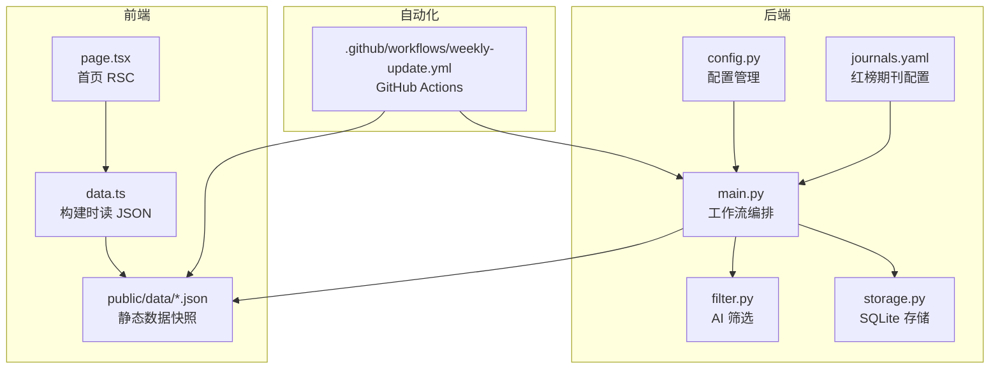
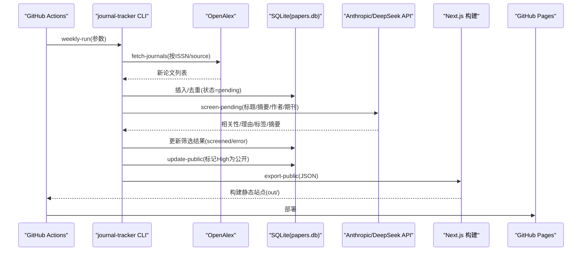
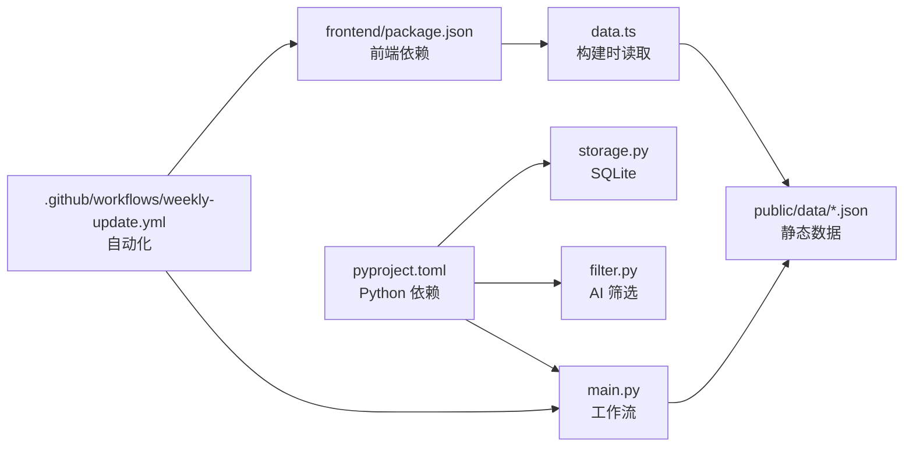

# 项目概述

<cite>
**本文引用的文件**   
- [README.md](file://README.md)
- [pyproject.toml](file://pyproject.toml)
- [frontend/package.json](file://frontend/package.json)
- [backend/journal_tracker/main.py](file://backend/journal_tracker/main.py)
- [backend/journal_tracker/config.py](file://backend/journal_tracker/config.py)
- [backend/journal_tracker/storage.py](file://backend/journal_tracker/storage.py)
- [backend/journal_tracker/filter.py](file://backend/journal_tracker/filter.py)
- [frontend/app/page.tsx](file://frontend/app/page.tsx)
- [frontend/lib/data.ts](file://frontend/lib/data.ts)
- [backend/config/journals.yaml](file://backend/config/journals.yaml)
- [.github/workflows/weekly-update.yml](file://.github/workflows/weekly-update.yml)
- [docs/project-map.md](file://docs/project-map.md)
- [docs/automation.md](file://docs/automation.md)
</cite>

## 目录
1. [引言](#引言)
2. [项目结构](#项目结构)
3. [核心组件](#核心组件)
4. [架构总览](#架构总览)
5. [详细组件分析](#详细组件分析)
6. [依赖关系分析](#依赖关系分析)
7. [性能考量](#性能考量)
8. [故障排查指南](#故障排查指南)
9. [结论](#结论)
10. [附录](#附录)

## 引言
Paper-Hot（Paper HOT / 计算传播期刊追踪）是一个面向计算传播研究的论文情报站。其核心价值主张是：以团队红榜期刊为稳定数据源，定期抓取2026年以来的论文更新，保留期刊全量更新；再用AI筛选出与计算传播相关的论文，生成摘要、标签和推荐理由，最终发布到静态网站与后续推送渠道。项目通过“后端工作流 + 前端静态站点 + SQLite 存储 + GitHub Actions 自动化”的闭环，持续产出高质量、可检索、可交互的学术情报内容。

## 项目结构
仓库采用前后端分离的组织方式：
- backend：Python 工作流与数据处理，包含配置、发现、筛选、存储、公开导出、覆盖率校验、热点网络等模块
- frontend：Next.js 静态站点，构建时读取 public/data/*.json 渲染页面
- docs：项目地图、自动化说明、路线图与历史文档
- .github/workflows：CI、每周更新、部署 Pages 等工作流

图表来源
- [backend/journal_tracker/main.py:1-120](file://backend/journal_tracker/main.py#L1-L120)
- [backend/journal_tracker/config.py:1-120](file://backend/journal_tracker/config.py#L1-L120)
- [backend/journal_tracker/storage.py:1-120](file://backend/journal_tracker/storage.py#L1-L120)
- [backend/journal_tracker/filter.py:1-80](file://backend/journal_tracker/filter.py#L1-L80)
- [backend/config/journals.yaml:1-60](file://backend/config/journals.yaml#L1-L60)
- [frontend/app/page.tsx:1-9](file://frontend/app/page.tsx#L1-L9)
- [frontend/lib/data.ts:1-40](file://frontend/lib/data.ts#L1-L40)
- [.github/workflows/weekly-update.yml:1-60](file://.github/workflows/weekly-update.yml#L1-L60)

章节来源
- [README.md:1-120](file://README.md#L1-L120)
- [docs/project-map.md:1-85](file://docs/project-map.md#L1-L85)

## 核心组件
- 工作流入口与编排：提供 weekly-run、fetch-journals、screen-pending、export-public、verify-coverage、update-public 等命令，串联采集、修复队列、AI 筛选、错误重筛、公开发布与覆盖率校验
- 配置管理：集中加载 journals.yaml、prompts.yaml、settings.yaml 与环境变量，提供数据库路径、模型名、API Key、关键词与热点网络参数
- 数据存储：SQLite 双表（papers、paper_features），维护去重、状态机（pending/screened/error/quarantined）、统计与导出
- AI 筛选：基于 Anthropic 兼容 API（Claude/DeepSeek），输出相关性等级、理由、标签与摘要，具备健壮解析与容错
- 公开数据导出：将精选与全量更新导出为 JSON，供 Next.js 构建时读取并生成静态站点
- 覆盖率校验：对比 OpenAlex 与 Crossref DOI 覆盖，输出报告并持久化
- 自动化部署：GitHub Actions 每周一定时运行，缓存数据库与模型，构建静态站点并部署至 Pages

章节来源
- [backend/journal_tracker/main.py:1-120](file://backend/journal_tracker/main.py#L1-L120)
- [backend/journal_tracker/config.py:1-120](file://backend/journal_tracker/config.py#L1-L120)
- [backend/journal_tracker/storage.py:1-120](file://backend/journal_tracker/storage.py#L1-L120)
- [backend/journal_tracker/filter.py:1-120](file://backend/journal_tracker/filter.py#L1-L120)
- [docs/project-map.md:24-40](file://docs/project-map.md#L24-L40)

## 架构总览
系统由“数据采集 → 本地存储 → AI 筛选 → 公开导出 → 静态站点 → 自动化部署”构成。OpenAlex 作为主要数据源，结合 ISSN/source id 精准抓取红榜期刊；SQLite 保证去重与状态流转；AI 筛选确保领域相关性；Next.js 构建时预渲染，提升访问性能；GitHub Actions 负责周度更新与部署。

图表来源
- [.github/workflows/weekly-update.yml:94-134](file://.github/workflows/weekly-update.yml#L94-L134)
- [backend/journal_tracker/main.py:556-646](file://backend/journal_tracker/main.py#L556-L646)
- [backend/journal_tracker/storage.py:196-228](file://backend/journal_tracker/storage.py#L196-L228)
- [backend/journal_tracker/filter.py:89-160](file://backend/journal_tracker/filter.py#L89-L160)
- [frontend/lib/data.ts:1-40](file://frontend/lib/data.ts#L1-L40)

## 详细组件分析

### 工作流编排（main.py）
- 关键流程：
  - ingest_journal_updates：按红榜期刊抓取更新，写入 papers 表，标注 source_type=openalex，初始 screening_status=pending
  - repair_local_screening_queue：历史 Unscreened 分流为 pending（红榜）或 quarantined（非红榜）
  - screen_pending_papers：批量调用 PaperFilter，更新 relevance/reason/tags/summary，失败则标记 error
  - backfill_openalex_features：补全 topics/keywords/references/citations 等特征
  - update_public_workflow：重筛错误论文、自动公开 High 论文、刷新 public JSON
  - run_weekly_journal_workflow：串联上述步骤，生成周报与热点数据，可选 coverage 校验
- 输出：
  - backend/data/reports/weekly_run_*.json（运行报告）
  - frontend/public/data/papers.json、all_papers.json（公开数据）
  - 热点网络数据（hotspots/*.json）

章节来源
- [backend/journal_tracker/main.py:171-241](file://backend/journal_tracker/main.py#L171-L241)
- [backend/journal_tracker/main.py:243-255](file://backend/journal_tracker/main.py#L243-L255)
- [backend/journal_tracker/main.py:353-399](file://backend/journal_tracker/main.py#L353-L399)
- [backend/journal_tracker/main.py:298-350](file://backend/journal_tracker/main.py#L298-L350)
- [backend/journal_tracker/main.py:543-554](file://backend/journal_tracker/main.py#L543-L554)
- [backend/journal_tracker/main.py:556-646](file://backend/journal_tracker/main.py#L556-L646)

### 配置管理（config.py）
- 环境变量优先级：.local/key.env > 环境变量 > settings.yaml
- 支持字段：ANTHROPIC_API_KEY、ANTHROPIC_BASE_URL、AI_MODEL、SEMANTIC_SCHOLAR_API_KEY、OPENALEX_API_KEY
- 红榜期刊：从 journals.yaml 读取，默认 priority=core/watch，track_from_year=2026
- 提示词与热点网络：prompts.yaml、settings.yaml 中的 hotspot_network 参数

章节来源
- [backend/journal_tracker/config.py:24-43](file://backend/journal_tracker/config.py#L24-L43)
- [backend/journal_tracker/config.py:97-156](file://backend/journal_tracker/config.py#L97-L156)
- [backend/journal_tracker/config.py:199-214](file://backend/journal_tracker/config.py#L199-L214)
- [backend/config/journals.yaml:1-60](file://backend/config/journals.yaml#L1-L60)

### 数据存储（storage.py）
- 表结构：
  - papers：基础元数据、筛选结果、来源信息、发布时间、公开状态等
  - paper_features：文本哈希、嵌入模型/维度/向量、OpenAlex 主题/关键词/引用、被引次数、撤稿标记
- 索引优化：link、doi、relevance、is_public、screening_status、source_type
- 状态机：pending → screened/error/quarantined；is_public 控制公开
- 统计与导出：get_statistics、export_to_csv、get_public_papers、get_all_journal_update_papers

章节来源
- [backend/journal_tracker/storage.py:82-152](file://backend/journal_tracker/storage.py#L82-L152)
- [backend/journal_tracker/storage.py:196-228](file://backend/journal_tracker/storage.py#L196-L228)
- [backend/journal_tracker/storage.py:341-358](file://backend/journal_tracker/storage.py#L341-L358)
- [backend/journal_tracker/storage.py:632-681](file://backend/journal_tracker/storage.py#L632-L681)

### AI 筛选（filter.py）
- 输入：title、abstract、authors、journal
- 输出：{relevance, reason, tags, summary}
- 兼容性：Anthropic 客户端 + base_url 支持 DeepSeek 兼容接口
- 健壮性：提取 text block，JSON 解析失败回退策略，必填字段校验

章节来源
- [backend/journal_tracker/filter.py:73-88](file://backend/journal_tracker/filter.py#L73-L88)
- [backend/journal_tracker/filter.py:89-160](file://backend/journal_tracker/filter.py#L89-L160)

### 前端静态站点（Next.js）
- 构建时数据读取：lib/data.ts 读取 public/data/*.json，RSC 预渲染
- 首页：app/page.tsx 使用 HomeFeed 展示精选与全部论文
- 类型与样式：TypeScript strict、Tailwind v4、shadcn/ui 组件库

章节来源
- [frontend/lib/data.ts:1-40](file://frontend/lib/data.ts#L1-L40)
- [frontend/app/page.tsx:1-9](file://frontend/app/page.tsx#L1-L9)
- [frontend/package.json:1-38](file://frontend/package.json#L1-L38)

### 自动化部署（GitHub Actions）
- 触发：每周一 13:00 (Asia/Shanghai)，支持手动触发与参数
- 缓存：恢复 papers.db 与 FastEmbed 模型缓存
- 步骤：安装依赖 → 检查密钥 → weekly-run → 构建热点网络 → 验证 JSON → 构建站点 → 部署 Pages → 保存缓存 → 上传工件 → 提交公开数据（条件）

章节来源
- [.github/workflows/weekly-update.yml:1-60](file://.github/workflows/weekly-update.yml#L1-L60)
- [.github/workflows/weekly-update.yml:94-134](file://.github/workflows/weekly-update.yml#L94-L134)
- [.github/workflows/weekly-update.yml:135-170](file://.github/workflows/weekly-update.yml#L135-L170)
- [.github/workflows/weekly-update.yml:195-210](file://.github/workflows/weekly-update.yml#L195-L210)

## 依赖关系分析
- Python 包依赖：anthropic、pyyaml、requests；可选 analysis 依赖 fastembed、numpy、scikit-learn、scipy、igraph
- 前端依赖：Next.js 16、React 19、Tailwind CSS v4、Sigma.js、Graphology、Zod
- 外部服务：OpenAlex、Crossref、Anthropic/DeepSeek、Semantic Scholar（可选）

图表来源
- [pyproject.toml:1-49](file://pyproject.toml#L1-L49)
- [frontend/package.json:1-38](file://frontend/package.json#L1-L38)
- [backend/journal_tracker/main.py:1-120](file://backend/journal_tracker/main.py#L1-L120)
- [frontend/lib/data.ts:1-40](file://frontend/lib/data.ts#L1-L40)
- [.github/workflows/weekly-update.yml:1-60](file://.github/workflows/weekly-update.yml#L1-L60)

章节来源
- [pyproject.toml:1-49](file://pyproject.toml#L1-L49)
- [frontend/package.json:1-38](file://frontend/package.json#L1-L38)

## 性能考量
- 数据库层：SQLite 多索引加速查询（link、doi、relevance、is_public、screening_status、source_type）
- 批处理：screen_pending 分批执行，限制 batch 数量避免超时
- 缓存：Actions 缓存 papers.db 与 FastEmbed 模型，减少重复下载与初始化
- 构建优化：Next.js 静态导出，构建时读取 JSON，无运行时 fetch，首屏更快
- 外部 API：OpenAlex/Crossref 限频与重试，Anthropic/DeepSeek 请求 token 上限控制

[本节为通用指导，不直接分析具体文件]

## 故障排查指南
- 环境预检：journal-tracker doctor 检查 ANTHROPIC_API_KEY、数据库、公开 JSON、关键词等
- 常见问题：
  - AI 筛选失败：查看 screening_status=error 与 reason，使用 refilter_error_papers 重筛
  - 队列异常：repair-queue 将历史 Unscreened 分流为 pending 或 quarantined
  - 覆盖率不足：verify-coverage 输出 Crossref vs OpenAlex 差异报告
  - 构建失败：确认 public/data/*.json 存在且格式正确，pnpm build 检查产物
- 日志与工件：Actions 上传 reports/*.json、public data、README 快照，便于回溯

章节来源
- [backend/journal_tracker/main.py:761-800](file://backend/journal_tracker/main.py#L761-L800)
- [backend/journal_tracker/main.py:717-758](file://backend/journal_tracker/main.py#L717-L758)
- [backend/journal_tracker/main.py:402-434](file://backend/journal_tracker/main.py#L402-L434)
- [docs/automation.md:1-117](file://docs/automation.md#L1-L117)

## 结论
Paper-Hot 以“红榜期刊 + OpenAlex 抓取 + AI 筛选 + 静态站点 + 自动化”为核心设计，形成稳定、可扩展、低维护成本的学术情报流水线。相比传统学术追踪工具，本项目强调：
- 数据源稳定：红榜期刊清单与 ISSN/source id 保障覆盖面与准确性
- 智能筛选：AI 生成摘要、标签与推荐理由，提升可读性与可用性
- 静态优先：构建时预渲染，提高访问速度与可缓存性
- 自动化运维：GitHub Actions 周度更新与部署，降低人工干预

当前状态统计（来自 README 自动更新）：
- 数据库论文：645
- 当期新增：0
- High/Medium/Low：238/124/283
- Pending/Screened/Quarantined/Error：0/644/0/1
- 已发布精选：238
- 期刊全量导出：645

[本节总结不直接分析具体文件]

## 附录
- 主要功能特性列表：
  - 红榜期刊配置与追踪（priority/core/watch/skip）
  - OpenAlex ISSN/source 抓取与去重
  - SQLite 存储与状态机（pending/screened/error/quarantined）
  - AI 筛选（relevance/reason/tags/summary）
  - 公开数据导出（papers.json、all_papers.json）
  - 覆盖率校验（OpenAlex vs Crossref）
  - 热点网络生成与可视化（graph/trends/manifest）
  - Next.js 静态站点（RSC 构建时数据读取）
  - GitHub Actions 自动化（周度更新、构建、部署）
  - Windows Task Scheduler 本地调度脚本

章节来源
- [docs/project-map.md:24-85](file://docs/project-map.md#L24-L85)
- [README.md:30-63](file://README.md#L30-L63)
- [backend/config/journals.yaml:1-60](file://backend/config/journals.yaml#L1-L60)
- [.github/workflows/weekly-update.yml:1-60](file://.github/workflows/weekly-update.yml#L1-L60)